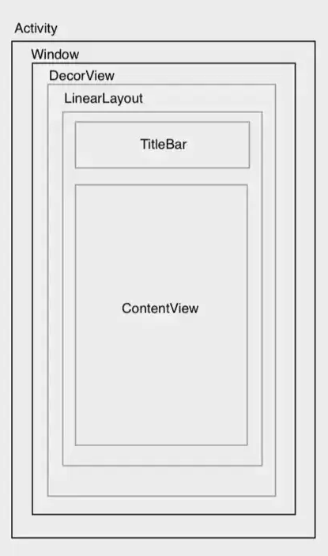

[TOC]

## 一、View 框架 

### 2.1 View 基本概念


### 2.2 事件分发

#### ACTION_CANCEL 在什么场景下触发？

**考察点**：是否理解触摸事件序列的“取消”语义；与 DOWN/MOVE/UP 的区别及典型触发时机。

**答案要点**：

`ACTION_CANCEL` 是 `MotionEvent` 的一种动作，表示**当前触摸序列被取消**，后续不会再收到该序列的 UP 等事件，也不会触发点击、长按等逻辑。常见触发场景：

- **父 View 中途拦截**：子 View 已消费了 DOWN（甚至几次 MOVE）后，父 View 在后续某次事件中 `onInterceptTouchEvent()` 返回 true 拦截。子 View 会收到 **ACTION_CANCEL**，父 View 则从新的 DOWN 开始自己的序列。
- **窗口/触摸区域变化**：手指仍在屏幕上，但窗口失去焦点、被覆盖或界面切换（如弹出 Dialog、Activity 被盖住）。系统会向此前正在接收事件的 View 发送 **ACTION_CANCEL**，表示该序列不再有效。
- **多指或系统手势**：手势被识别为其他用途（如系统手势、多指操作），当前 View 的这条指针序列会被取消，也会收到 **ACTION_CANCEL**。


### 2.2 View 绘制

#### View 的绘制流程

View 的绘制流程是一个递归的树形遍历过程，通过 `Measure` → `Layout` → `Draw` 确定每个 View 的尺寸、位置和内容。理解其底层机制（如 VSYNC、双缓冲）和优化手段，是开发高性能 UI 的关键。

```
 private void performTraversals() {
            ...
            WindowManager.LayoutParams lp = mWindowAttributes;
            ...
            int childWidthMeasureSpec = getRootMeasureSpec(mWidth, lp.width);
            int childHeightMeasureSpec = getRootMeasureSpec(mHeight, lp.height);
            ...
            // measur过程
            performMeasure(childWidthMeasureSpec, childHeightMeasureSpec);
            ...
            // layout过程
            performLayout(lp, mWidth, mHeight);
            ...
            // draw过程
            performDraw();
            ...
    }
```


#### 自定义 View 的注意事项

- 根据应用场景选择自定义的 View 类型。
- **禁止在 `onDraw`中创建对象**：`onDraw`每秒可能调用 60 次，频繁创建 `Paint`、`Path`等对象会导致内存抖动（频繁 GC），引发卡顿。应将对象声明为**成员变量**并在构造函数中初始化。

- **避免使用 `Handler`**：View 已提供 `post()`和 `postDelayed()`方法，能确保任务在 UI 线程安全执行，无需额外创建 Handler。


#### 自定义 View 和 ViewGroup 的区别

**考察点**：是否理解两者职责差异（单 View 绘制 vs 容器布局）、在事件分发与测量/绘制流程中的不同。

**答案要点**：

**(1) 概念与职责**

- **自定义 View**：继承自 `View`，只负责**自身**的展示与交互，核心是**绘制**（`onDraw`）。
- **自定义 ViewGroup**：继承自 `ViewGroup`，负责**管理子 View**，核心是**测量与布局**（`onMeasure`、`onLayout`），以及子 View 的绘制调度。

**(2) 事件分发**

- **View**：参与 `dispatchTouchEvent()`、`onTouchEvent()`，无拦截逻辑。
- **ViewGroup**：在此基础上多出 **`onInterceptTouchEvent()`**，用于决定事件是交给子 View 还是由自己消费，因此才能实现“先问子 View、再决定是否拦截”的传递流程。

**(3) UI 绘制**

- **View**：主要重写 `onMeasure()`、`onLayout()`（子 View 常为空）、`onDraw()`，只处理自己。
- **ViewGroup**：除上述外，还需在 `onMeasure()` 中测量子 View、在 `onLayout()` 中摆放子 View，并通过 **`dispatchDraw()`**、**`drawChild()`** 调度子 View 的绘制。


#### view 的绘制流程是从 Activity 的哪个生命周期方法开始执行的

View的绘制流程是从Activity的 onResume 方法开始执行的。


#### Activity、Window、View 三者的联系和区别

**考察点**：是否理解 UI 显示链条中三者的角色与委托关系；Window 作为中间层的作用。

**答案要点**：

**(1) 三者联系——协同工作**

三者通过委托形成完整的 UI 显示链条：

- **Activity 持有 Window**：在 `Activity.attach()` 中，系统创建 `PhoneWindow` 并赋给 Activity 的 `mWindow`。
- **Window 承载 View**：Window 内有顶级 View **DecorView**（FrameLayout）。`Activity.setContentView()` 实际调用 `PhoneWindow.setContentView()`，将布局解析成 View 树并添加到 DecorView 的 **content 区域**。
- **View 依附于 Window**：View 通过 Window 才能显示。Window 通过 **ViewRootImpl** 与 **WindowManagerService (WMS)** 通信，最终把 View 绘制到屏幕。

> 示意图见 [简述一下 View 的绘制流程-腾讯云开发者社区](https://cloud.tencent.com/developer/article/1745688)。



**(2) 三者区别——职责分离**

Window 作为中间层**解耦** Activity 与 View，使两者职责单一：

| 组件         | 角色定位            | 核心职责                     | 关键特性                     |
| :----------- | :------------------ | :--------------------------- | :--------------------------- |
| **Activity** | 控制器 (Controller) | 生命周期、业务逻辑           | 四大组件之一，由 AMS 管理    |
| **Window**   | 容器 (Container)    | 窗口属性、事件分发、对接 WMS | 抽象类，实现类为 PhoneWindow |
| **View**     | 内容 (Content)      | UI 绘制、触摸处理            | 测量、布局、绘制的基类       |


#### DecorView、ViewRootImpl、View 之间的关系

**考察点**：是否理解窗口与 View 树的层次；ViewRootImpl 在绘制与 WMS 之间的桥梁作用。

**答案要点**：

具体细节查看 [Android View源码解读：浅谈DecorView与ViewRootImpl](https://mp.weixin.qq.com/s?__biz=MzA3MjgwNDIzNQ%3D%3D&mid=2651942728&idx=1&sn=1dd4caaff277e3e146d7190c0c3efc73&scene=45&poc_token=HEFOqWmj_WvugKhmnJ5TxE6FSnbGOclThMI6KUMK)

**(1) 三者的角色**

- **View**：泛指界面上的控件，负责测量、布局、绘制和事件处理。我们写的布局里的 TextView、LinearLayout 等都是 View 树上的节点。
- **DecorView**：整棵 **View 树的根节点**，是一个 FrameLayout，由 PhoneWindow 持有。它包含系统装饰（如状态栏、标题栏区域）和一块 **content 区域**；`Activity.setContentView()` 传入的布局会被加到这个 content 里，成为 DecorView 的子 View 树。
- **ViewRootImpl**：**不是 View**，而是**整棵 View 树的“根”的管理者**，一个 Window 对应一个 ViewRootImpl。它不参与 View 树结构，但**持有/关联 DecorView**，负责：把 DecorView 与 **WindowManagerService (WMS)** 连接起来、执行 **performTraversals()**（measure → layout → draw）、输入事件从 WMS 往下分发、以及主线程检查（如 `checkThread()`）等。

**(2) 关系小结**

- **层级**：Activity → PhoneWindow → **DecorView**（View 树根）→ 我们 setContentView 的布局（以及其中的各种 **View**）。
- **桥梁**：**ViewRootImpl** 作为“根”的管理者，一端连着 DecorView（整棵 View 树），另一端通过 WMS 连到系统窗口；没有 ViewRootImpl，View 树不会参与测量、布局、绘制，也不会显示到屏幕。
- 可简记为：**View = 树上节点，DecorView = 树根，ViewRootImpl = 树根背后的管理者（连 WMS、驱动 measure/layout/draw）。**


#### 在 onResume 中是否可以直接获取测量宽高？

**考察点**：生命周期与 View 绘制时序的关系；为何 `View.post()` 能在绘制后执行。

> 详细可查 [Android UI 相关面试题：在 onResume 中是否可以测量宽高](https://mp.weixin.qq.com/s?__biz=Mzg3ODY2MzU2MQ==&mid=2247490161&idx=6&sn=8de2949bd48bfb1cd3fbfc3b9a7490ad&chksm=cf111897f8669181472fbb52dd01366786449f6caa25307aa07899c942ecc629b33702e64681&token=1436311520&lang=zh_CN#rd)

**(1) onResume 中不能直接拿到测量宽高**

`onResume()` 在 View 树的 measure/layout **之前**被调用。按 `ActivityThread.handleResumeActivity` 的流程：

1. 先执行 `performResumeActivity()` → 回调 Activity 的 `onResume()`。
2. 再执行 `wm.addView(decor, l)`，把 DecorView 加入 WindowManager。
3. `addView` 时创建 `ViewRootImpl`，通过 `requestLayout()` 触发 `performTraversals()`，才真正执行 measure/layout。

因此 `onResume()` 执行时 View 尚未测量，宽高为 0。

**(2) 用 `View.post(Runnable)` 在绘制后获取**

`View.post(Runnable)` 依赖主线程消息队列，保证 Runnable 在**本帧 measure/layout 之后**执行。

**执行过程简述**：

- **缓存（绘制前）**：在 `onCreate()`/`onResume()` 里调用 `view.post(runnable)` 时，View 尚未 attach（`mAttachInfo == null`），Runnable 不会立刻进消息队列，而是被放进 View 的 **RunQueue**（HandlerActionQueue）。
- **分发（绘制开始时）**：`ViewRootImpl.performTraversals()` 里会调用 `dispatchAttachedToWindow()`，此时把 RunQueue 里缓存的任务取出，投递到主线程 Handler 队列。
- **执行（绘制后）**：绘制任务（measure → layout → draw）的优先级更高，所以先执行；完成后才执行队列里你的 Runnable，此时 layout 已结束，可拿到正确宽高。


#### 为什么子线程不能更新 UI？子线程执行完任务后如何安全地更新界面？

**考察点**：UI 线程约束的原因（线程安全、检查机制）；从子线程切回主线程的常见方式。

**答案要点**：

具体细节查看 [Android 子线程更新UI的六种方式 - ApeJ - 博客园](https://www.cnblogs.com/JerryLau-213/p/16082187.html)

**(1) 为什么子线程不能直接更新 UI**

- Android 的 UI 组件**非线程安全**，所有 UI 操作必须在**主线程（UI 线程）**执行，否则界面状态可能错乱。
- 若在子线程中直接更新 UI（如 `TextView.setText()`），会抛出 **`CalledFromWrongThreadException`**。系统在 View 操作时（如 `ViewRootImpl` 的 `checkThread()`）会检查当前线程是否为创建该 View 的原始线程（主线程）。

注意，在 `oncreat()` 方法中，此时 viewRootlmpl 还没有被创建，viewRootlmpl 在 Activity 处于 `onResume()` 之后才被创建的。所以不会执行 `checkThread()` 方法，自然不会报错。当进行耗时操作时，此时 viewRootlmpl 已经创建成功，所以程序会崩溃。

**(2) 子线程完成后如何更新 UI**

当需要在后台任务完成后更新UI时，必须切换到主线程执行 UI 更新：

- **`Activity.runOnUiThread(Runnable)`**：在 Activity 内直接投递到主线程执行，写法简单。

  ```java
  new Thread(() -> {
      // 子线程做耗时操作
      runOnUiThread(() -> textView.setText("完成"));
  }).start();
  ```

- **`Handler`**：创建绑定主线程 `Looper` 的 Handler，在子线程中 `handler.post(Runnable)` 或发送 Message，在主线程处理并更新 UI。

  ```java
  Handler handler = new Handler(Looper.getMainLooper());
  new Thread(() -> {
      handler.post(() -> textView.setText("完成"));
  }).start();
  ```

- **`View.post(Runnable)`**：通过任意已 attach 的 View 投递到主线程，不依赖 Activity/Context。

  ```java
  new Thread(() -> {
      textView.post(() -> textView.setText("完成"));
  }).start();
  ```

- **Kotlin 协程**：在协程内用 `withContext(Dispatchers.Main)` 或 `lifecycleScope.launch(Dispatchers.Main)` 切到主线程再更新 UI。

  ```kotlin
  lifecycleScope.launch(Dispatchers.IO) {
      // 子线程做耗时操作
      withContext(Dispatchers.Main) { textView.text = "完成" }
  }
  ```


#### invalidate() 和 postInvalicate() 区别

- invalide 只能 UI 线程中刷新 View，不能在子线程中刷新。
- postInvalidate()本质上是对 invalidate()的封装，它通过 Handler 机制​ 实现了线程切换， 能够在子线程中刷新 UI。


#### 为什么 invalidate()有时不回调 onDraw()？

invalidate()并非无条件触发重绘，系统在 invalidateInternal()方法中设置了两道“关卡”。如果 View 的状态不符合重绘条件，请求会被直接拦截，导致 onDraw()不被调用。

具体细节查看 [Android UI相关面试题：自定义View执行invalidate()方法,为什么有时候不会回调onDraw()](https://mp.weixin.qq.com/s?__biz=Mzg3ODY2MzU2MQ==&mid=2247490311&idx=3&sn=2c15eaac3cf7c1c8a46a26af0bcc1619&chksm=cf1119e1f86690f768120f33db1d6937cdc7e506dd5cd7e8013b9e581952da9c45e073d83c20&token=1436311520&lang=zh_CN#rd)

不回调的触发条件有：

- **View 不可见**：即 `View.VISIBLE`为 `false`。
- **View 不可见且没有运行动画**：如果 View 不可见且没有动画正在执行，系统认为没必要重绘。
- **View 尚未绘制过或没有边界**：例如 View 刚被创建但还未执行 `onLayout`。
- **绘制缓存有效且不需要失效**：例如硬件加速下，View 内容未改变，缓存复用


## 二、Cpmpose 框架