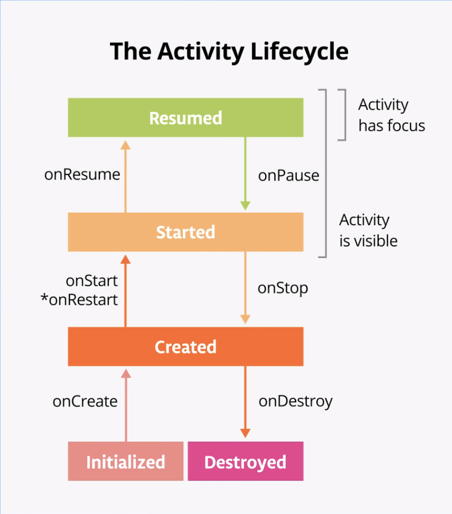
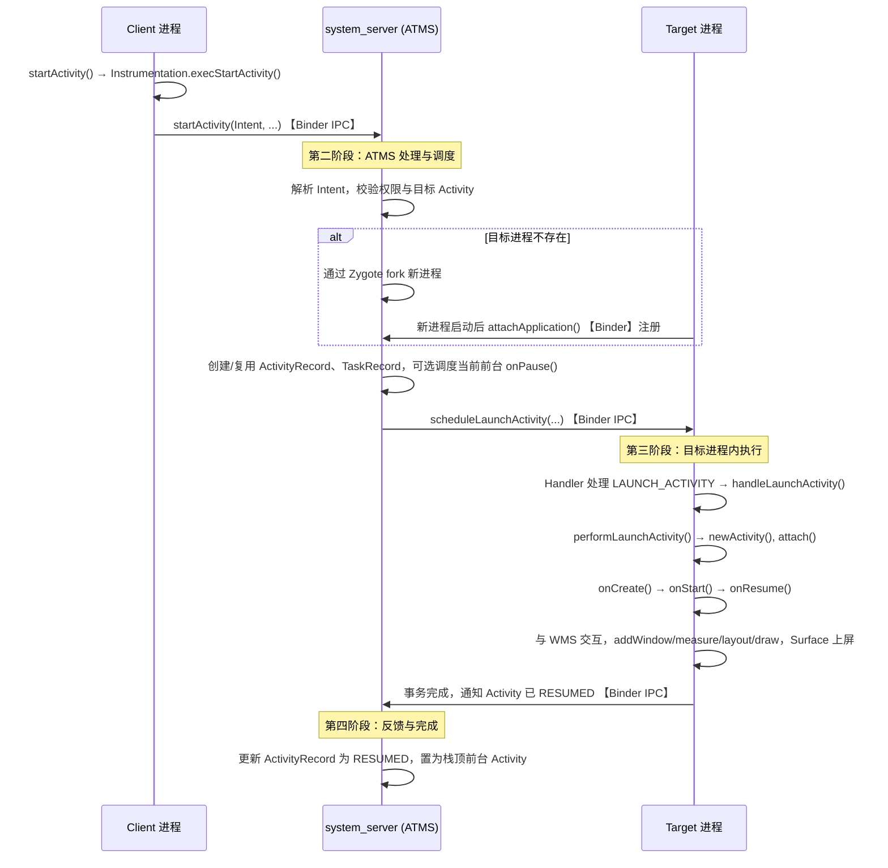
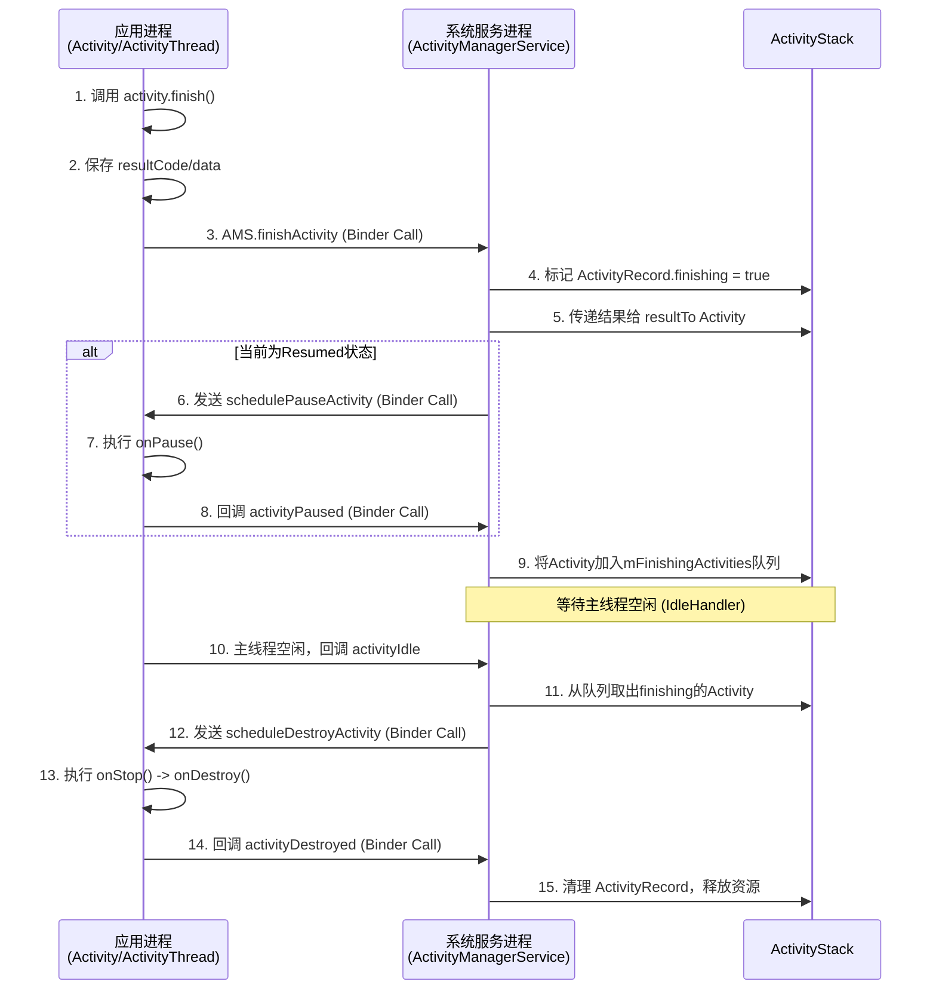
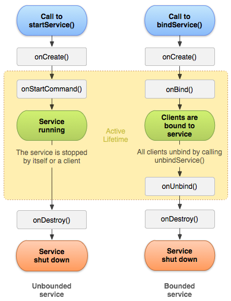

## 一、组件面试题

Android 四大组件分别是：**Activity（活动）**、**Service（服务）**、**BroadcastReceiver（广播接收器）**和**ContentProvider（内容提供者）**。

- **Activity**：负责用户界面交互，一个 Activity 通常对应一个屏幕界面。
- **Service**：在后台执行长时间运行操作，无用户界面，常用于播放音乐或网络请求。
- **BroadcastReceiver**：用于接收并响应系统或应用发出的广播消息，如电量变化、网络状态变化等。
- **ContentProvider**：用于在不同应用之间共享数据，提供统一的 URI 访问接口。

其中，Intent 可以是**显式 Intent**（明确指定目标组件）或**隐式 Intent**（通过 action、category、data 等匹配组件），是 Android 组件间解耦通信的核心机制。


### 1.1 Activity

#### Activity 的生命周期状态



不同的回调方法里面执行的逻辑的主要判断依据：

- 完整生存期的回调方法只会执行一次，而可见生存期和前台生存期的回调方法可能会执行多次。
- 可见生存期中已经部分可见了。前台生存期则表示拥有焦点，可以接收用户输入数据。


**(1) 完整生存期 (Entire Lifetime)**

从 `onCreate()`调用开始，到 `onDestroy()`调用结束。

- `onCreate(Bundle savedInstanceState)`：必须实现。如果 Activity 是重新创建的（例如配置变更后），会收到之前保存的状态 Bundle。执行的相关工作有：
  - **必须实现的初始化**：调用 `setContentView()`来绑定布局。
  - **视图初始化**：通过 `findViewById`或 View Binding/View Binding 获取布局中的视图控件。
  - **数据初始化**：初始化 Activity 所需的**关键数据成员**（但非UI数据）。
  - **配置持久化组件**：初始化 ViewModel。如果 `savedInstanceState`不为空，从中恢复 Activity 级别的临时UI状态（如文本框内容、列表滚动位置）。更复杂的数据恢复应交给 ViewModel。
  - **设置监听器**：为按钮等控件设置点击等事件的监听器。
  - **导航参数处理**：从 `Intent`的 `extras`中获取启动参数。
- `onDestroy()`：Activity 被最终销毁前调用。原因可能是用户主动关闭（按返回键）或系统为回收内存而销毁。执行的相关工作有
  - **资源清理**：确保释放所有可能造成内存泄漏的引用。例如，取消在 `onCreate`中注册的、生命周期与 Activity 绑定的回调或监听器（特别是那些持有 Context 引用的）。
  - **停止后台任务**：如果启动了任何生命周期与 Activity 绑定的线程、AsyncTask 或协程，确保在此处取消它们。
  - **解绑服务**：如果绑定了服务，应在此解绑。

**注意**：系统为回收内存而调用此方法时，不应依赖其被及时调用。**关键资源的释放（如相机、传感器）应在 `onPause()`或 `onStop()`中提前进行**。


**(2) 可见生存期 (Visible Lifetime)**

从 `onStart()`调用开始，到 `onStop()`调用结束。在此期间，Activity 对用户**可见**（可能部分被遮挡，但未完全离开屏幕）。

- `onStart()`：Activity 对用户变得可见，但还无法交互。常用于启动或恢复那些需要在界面可见时运行的操作，相关操作如下：

  - **注册与UI相关的监听器**：注册那些需要**在界面可见时更新UI**的组件。例如： 监听网络状态变化以更新UI。 注册一个 `BroadcastReceiver`来接收影响UI显示的系统广播（如屏幕锁屏/解锁）。 开始执行那些需要在用户可见时运行的**动画**。
  - **恢复UI数据**：从 ViewModel 或数据层加载数据，并应用到UI上。对于 `LiveData`的观察，通常应在 `onCreate`中设置，但 `observe`的调用是安全的，因为 `LiveData`只在 Activity 处于活跃状态（`onStart`到 `onStop`）时通知观察者。

- `onStop()`：Activity 对用户完全不可见（被其他 Activity 完全覆盖或应用进入后台）。在此应暂停或停止在 onStart中启动的、无需在不可见时运行的操作，以节省资源。相关操作如下：

  - **注销监听器**：注销在 `onStart()`中注册的、不需要在界面不可见时运行的监听器（特别是 `BroadcastReceiver`）。这是防止内存泄漏和节省电量的关键步骤。
  - **暂停或保存UI相关操作**：暂停在 `onStart()`中开始的动画。
  - **释放UI相关资源**：如果持有一些较大的资源（如位图缓存），且它们只在UI可见时需要用，可以考虑在此释放。
  - **持久化临时UI数据**：如果需要保存用户在当前界面输入的大量临时数据（如填写了一半的表单），可以在此处将数据保存到 `ViewModel`或本地数据库/`SharedPreferences`中。

  

**(3) 前台生存期 (Foreground Lifetime)**

从 `onResume()`调用开始，到 `onPause()`调用结束。在此期间，Activity 位于屏幕最顶层，**拥有焦点，可与用户交互**。

- `onResume()`：Activity 即将开始与用户交互。在此应启动需要在 Activity 位于前台并交互时运行的核心组件（如相机预览、传感器监听）。此方法中应执行**轻量、快速**的操作，因为它是Activity变为可交互前的最后一步，耗时操作会延迟用户交互。

  - **获取独占资源**：申请或重新获取**独占性系统资源**，这些资源在同一时刻只能被一个组件使用。最典型的例子是**相机**的 `lock()`或初始化预览。

  - **启动高频率更新**：启动或恢复需要**高频、实时更新**的组件，例如： 传感器的监听（如加速度计、陀螺仪）。 位置更新（GPS）。 相机预览流的处理。

  - **恢复交互状态**：如果有在 `onPause()`中暂停的游戏主循环、音频/视频播放，应在此处恢复。

- `onPause()`：当系统准备启动或恢复另一个 Activity 时调用。此时 Activity 可能部分可见但失去焦点。在此必须执行快速、轻量的操作，因为下一个 Activity 必须等待此方法返回才会继续其生命周期。不应执行耗时操作。
  - **必须释放独占资源**：**这是最重要的职责**。必须立即释放或断开在 `onResume()`中申请的独占资源，以便其他组件（如下一个要显示的Activity）可以立即使用它们。例如： 释放相机 (`unlock()`, `release()`)。 断开传感器监听。 暂停高精度的位置更新。
  - **暂停高频率操作**：暂停在 `onResume()`中开始的高频更新、游戏循环或媒体播放。
  - **提交轻量级持久化操作**：可以在此处保存用户在当前Activity中做出的、需要立即保存的变更（例如，将文档的“草稿”状态保存到数据库）。**但必须是极快的操作**，因为系统会等待此方法返回才会进入下一个Activity的生命周期。


#### Intent 显式跳转和隐式跳转

| 特性             | 显式跳转                                       | 隐式跳转                                                     |
| :--------------- | :--------------------------------------------- | :----------------------------------------------------------- |
| **目标指定**     | **明确指定**目标组件的类名。                   | **不指定**具体组件，通过 Action、Data、Category 等条件匹配。 |
| **使用场景**     | 应用**内部**的页面跳转。                       | 1. 应用**内部**解耦跳转。<br>2. 调用**系统或其他应用**的功能（如相机、相册、浏览器、地图）。<br>3. 实现可被外部调用的功能。 |
| **匹配过程**     | 直接启动，无需系统匹配。                       | 系统通过 **Intent Filter** 匹配。可能匹配到0个、1个或多个Activity。 |
| **安全性**       | 较高，直接指向已知组件。                       | 需注意安全，可能启动到非预期的组件（应使用 `resolveActivity` 检查）。 |
| **代码耦合度**   | 耦合度高，直接依赖具体类。                     | 耦合度低，发起方不关心具体由谁处理。                         |
| **核心构造函数** | `Intent(Context packageContext, Class<?> cls)` | `Intent(String action)` 或 `Intent(String action, Uri uri)`  |


在隐式跳转中，Action是一个双方约定的、公开的**字符串契约**，系统可以在运行时扮演“中介”或“服务发现者”的角色


#### Activity A跳转B，B跳转C，A不能直接跳转到C，A如何传递消息给C？

具体消息查看 [Android组件内核面试题：Activity A跳转B，B跳转C，A不能直接跳转到C，A如何传递消息给C？](https://mp.weixin.qq.com/s?__biz=Mzg3ODY2MzU2MQ==&mid=2247490363&idx=6&sn=fcd2175fbbaf495eef64a541ac3efde1&chksm=cf1119ddf86690cbbb40f2fb02dab2b69bd10ace5885f1022cba6b146bce6fa0a3935cedec82&token=1436311520&lang=zh_CN#rd)


#### Activity 的启动模式以及开发中的注意事项

**(1) 启动模式类型**

Activity 的启动模式主要有如下 4 种：

1. **Stantard 标准模式**: 默认的启动模式。每次启动一个Activity都会重新创建一个新的实例入栈，不管这个实例是否存在。
2. **SingleTop 栈顶复用模式**： 如果新 Activity 已经位于任务栈的栈顶，那么此 Activity 不会被重新创建，而是复用栈顶的实例，同时会回调该实例的 `onNewIntent()`方法。如果新 Activity 不在栈顶，则会创建新的 Activity 实例。**特点**：防止快速重复点击导致栈顶出现多个相同页面。
3. **SingleTask 栈内复用模式**：系统会先检查任务栈中是否存在该 Activity 的实例。如果存在，则直接将该实例上方的所有 Activity 出栈，使其成为栈顶，并回调 `onNewIntent()`；如果不存在，则创建新的实例。**特点**：一个任务栈中只允许存在一个该 Activity 的实例，通常用于应用的主页（MainActivity）。
4. **SingleInstance 单实例模式**：这是最特殊的模式。具有此模式的 Activity 会单独占用一个任务栈，并且该栈中只有它一个 Activity。后续请求该 Activity 时，会直接复用这个栈中的实例。**特点**：全局唯一，常用于需要与系统解耦的独立页面（如闹钟、来电界面、Launch、锁屏键的应用），在普通应用中通常不会用到。

> **“Single”**：意味着“同一个 Activity 实例，在当前情况下是唯一的，不会被重复创建”。

注意：当 Activity 使用 `SingleTop`或 `SingleTask`模式被复用时，`onCreate()`不会执行，并且`getIntent()`获取的还是旧的 Intent 数据。因此，<font color="red">**必须重写 `onNewIntent()`方法，在其中调用 `setIntent()`更新数据并重新初始化**</font>。

```java
public class DetailActivity extends AppCompatActivity {
    private TextView mDataTextView;
    private String mData;

    @Override
    protected void onCreate(Bundle savedInstanceState) {
        super.onCreate(savedInstanceState);
        setContentView(R.layout.activity_detail);
        
        mDataTextView = findViewById(R.id.tv_data);
        
        // 首次创建时，从Intent获取数据来初始化
        // getIntent() 用于获取启动当前 Activity 的那个 Intent 对象
        processIntentData(getIntent());
    }

    // 处理Intent数据的公共方法
    private void processIntentData(Intent intent) {
        if (intent != null) {
            mData = intent.getStringExtra("data_key");
            updateUI();
        }
    }

    // 更新UI
    private void updateUI() {
        if (mData != null) {
            mDataTextView.setText("当前数据: " + mData);
        } else {
            mDataTextView.setText("暂无数据");
        }
    }

    @Override
    protected void onNewIntent(Intent intent) {
        super.onNewIntent(intent);
        
        // 关键：必须调用setIntent更新Activity持有的Intent
        setIntent(intent);
        
        // 处理新的Intent数据
        processIntentData(intent);
    }
}
```

**(2) 启动模式的使用方法**

- **静态配置（在 Manifest.xml 中声明）**: 直接在 AndroidManifest.xml 文件中为 Activity 设置 `android:launchMode`属性。这个无法指定 `FLAG_ACTIVITY_CLEAR_TOP`

  ```xml
  <activity
      android:name=".activity.CourseDetailActivity"
      android:launchMode="singleTop" <!-- 设置启动模式 -->
      android:screenOrientation="portrait" />
  ```

- **动态设置（通过 Intent 的 Flags）**: 在代码中启动 Activity 时，通过 `Intent.addFlags()`方法动态指定启动行为。这种方式优先级**高于**静态配置。但这个无法指定 `singleInstance` 模式

  ```java
  Intent intent = new Intent();
  intent.setClass(context, MainActivity.class);
  intent.addFlags(Intent.FLAG_ACTIVITY_NEW_TASK); // 动态设置标记位
  context.startActivity(intent);
  ```

**(3) Activity 的 Flags**

- `FLAG_ACTIVITY_NEW_TASK`：为Activity指定 “**SingleTask**”启动模式
- `FLAG_ACTIVITY_SINGLE_TOP`: 为Activity指定 “**SingleTop**”启动模式
- `FLAG_ACTIVITY_CLEAN_TOP`: 启动时会将与该Activity在同一任务栈的其它Activity出栈，一般与SingleTask启动模式一起出现。
- `FLAG_ACTIVITY_EXCLUDE_FROM_RECENTS`: 具有此标记位的Activity不会出现在历史Activity的列表中, 这是为了防止用户通过历史列表重新回到某些页面。


#### Activity 的启动流程

**(1) 核心角色**

在 Activity 的启动流程中，Client、`system_server`、Target 三个进程，依赖 Binder IPC 进行通信。

在启动流程中，关键的类和进程主要有：

- **Client Process**：发起启动请求的**源应用进程**（例如，你点击了 App A 里的一个按钮，要启动 App B 的一个 Activity，那么 App A 就是 Client）。当用户在桌面上点击一个应用图标时，**Client Process** 就是 `Launcher` 进程。
- **ActivityTaskManagerService (ATMS)**：Android 10 (API 29) 之后，负责 Activity 生命周期、任务栈管理的**核心系统服务**，运行在 `system_server`进程。这是大脑和指挥中心，从 AMS 中拆分出来的子模块。
- **ActivityThread**: App的入口类，其main方法为应用进程java层的起点，完成启动初始化工作，并通过Binder和Handler负责应用与system_server进程间通信的消息转发工作
- **ApplicationThread**：应用进程中的一个核心 Binder 对象，它是 **ATMS 与目标应用进程通信的桥梁**。ATMS 通过它向应用进程发送调度 Activity 生命周期等命令。其本质上是 ActivityThread 中的一个成员变量。
- **WindowManagerService**: Activity 负责逻辑和视图树，`WindowManagerService`负责窗口管理和 `Surface`分配，`SurfaceFlinger`负责最终合成显示。
- **Target Process**：即将启动的 Activity 所在的**目标应用进程**（如果应用未启动，则需要先创建进程）。

**(2) 启动流程**

**第一阶段：Client → ATMS (发起请求)**

1. **调用 startActivity**：在 Client Process 中，调用 `Context.startActivity()`或 `Activity.startActivityForResult()`。
2. **层层转发**：
   - 请求会经过 `Instrumentation.execStartActivity()`。
   - 然后通过 `ActivityTaskManager.getService()`获取到 ATMS 的 Binder 代理对象 (`IActivityTaskManager`)。
3. **IPC 调用**：Client Process 通过 Binder IPC，调用运行在 `system_server`进程中的 **ATMS** 的 `startActivity`方法，将启动信息（Intent、Flags 等）传递过去。

**此时，控制权从 Client 应用进程移交给了系统服务进程 (ATMS)。**

**第二阶段：ATMS 处理与调度 (系统服务进程)**

1. **解析与校验**：ATMS 解析 Intent，确定目标 Activity、所在包名与进程名，校验权限、Intent 合法性及是否存在目标 Activity。
2. **进程决策**：若目标应用未运行，ATMS 会通过 `Process.start()` 等途径请求 **Zygote** fork 出新进程，新进程入口为 `ActivityThread.main()`；若进程已存在，则复用。
3. **任务栈管理**：创建或复用 **ActivityRecord**、**TaskRecord**，根据 LaunchMode、Flags 决定是否新建 Task、是否复用已有 Activity、是否清理栈顶等。
4. **暂停当前前台**：若需要先显示新 Activity，ATMS 会调度当前前台的 Activity 执行 `onPause()`（通过其所在进程的 ApplicationThread 下发）。
5. **调度目标进程**：ATMS 通过 Binder 调用 **Target Process** 中 **ApplicationThread** 的 `scheduleTransaction()`（内部包含 `scheduleLaunchActivity` 等），将启动参数（Intent、Token、Configuration 等）传给目标进程。

**此时，控制权从 system_server 移交到目标应用进程。**

**第三阶段：Target Process（目标应用进程内执行）**

1. **收到启动请求**：`ApplicationThread.scheduleLaunchActivity()` 被 ATMS 跨进程调用后，将启动信息封装成 **Message**，通过 **ActivityThread 内部的 Handler (H)** 发送到主线程消息队列。
2. **Handler 处理**：主线程 **H** 收到 `LAUNCH_ACTIVITY` 等消息后，调用 `ActivityThread.handleLaunchActivity()`，进而通过 **Instrumentation** 执行 `newActivity()` 创建 Activity 实例，并调用 `Activity.attach()` 完成与 Context、Window 的绑定。
3. **生命周期回调**：依次执行 `Instrumentation.callActivityOnCreate()` → `onCreate()`，随后 `handleStartActivity()` → `onStart()`，再通过 `ActivityThread.performResumeActivity()` → `onResume()`。
4. **窗口与显示**：在 `onResume()` 前后，Activity 的 **Window** 被加入 **WindowManager**（与 WMS 交互），完成 **DecorView** 的添加、**ViewRootImpl** 的创建、**Surface** 的分配与 **measure/layout/draw**，最终由 **SurfaceFlinger** 合成上屏，用户看到界面。

**第四阶段：反馈与完成**

1. **报告 ATMS**：当目标 Activity 完成 `onResume()` 及本次启动事务后，目标应用进程会通过 Binder IPC 通知 ATMS：本次事务已执行完毕（Activity 已进入 **RESUMED** 状态）。在源码中体现为事务执行完成后向 ATMS 的回调。
2. **更新状态**：ATMS 收到反馈后，将其内部 **ActivityRecord** 的状态更新为 **RESUMED**，并将该 Activity 置于任务栈顶，标记为当前前台 Activity。
3. **流程结束**：至此，一次完整的跨进程 Activity 启动流程结束，用户看到新界面，系统状态与各进程内的生命周期一致。

---

**(3) Activity 启动流程时序图**




#### Activity 的销毁场景有哪些？

在 Android 中，Activity 的销毁是系统为了管理内存和任务栈而采取的关键操作，其过程严格遵循生命周期回调。销毁主要分为配置变更销毁和完全销毁两种场景。

> **划分依据**：按**销毁后是否会被系统立即重建**（或说**本次销毁是否“终结”该界面**）来区分。对应到代码，可在 `onDestroy()` 里通过 **`isFinishing()`** 判断：为 `false` 表示因配置变更等导致的临时销毁，系统会马上重建新实例；为 `true` 表示用户或代码主动结束界面或进程被系统回收，不会重建。

**(1) 配置变更销毁 (可恢复的临时销毁)**

- **触发条件**：设备配置发生改变，如屏幕旋转、语言切换、多窗口模式切换。

- **特点**：系统会自动重建一个新的 Activity 实例。在销毁前，系统会调用 `onSaveInstanceState()`来保存界面状态（如文本框内容），并在重建后恢复。

- **流程**：在Actvity 销毁时，系统依次调用 `onPause() -> onStop() -> onDestroy()`完成销毁，然后立即创建一个新实例并恢复状态。

注意，切勿依赖 `onSaveInstanceState()`保存永久数据（如用户设置、数据库记录），它仅用于临时UI状态。永久数据应在 `onPause()`中保存到持久化存储。

**(2) 完全销毁 (通常不可逆)**

- **触发条件**：
  -  **用户主动退出**：按返回键，或代码调用 `finish()`、`finishActivity()`。 
  -  **系统资源回收**：当系统内存极度不足时，会杀死后台进程及其中的 Activity。

- **特点**：这是 Activity 生命周期的**真正终结**。如果是用户主动退出，实例被销毁；如果是系统回收，进程可能被杀死。

- **流程**：在Actvity 销毁时，系统依次调用 `onPause() -> onStop() -> onDestroy()`完成销毁，最终实例被垃圾回收器回收。


#### 为什么配置变更的时候，要销毁Activity 并重新创建？

**为了保证应用界面与新的系统配置（如横竖屏、语言、字体大小等）所使用的资源能够正确、自动地匹配。**系统通过“销毁-重建”的机制，确保新的Activity实例能够从一个干净的状态开始，并加载完全匹配当前新环境的最优资源。同时，为了防止用户体验中断（如输入的文字消失），Android 提供了**状态保存机制**来弥补销毁重建的副作用。

**(1) Activity 重建——匹配新配置的资源**

Android应用资源是**基于配置（Configuration）进行分目录管理**的（例如：`layout-port/`, `layout-land/`, `values-zh/`, `drawable-hdpi/`）。当配置（configuration）改变时，应用可用的资源集合可能完全改变了。最典型的例子就是屏幕旋转：

- 布局文件不同：竖屏（portrait）时使用 `layout/main.xml`，横屏（landscape）时系统会尝试寻找并加载 `layout-land/main.xml`。这是两个不同的布局文件。
- 资源引用不同：`drawable-hdpi`和 `drawable-xhdpi`的图片、不同语言的 `strings.xml`值、不同尺寸的 `dimens.xml`值等，都会根据新配置切换。

系统需要确保 Activity 的界面与新配置下的最佳资源相匹配。 而最简单的实现方式，就是销毁旧实例，并用新配置重新走一遍创建流程。这个流程保证了：

- `onCreate(Bundle)`会被再次调用，并传入新的 `Configuration`对象，系统可以据此加载正确的资源。
- 所有基于配置的资源获取（如 `getResources().getString(...)`）都能得到与新环境匹配的值。

**(2) Activity 不重建可能导致的问题**

- 布局错乱：假设Activity不重建，其内部的View树仍然是根据旧布局文件（如竖屏布局）构建的。横屏专用的布局文件（`layout-land/`）将无法自动生效，导致显示异常。

- 资源陈旧：通过`getResources()`获取的字符串、图片等资源，可能仍是旧配置下的缓存，不会自动更新。

- 状态不一致：Activity内部持有的`Configuration`对象会过时，任何基于此对象做逻辑判断的代码都会出错。


#### 如何摧毁 Activity ？

销毁 Activity是一个由**应用进程发起 -> 系统服务调度 -> 应用进程执行**的复杂闭环，核心在于 AMS 对 `ActivityRecord`状态的管理和跨进程通信的协调。

> 具体细节可以查看 [Android组件内核面试题：Acitvity的生命周期，如何摧毁一个Activity?](https://mp.weixin.qq.com/s?__biz=Mzg3ODY2MzU2MQ==&mid=2247490363&idx=3&sn=97854c3d5e8197b1929b1cff8a629445&chksm=cf1119ddf86690cb4c82184dc5d0d3e2c1a2b2864c744d36ae3a1feabeb5125e1639403b3215&token=1436311520&lang=zh_CN#rd)

这是一个涉及**应用进程**与**系统服务进程**（`System_Server`）跨进程协作的经典流程。整个过程体现了 Android 框架**安全第一**和**用户体验优先**的设计思想。先保证 `onPause()`立即执行以释放关键资源（如摄像头），再<font color="red">**将耗时的停止和销毁操作延迟到空闲时处理**</font>，避免卡顿。同时，通过 AMS 集中管理所有 `ActivityRecord`的状态，确保了多任务环境下的秩序。

> ActivityThread是 Android 系统中一个核心的内部类，并不是一个线程。它是每个应用进程的主线程（UI线程）的真正入口和总控中心,  负责调度和管理应用程序中所有与 Activity、Service、BroadcastReceiver 等组件的生命周期事件和消息处理，与主线程的 Looper 和 Handler 紧密协作。



其中，

- **步骤 3 & 6 & 12**：这是三次核心的**跨进程 Binder 调用**，是驱动整个流程的引擎。

- **步骤 7**：**`onPause()`是保证会立即执行的**，这是生命周期回调的“最后保障”。

- **步骤 9-11**：体现了 **“空闲执行”** 机制，`onStop()`和 `onDestroy()`被延迟，以确保UI流畅。

- **步骤 13**：在应用进程内部，`onStop()`和 `onDestroy()`是连续执行的。

**(1) 请求阶段（应用进程 -> 系统服务）**

当我们在 Activity 中调用 `finish()`时，工作还在应用进程内。

- **数据暂存**：如果之前调用了 `setResult()`，系统会先将 `resultCode`和 `resultData`暂存在 Activity 的成员变量中。这个主要是给后续的父Activity 来使用的。 父Activity的 `ActivityThread`收到数据后，最终会回调其 `onActivityResult(int requestCode, int resultCode, Intent data)`方法。
- **发起请求**：接着，通过 Binder IPC 调用 `ActivityManagerService`的 `finishActivity`方法，正式向系统服务发出销毁请求。


**(2) 调度与暂停阶段（系统服务进程）**

AMS 作为“总指挥”，接管后续流程，核心目标是**安全地暂停当前 Activity 并准备下一个**。

- **状态标记**：AMS 找到对应的 `ActivityRecord`，将其 `finishing`标志设为 `true`。
- **结果传递**：将之前暂存的 `resultCode`和 `data`传递给启动它的父 Activity（如果有）。
- **关键暂停**：如果此 Activity 当前是 `Resumed`状态，AMS 会先调用 `startPausingLocked`，再次通过 Binder 通知**应用进程**执行 `onPause()`生命周期回调。**这是保证界面响应的关键，必须在销毁前让 Activity 进入暂停状态。**
- **启动下一个**：在确认当前 Activity 进入 `Paused`状态后，AMS 会开始恢复任务栈中下一个应该显示的 Activity。

> 


**(3) 停止与销毁阶段（系统服务 -> 应用进程）**

当主线程空闲时，系统才会执行最后的资源回收。

- **进入停止队列**：被标记为 `finishing`的 Activity 会被放入一个 `mStoppingActivities`或 `mFinishingActivities`队列中。
- **空闲时处理**：系统通过 `IdleHandler`机制，在应用主线程消息队列空闲时，才通知 AMS。
- **执行销毁**：AMS 在 `activityIdleInternal`中处理队列，向应用进程发送 `scheduleDestroyActivity`调用。
- **最终回调**：应用进程的 `ActivityThread`收到指令后，依次调用 `onStop()`和 `onDestroy()`，并最终通知 `WindowManager`移除其窗口和界面资源。

> Idler 是 Android 系统中一种**利用主线程空闲时间执行任务的机制**。它本质上是一个回调接口，当主线程（UI 线程）的消息队列处理完所有待处理消息、暂时没有新任务时，系统就会调用 Idler 来执行一些**非紧急、低优先级的后台任务**。


#### 如何保存Activity 的状态?

在Android中，以下几种情况会使Activity的状态发生变化，并且用户期望在某些情况下状态得以保留：

1. **配置变更**（如屏幕旋转）：用户期望在配置变更后，界面能恢复到之前的状态（例如，输入框中的文本不丢失）。
2. **系统自动销毁Activity**（当系统内存不足时）：用户期望在应用被系统销毁后重新返回时，之前的界面状态依然存在。
3. **手动销毁Activity**（如点击返回键或在概览界面划掉应用）：用户期望下一次重新打开应用时，它是一个全新的空白状态。

对于前两种情况，系统默认会销毁Activity并清除其状态，但这不符合用户期望。因此，Android提供了专门的机制来保存“界面瞬态”。**对于配置变更销毁 (可恢复的临时销毁) ， 使用ViewModel**；**对于完全销毁 (通常不可逆)，使用`onSaveInstanceState()`**。

> ViewModel 的数据存储在内存中，进程被杀死意味着其所在的内存空间被系统回收，其中的数据（包括 ViewModel 实例及其持有的数据）**会全部丢失**。

| 特性             | ViewModel                                                    | onSaveInstanceState()                                        |
| :--------------- | :----------------------------------------------------------- | :----------------------------------------------------------- |
| **数据保存时机** | 配置变更期间，ViewModel 实例**保留在内存中**，其数据随之自动保留。 | 在 **Activity 可能被销毁** 时（包括配置变更、应用在后台被系统回收等场景）被系统回调，用于保存数据。 |
| **数据存储位置** | **内存**。                                                   | 序列化后存入**磁盘**（一个系统管理的 Bundle）。              |
| **主要设计目的** | 在**配置变更**（如屏幕旋转、语言切换）期间，保留相对**较大、非瞬态**的界面相关数据（如用户列表、网络加载结果）。 | 在**进程被系统终止**后，保存**少量、关键的瞬态**界面状态（如滚动位置、未提交的表单内容），以便在用户返回时恢复。 |
| **数据大小限制** | 无严格限制（但受限于可用内存）。                             | **有严格限制**，因为 Bundle 需要序列化/反序列化并通过 Binder 传递，存储过大的数据会导致 **TransactionTooLargeException**。 |
| **生命周期关联** | 与 Activity 的“逻辑生命周期”关联，在 Activity 真正销毁（如用户按返回键）时才被清理。 | 与 Activity 实例的“进程生命周期”关联，仅在进程可能被杀死时触发保存。 |


同时，系统提供了 `SavedStateHandle` 工具。它让ViewModel也能拥有跨进程终止的持久化能力，适用于那些既需要在配置变更时保留（ViewModel特性），又需要在进程被杀死后能恢复（`onSaveInstanceState`特性）的数据。

```java
public class MyViewModel extends ViewModel {
    // 关键：持有 SavedStateHandle 对象
    private SavedStateHandle savedStateHandle;

    // 关键：构造函数接收 SavedStateHandle
    public MyViewModel(SavedStateHandle savedStateHandle) {
        this.savedStateHandle = savedStateHandle;
    }

    // 保存数据到 SavedStateHandle
    public void saveText(String text) {
        savedStateHandle.set("my_key", text);
    }

    // 从 SavedStateHandle 读取数据
    public String getSavedText() {
        // 如果“my_key”不存在，则返回默认值“默认文本”
        return savedStateHandle.get("my_key");
    }
}


public class MainActivity extends AppCompatActivity {

    private MyViewModel viewModel;
    private EditText editText;
    private TextView textView;
    private Button saveButton;

    @Override
    protected void onCreate(Bundle savedInstanceState) {
        super.onCreate(savedInstanceState);
        setContentView(R.layout.activity_main);

        editText = findViewById(R.id.editText);
        textView = findViewById(R.id.textView);
        saveButton = findViewById(R.id.saveButton);

        // 关键步骤：使用 SavedStateViewModelFactory 创建 ViewModelProvider
        SavedStateViewModelFactory factory = new SavedStateViewModelFactory(getApplication(), this);
        viewModel = new ViewModelProvider(this, factory).get(MyViewModel.class);

        // 1. 恢复数据：从 ViewModel (通过 SavedStateHandle) 读取上次保存的文本，并显示
        String savedText = viewModel.getSavedText();
        if (savedText != null) {
            textView.setText("已保存的文本: " + savedText);
        }

        // 2. 保存数据：点击按钮时，将输入框的文字保存
        saveButton.setOnClickListener(v -> {
            String input = editText.getText().toString();
            viewModel.saveText(input); // 保存到 SavedStateHandle
            textView.setText("已保存的文本: " + input);
            editText.setText(""); // 清空输入框
        });
    }
}
```


#### **为什么配置变更时 ViewModel 能保留数据，按返回键（仍在应用内）却不能？**

**考点**  

- 区分「配置变更销毁」与「用户主动结束 / 返回导致的销毁」；  

- 理解 ViewModel 的存活范围：谁持有 ViewModelStore、在什么时机被清空；  
- 理解系统对“临时销毁”和“最终销毁”的不同处理。

**答案要点**  

1. **配置变更时**：系统只是**为了换配置而临时销毁并重建**当前 Activity，进程还在，**不会**调用 `ViewModelStore.clear()`。`ComponentActivity` 在配置变更时会把 **ViewModelStore** 交给系统暂存（或通过保留的机制持有），新 Activity 实例创建后会**拿回同一个 ViewModelStore**，所以同一个 ViewModel 实例仍在，数据自然保留。  

2. **按返回键（或 finish）时**：表示用户**结束**当前界面，Activity 会走**最终销毁**（`onDestroy()` 且 `isFinishing() == true`）。此时会调用 **`ViewModelStore.clear()`**，所有 ViewModel 的 `onCleared()` 被调用并释放，ViewModelStore 被清空。下次再进入该界面是**全新的 Activity 和全新的 ViewModel**，因此不会保留上次的数据。  

ViewModel 的设计是“在**同一界面逻辑生命周期内**保留数据”。配置变更只是同一界面的“重建”，所以保留；返回键是“离开该界面”，生命周期结束，所以不保留。若需要在按返回键后仍保留数据，应把数据放到更大作用域（如上级 Activity 的 ViewModel、单例、数据库等），而不是依赖当前 Activity 的 ViewModel。


#### 如何退出 Activity？如何安全退出已调用多个Activity的Application？

[40个比较重要的Android面试题 - 博启 - 博客园](https://www.cnblogs.com/WangQuanLong/p/5826098.html)


#### 如何在 Activy 被销毁前保存数据？onSaveInstanceState () 和 onPause () 有何不同？

用 onSaveInstanceState () 保存临时数据，它在 Activity 可能被销毁前调用（如旋转屏幕），适合保存轻量数据；

onPause () 用于持久化数据（如保存到数据库），在 Activity 失去焦点时必调用，无论是否销毁。


#### 什么是 Activity 栈？系统如何管理多个 Activity 的栈结构？

Activity 栈（Task）是管理 Activity 的后进先出队列。启动新 Activity 时入栈，按返回键时出栈。默认一个应用对应一个栈，可通过 taskAffinity 属性指定不同栈。


### 1.2 Service 

#### Service 的启动方式及应用场景

**(1) 启动方式类型**

Service 的启动方式主要有：

- **启动式 Service（Started Service）**：通过 startService() 启动，即使启动组件被销毁，Service 仍可继续运行
- **绑定式 Service（Bound Service）**：通过 bindService() 绑定，多个组件可以绑定到同一个 Service，当所有组件都解绑后，Service 会被销毁


| 特性         | 启动式Service (Started Service)         | 绑定式Service (Bound Service)       |
| ------------ | --------------------------------------- | ----------------------------------- |
| **启动方式** | `startService()`                        | `bindService()`                     |
| **生命周期** | 独立于调用者，可长时间运行              | 依赖绑定者，所有客户端解绑后销毁    |
| **停止方式** | 需显式调用`stopService()`或`stopSelf()` | 自动销毁（当所有客户端解绑时）      |
| **交互模式** | 单向操作，无法直接返回值                | 双向通信，可通过IBinder进行方法调用 |
| **使用场景** | 执行独立后台任务                        | 提供功能接口给多个组件              |
| **返回数据** | 通常通过Broadcast、EventBus等           | 可直接通过Binder接口返回            |


**(2) 应用场景**

启动式 Service 启动后跟启动组件就没有关联了，不支持双向通信，适合执行独立的、长时间的后台任务，例如文件上传/下载、定时同步数据。

而绑定式 Service 启动后跟启动组件有关联，支持双向通信，可以给多个组件提供可交互的、共享的服务功能，例如 音乐播放器（需要控制播放、暂停、获取进度）、跨应用功能提供（如地图、支付等SDK）。


#### Service 的生命周期

Android Service 的生命周期根据启动方式不同而有所差异。




#### 在什么样的情况下使用 Service？

在需要**独立于UI、在后台持续执行**任务时考虑使用 Service。主要场景包括：

1. **长期后台任务**：如音乐播放、文件下载、位置追踪。
2. **前台服务**：需要用户感知的重要任务（如导航、录音），必须在通知栏显示。
3. **跨进程通信**：为其他应用提供功能接口。

**注意**：现代开发中，可延迟的任务优先用 WorkManager；简单异步用协程。由于 Android 对后台限制严格，普通后台服务已基本不可用，大多数情况需用前台服务。

> **Android的后台就是指，它的运行是完全不依赖UI的，**即使Activity被销毁，或者程序被关闭，只要进程还在，Service就可以继续运行。


#### Service 在子线程里面单独运行吗？

在 Android 中，默认情况下，Service 是在**主线程**中运行的，而不是在单独的线程中。如果你在 Service 中执行耗时操作（如网络请求、大文件读写等），就会阻塞主线程，导致应用无响应（ANR）。

同时，Foreground Service 也是在主线程里面运行的。


#### Service 和 Thread 的区别？

- **定义**：**Thread** 是程序执行的**最小单元**（CPU 调度单位），用来在子线程里做耗时操作、避免阻塞主线程。**Service** 是 Android **四大组件之一**，由系统托管、有生命周期，用来在**后台持续运行**且不依赖界面。
- **关系**：二者**不是二选一**。Service 默认运行在**主线程**，若在 Service 里直接写耗时逻辑会 ANR，因此**应在 Service 内创建子线程**（或线程池、协程）执行耗时任务，用 Service 做“后台任务载体”，用 Thread 做“实际执行单元”。
- **为何需要 Service**：若任务需**长期运行**且**在 Activity 销毁后仍可被控制**（如音乐播放、下载管理、心跳保活），单用 Thread 时，Activity 销毁后难以再对该线程做停止或查询；用 Service 则任意组件都可通过 `startService` / `stopService`、`bindService` 与**同一 Service 实例**交互，由系统统一管理，便于跨界面控制。


### Service 怎么和 UI 线程通信？

Android 里跨进程 IPC 底层都是 Binder。在没有用 AIDL 接口的情况下，而是用官方封装的 `Messenger` + `Handler` + `Message`：

- `Messenger` 里包着一个 Binder（`serviceMessenger.binder`）
- 发送方调用 `messenger.send(message)`
- 接收方在 `Handler.handleMessage` 里按 `msg.what` 分发

Binder 事务里装的就是 `Message` 及其 `Bundle data`（Parcel 序列化）。

注意，Binder 缓冲区是由上限的，如果超过，会出现问题。


#### Service 和 IntentService 的区别？（含 IntentService 原理）

- **IntentService**: **Service** 运行在**主线程**，，耗时操作需自己在 Service 里起子线程来运行，避免 ANR。但 可直接用 IntentService，避免自己在 Service 里开线程。 
- **IntentService**：继承 Service，在 **onCreate** 里创建 **HandlerThread**，用其 Looper 构造 **Handler**；每次 **onStart**（或 onStartCommand 内部调用 onStart）时把 Intent 封装成 **Message** 发到该 Handler，在 **Handler 的 handleMessage** 里调用子类实现的 **onHandleIntent(Intent)**，执行完后 **stopSelf(startId)**。因此 **onHandleIntent 在子线程执行**，耗时操作不会阻塞主线程，也不会 ANR。

**注意**：IntentService 在 API 30 已废弃，现代开发推荐 WorkManager、协程等，但理解其“HandlerThread + Handler + 子线程 onHandleIntent”的实现有助于回答原理类面试题。


#### 在有前台服务和 WorkMangger 的基础上，后台服务还有什么应用场景？

“后台服务”作为一种独立的、完整的后台任务解决方案，其应用场景在 Android 8.0 之后已基本消失。但它作为一种“组件角色”和“代码基类”，在特定的、受限制的上下文中仍有其不可替代的价值。

- 做为 **“前台服务的准备状态”**

- 作为 **“纯绑定服务”**。例如，实现一个 AIDL 接口，为其他应用提供专业的图像处理或数据加密服务。
- 处理 **“前台任务中的短暂后台工作”**


#### 后台和前台服务的关系是什么？前台服务可以降级为后台服务吗？

- **后台服务** 是服务的**基础状态**。它是一个能在后台执行操作的组件，但自 Android 8.0 起，它**不被允许在应用退到后台后持续运行**。
- **前台服务** 是服务的**提升状态**。通过调用 `startForeground()`并提供一个持续的通知，它向系统和用户宣告：“我正在执行一个用户关心的任务，请允许我在后台继续运行。”

**它们本质上是同一个 `Service`类的实例，通过一个 API 调用 (`startForeground`/ `stopForeground`) 来切换其“前台身份”。**


#### 绑定服务是否受后台启动限制的吗？

**(1) 启动方式决定限制**

系统的“后台执行限制”（Android 8.0+）针对的是 **`startService()`** 这个方法。这条规则是：

> **当应用处于后台时，禁止调用 `Context.startService()`。**

而 `bindService()`是另一条完全独立的通道，不受此规则约束。

**(2) 绑定服务被允许的原因**

因为绑定服务的设计意图和生命周期与可启动服务有本质不同：

1. 依赖客户端而存在：一个纯绑定服务（即仅通过 `bindService()`绑定，未调用 `startService()`或 `startForeground()`）的生命周期与其客户端（如 Activity）紧密绑定。当所有客户端都解绑后，系统会立即销毁该服务。 它不会“在后台偷偷运行”。
2. 是“组件”而非“任务”：系统将其视为一个可交互的组件，而非一个独立执行的后台任务。它更像是一个“服务器”，等待“客户端”的连接和请求，自身不主动执行耗时操作。
3. 不消耗额外资源：理论上，如果该服务只是应用主进程中的一个组件，绑定它并不会像启动一个前台服务那样持续消耗用户注意力和系统资源。


#### Service 的 onStartCommand () 返回值有哪些类型？

有三种：START_STICKY（重启后不保留 Intent）、START_NOT_STICKY（不自动重启）、START_REDELIVER_INTENT（重启后重发 Intent）。


#### 如何在 Service 和 Activity 之间进行双向通信？

通过 Binder 机制，Service 在 onBind () 中返回自定义 Binder 对象，Activity 绑定后通过 Binder 调用 Service 方法；或用 EventBus、LiveData 等跨组件通信工具。


#### 远程 Service 和本地 Service 的区别是什么？

本地 Service 与应用在同一进程，通信快（直接调用）；

远程 Service 独立进程，需通过 AIDL 跨进程通信，适合给其他应用提供服务，开销较大。


### 1.3 BroadcastReceiver

#### 广播的两种注册方式有什么区别？

- 静态注册（Manifest 声明）：应用未启动也能接收，耗电，Android 8.0 后对隐式广播限制严格；

- 动态注册（代码中注册）：随组件生命周期，灵活可控，需手动注销。


#### Android 8.0 后对静态广播有哪些限制？

8.0 后静态注册无法接收大部分隐式广播，需使用显式广播（指定包名）或动态注册，系统广播（如开机完成）不受影响。


#### 有序广播和无序广播的区别是什么？

有序广播按优先级接收，可被拦截（abortBroadcast ()）和修改数据；

无序广播所有接收者同时收到，无法拦截，效率高。


#### 本地广播和全局广播的区别是什么？

本地广播（LocalBroadcastManager）仅在应用内传播，安全高效；

全局广播可跨应用，存在安全风险（如数据泄露）。


#### 如何防止广播被恶意接收或发送？

发送时指定权限（sendBroadcast (intent, permission)），接收时在 Manifest 声明对应权限；使用显式广播，避免隐式广播被滥用。


#### 系统常见的广播事件有哪些？

如开机完成（ACTION_BOOT_COMPLETED）、网络变化（ACTION_CONNECTIVITY_CHANGE）、电量低（ACTION_BATTERY_LOW）、安装应用（ACTION_PACKAGE_ADDED）等。


#### 动态广播为什么必须在 onDestroy () 中注销？

若不注销，广播接收器会持有 Activity 引用，导致内存泄漏；Activity 销毁后，接收器仍可能接收事件，引发空指针异常。


### 1.4 ContentProvider

#### ContentProvider 的核心作用是什么？

提供跨进程数据共享的标准化接口，封装数据访问逻辑，支持细粒度权限控制，常用于系统数据（如联系人、媒体库）和应用间数据共享。


#### 如何实现一个自定义 ContentProvider？

继承 ContentProvider，实现 query/insert/update/delete/getType 方法，在 Manifest 中注册并指定 authority，通过 Uri 匹配器（UriMatcher）处理不同请求。


#### ContentResolver 和 ContentProvider 是什么关系？

ContentResolver 是客户端访问数据的入口，通过 Uri 统一调用不同 ContentProvider 的方法，隐藏具体实现，实现解耦。


#### Uri 的结构是什么？

格式为 content ://authority/path/id，如 content://com.example.provider/user/1，其中 authority 是唯一标识，path 表示数据集合，id 是具体记录。


#### 系统提供了哪些常用的 ContentProvider？

联系人（ContactsContract）、媒体库（MediaStore）、日历（CalendarContract）、下载管理（Downloads）等。


### 1.5 Intent

#### Intent 的作用是什么？

Intent 可以是**显式 Intent**（明确指定目标组件）或**隐式 Intent**（通过 action、category、data 等匹配组件），是 Android 组件间解耦通信的核心机制。例如：

- 启动 Activity（如 `startActivity(intent)`）
- 启动或绑定 Service（如 `startService(intent)`、`bindService(...)`）
- 发送广播（如 `sendBroadcast(intent)`）
- 访问 ContentProvider（通过 URI + 指定操作）


## 二、布局与UI 

### 2.1 View 基本概念


### 2.2 事件分发

#### ACTION_CANCEL 在什么场景下触发？

**考察点**：是否理解触摸事件序列的“取消”语义；与 DOWN/MOVE/UP 的区别及典型触发时机。

**答案要点**：

`ACTION_CANCEL` 是 `MotionEvent` 的一种动作，表示**当前触摸序列被取消**，后续不会再收到该序列的 UP 等事件，也不会触发点击、长按等逻辑。常见触发场景：

- **父 View 中途拦截**：子 View 已消费了 DOWN（甚至几次 MOVE）后，父 View 在后续某次事件中 `onInterceptTouchEvent()` 返回 true 拦截。子 View 会收到 **ACTION_CANCEL**，父 View 则从新的 DOWN 开始自己的序列。
- **窗口/触摸区域变化**：手指仍在屏幕上，但窗口失去焦点、被覆盖或界面切换（如弹出 Dialog、Activity 被盖住）。系统会向此前正在接收事件的 View 发送 **ACTION_CANCEL**，表示该序列不再有效。
- **多指或系统手势**：手势被识别为其他用途（如系统手势、多指操作），当前 View 的这条指针序列会被取消，也会收到 **ACTION_CANCEL**。


### 2.2 View 绘制

#### View 的绘制流程

View 的绘制流程是一个递归的树形遍历过程，通过 `Measure` → `Layout` → `Draw` 确定每个 View 的尺寸、位置和内容。理解其底层机制（如 VSYNC、双缓冲）和优化手段，是开发高性能 UI 的关键。

```
 private void performTraversals() {
            ...
            WindowManager.LayoutParams lp = mWindowAttributes;
            ...
            int childWidthMeasureSpec = getRootMeasureSpec(mWidth, lp.width);
            int childHeightMeasureSpec = getRootMeasureSpec(mHeight, lp.height);
            ...
            // measur过程
            performMeasure(childWidthMeasureSpec, childHeightMeasureSpec);
            ...
            // layout过程
            performLayout(lp, mWidth, mHeight);
            ...
            // draw过程
            performDraw();
            ...
    }
```


#### 自定义 View 的注意事项

- 根据应用场景选择自定义的 View 类型。
- **禁止在 `onDraw`中创建对象**：`onDraw`每秒可能调用 60 次，频繁创建 `Paint`、`Path`等对象会导致内存抖动（频繁 GC），引发卡顿。应将对象声明为**成员变量**并在构造函数中初始化。

- **避免使用 `Handler`**：View 已提供 `post()`和 `postDelayed()`方法，能确保任务在 UI 线程安全执行，无需额外创建 Handler。


#### 自定义 View 和 ViewGroup 的区别

**考察点**：是否理解两者职责差异（单 View 绘制 vs 容器布局）、在事件分发与测量/绘制流程中的不同。

**答案要点**：

**(1) 概念与职责**

- **自定义 View**：继承自 `View`，只负责**自身**的展示与交互，核心是**绘制**（`onDraw`）。
- **自定义 ViewGroup**：继承自 `ViewGroup`，负责**管理子 View**，核心是**测量与布局**（`onMeasure`、`onLayout`），以及子 View 的绘制调度。

**(2) 事件分发**

- **View**：参与 `dispatchTouchEvent()`、`onTouchEvent()`，无拦截逻辑。
- **ViewGroup**：在此基础上多出 **`onInterceptTouchEvent()`**，用于决定事件是交给子 View 还是由自己消费，因此才能实现“先问子 View、再决定是否拦截”的传递流程。

**(3) UI 绘制**

- **View**：主要重写 `onMeasure()`、`onLayout()`（子 View 常为空）、`onDraw()`，只处理自己。
- **ViewGroup**：除上述外，还需在 `onMeasure()` 中测量子 View、在 `onLayout()` 中摆放子 View，并通过 **`dispatchDraw()`**、**`drawChild()`** 调度子 View 的绘制。


#### view 的绘制流程是从 Activity 的哪个生命周期方法开始执行的

View的绘制流程是从Activity的 onResume 方法开始执行的。


#### Activity、Window、View 三者的联系和区别

**考察点**：是否理解 UI 显示链条中三者的角色与委托关系；Window 作为中间层的作用。

**答案要点**：

**(1) 三者联系——协同工作**

三者通过委托形成完整的 UI 显示链条：

- **Activity 持有 Window**：在 `Activity.attach()` 中，系统创建 `PhoneWindow` 并赋给 Activity 的 `mWindow`。
- **Window 承载 View**：Window 内有顶级 View **DecorView**（FrameLayout）。`Activity.setContentView()` 实际调用 `PhoneWindow.setContentView()`，将布局解析成 View 树并添加到 DecorView 的 **content 区域**。
- **View 依附于 Window**：View 通过 Window 才能显示。Window 通过 **ViewRootImpl** 与 **WindowManagerService (WMS)** 通信，最终把 View 绘制到屏幕。

> 示意图见 [简述一下 View 的绘制流程-腾讯云开发者社区](https://cloud.tencent.com/developer/article/1745688)。


**(2) 三者区别——职责分离**

Window 作为中间层**解耦** Activity 与 View，使两者职责单一：

| 组件         | 角色定位            | 核心职责                     | 关键特性                     |
| :----------- | :------------------ | :--------------------------- | :--------------------------- |
| **Activity** | 控制器 (Controller) | 生命周期、业务逻辑           | 四大组件之一，由 AMS 管理    |
| **Window**   | 容器 (Container)    | 窗口属性、事件分发、对接 WMS | 抽象类，实现类为 PhoneWindow |
| **View**     | 内容 (Content)      | UI 绘制、触摸处理            | 测量、布局、绘制的基类       |


#### DecorView、ViewRootImpl、View 之间的关系

**考察点**：是否理解窗口与 View 树的层次；ViewRootImpl 在绘制与 WMS 之间的桥梁作用。

**答案要点**：

具体细节查看 [Android View源码解读：浅谈DecorView与ViewRootImpl](https://mp.weixin.qq.com/s?__biz=MzA3MjgwNDIzNQ%3D%3D&mid=2651942728&idx=1&sn=1dd4caaff277e3e146d7190c0c3efc73&scene=45&poc_token=HEFOqWmj_WvugKhmnJ5TxE6FSnbGOclThMI6KUMK)

**(1) 三者的角色**

- **View**：泛指界面上的控件，负责测量、布局、绘制和事件处理。我们写的布局里的 TextView、LinearLayout 等都是 View 树上的节点。
- **DecorView**：整棵 **View 树的根节点**，是一个 FrameLayout，由 PhoneWindow 持有。它包含系统装饰（如状态栏、标题栏区域）和一块 **content 区域**；`Activity.setContentView()` 传入的布局会被加到这个 content 里，成为 DecorView 的子 View 树。
- **ViewRootImpl**：**不是 View**，而是**整棵 View 树的“根”的管理者**，一个 Window 对应一个 ViewRootImpl。它不参与 View 树结构，但**持有/关联 DecorView**，负责：把 DecorView 与 **WindowManagerService (WMS)** 连接起来、执行 **performTraversals()**（measure → layout → draw）、输入事件从 WMS 往下分发、以及主线程检查（如 `checkThread()`）等。

**(2) 关系小结**

- **层级**：Activity → PhoneWindow → **DecorView**（View 树根）→ 我们 setContentView 的布局（以及其中的各种 **View**）。
- **桥梁**：**ViewRootImpl** 作为“根”的管理者，一端连着 DecorView（整棵 View 树），另一端通过 WMS 连到系统窗口；没有 ViewRootImpl，View 树不会参与测量、布局、绘制，也不会显示到屏幕。
- 可简记为：**View = 树上节点，DecorView = 树根，ViewRootImpl = 树根背后的管理者（连 WMS、驱动 measure/layout/draw）。**


#### 在 onResume 中是否可以直接获取测量宽高？

**考察点**：生命周期与 View 绘制时序的关系；为何 `View.post()` 能在绘制后执行。

> 详细可查 [Android UI 相关面试题：在 onResume 中是否可以测量宽高](https://mp.weixin.qq.com/s?__biz=Mzg3ODY2MzU2MQ==&mid=2247490161&idx=6&sn=8de2949bd48bfb1cd3fbfc3b9a7490ad&chksm=cf111897f8669181472fbb52dd01366786449f6caa25307aa07899c942ecc629b33702e64681&token=1436311520&lang=zh_CN#rd)

**(1) onResume 中不能直接拿到测量宽高**

`onResume()` 在 View 树的 measure/layout **之前**被调用。按 `ActivityThread.handleResumeActivity` 的流程：

1. 先执行 `performResumeActivity()` → 回调 Activity 的 `onResume()`。
2. 再执行 `wm.addView(decor, l)`，把 DecorView 加入 WindowManager。
3. `addView` 时创建 `ViewRootImpl`，通过 `requestLayout()` 触发 `performTraversals()`，才真正执行 measure/layout。

因此 `onResume()` 执行时 View 尚未测量，宽高为 0。

**(2) 用 `View.post(Runnable)` 在绘制后获取**

`View.post(Runnable)` 依赖主线程消息队列，保证 Runnable 在**本帧 measure/layout 之后**执行。

**执行过程简述**：

- **缓存（绘制前）**：在 `onCreate()`/`onResume()` 里调用 `view.post(runnable)` 时，View 尚未 attach（`mAttachInfo == null`），Runnable 不会立刻进消息队列，而是被放进 View 的 **RunQueue**（HandlerActionQueue）。
- **分发（绘制开始时）**：`ViewRootImpl.performTraversals()` 里会调用 `dispatchAttachedToWindow()`，此时把 RunQueue 里缓存的任务取出，投递到主线程 Handler 队列。
- **执行（绘制后）**：绘制任务（measure → layout → draw）的优先级更高，所以先执行；完成后才执行队列里你的 Runnable，此时 layout 已结束，可拿到正确宽高。


#### 为什么子线程不能更新 UI？子线程执行完任务后如何安全地更新界面？

**考察点**：UI 线程约束的原因（线程安全、检查机制）；从子线程切回主线程的常见方式。

**答案要点**：

具体细节查看 [Android 子线程更新UI的六种方式 - ApeJ - 博客园](https://www.cnblogs.com/JerryLau-213/p/16082187.html)

**(1) 为什么子线程不能直接更新 UI**

- Android 的 UI 组件**非线程安全**，所有 UI 操作必须在**主线程（UI 线程）**执行，否则界面状态可能错乱。
- 若在子线程中直接更新 UI（如 `TextView.setText()`），会抛出 **`CalledFromWrongThreadException`**。系统在 View 操作时（如 `ViewRootImpl` 的 `checkThread()`）会检查当前线程是否为创建该 View 的原始线程（主线程）。

注意，在 `oncreat()` 方法中，此时 viewRootlmpl 还没有被创建，viewRootlmpl 在 Activity 处于 `onResume()` 之后才被创建的。所以不会执行 `checkThread()` 方法，自然不会报错。当进行耗时操作时，此时 viewRootlmpl 已经创建成功，所以程序会崩溃。

**(2) 子线程完成后如何更新 UI**

当需要在后台任务完成后更新UI时，必须切换到主线程执行 UI 更新：

- **`Activity.runOnUiThread(Runnable)`**：在 Activity 内直接投递到主线程执行，写法简单。

  ```java
  new Thread(() -> {
      // 子线程做耗时操作
      runOnUiThread(() -> textView.setText("完成"));
  }).start();
  ```

- **`Handler`**：创建绑定主线程 `Looper` 的 Handler，在子线程中 `handler.post(Runnable)` 或发送 Message，在主线程处理并更新 UI。

  ```java
  Handler handler = new Handler(Looper.getMainLooper());
  new Thread(() -> {
      handler.post(() -> textView.setText("完成"));
  }).start();
  ```

- **`View.post(Runnable)`**：通过任意已 attach 的 View 投递到主线程，不依赖 Activity/Context。

  ```java
  new Thread(() -> {
      textView.post(() -> textView.setText("完成"));
  }).start();
  ```

- **Kotlin 协程**：在协程内用 `withContext(Dispatchers.Main)` 或 `lifecycleScope.launch(Dispatchers.Main)` 切到主线程再更新 UI。

  ```kotlin
  lifecycleScope.launch(Dispatchers.IO) {
      // 子线程做耗时操作
      withContext(Dispatchers.Main) { textView.text = "完成" }
  }
  ```


#### invalidate() 和 postInvalicate() 区别

- invalide 只能 UI 线程中刷新 View，不能在子线程中刷新。
- postInvalidate()本质上是对 invalidate()的封装，它通过 Handler 机制​ 实现了线程切换， 能够在子线程中刷新 UI。


#### 为什么 invalidate()有时不回调 onDraw()？

invalidate()并非无条件触发重绘，系统在 invalidateInternal()方法中设置了两道“关卡”。如果 View 的状态不符合重绘条件，请求会被直接拦截，导致 onDraw()不被调用。

具体细节查看 [Android UI相关面试题：自定义View执行invalidate()方法,为什么有时候不会回调onDraw()](https://mp.weixin.qq.com/s?__biz=Mzg3ODY2MzU2MQ==&mid=2247490311&idx=3&sn=2c15eaac3cf7c1c8a46a26af0bcc1619&chksm=cf1119e1f86690f768120f33db1d6937cdc7e506dd5cd7e8013b9e581952da9c45e073d83c20&token=1436311520&lang=zh_CN#rd)

不回调的触发条件有：

- **View 不可见**：即 `View.VISIBLE`为 `false`。
- **View 不可见且没有运行动画**：如果 View 不可见且没有动画正在执行，系统认为没必要重绘。
- **View 尚未绘制过或没有边界**：例如 View 刚被创建但还未执行 `onLayout`。
- **绘制缓存有效且不需要失效**：例如硬件加速下，View 内容未改变，缓存复用


## 三、异步消息处理机制

#### Handler 怎么进行线程通信，原理是什么？

(1) Handler 整体思想
在多线程的应用场景中，将工作线程中需更新UI的操作信息 传递到 UI主线程，从而实现 工作线程对UI的更新处理，最终实现异步消息的处理。
(2) 工作流程

1. 异步通信准备 (初始化)
   这是流程的起点，主要完成消息循环机制的搭建。

- 主线程：系统在应用启动时（ActivityThread.main()）自动调用 Looper.prepareMainLooper()和 Looper.loop()，为主线程创建了 Looper 和 MessageQueue。
- 子线程：若需在子线程使用 Handler，必须手动调用 Looper.prepare()和 Looper.loop()。
- Handler 创建：Handler 对象在创建时会自动绑定当前线程的 Looper 和 MessageQueue。如果当前线程没有 Looper，创建 Handler 会抛出异常。

2. 消息入队 (发送)
   当开发者调用 handler.sendMessage(msg)或 handler.post(runnable)时：

- 封装消息：Handler 将消息（Message）或任务（Runnable）封装成 Message 对象，并设置其 target字段指向自己（即哪个 Handler 发送的，就由哪个 Handler 处理）。
- 入队排序：Handler 调用 MessageQueue.enqueueMessage()将消息插入队列。队列会根据消息的 when（执行时间戳）进行排序，时间早的排在前面，实现延迟消息和即时消息的调度。

3. 消息循环 (轮询与分发)
   这是 Looper 的核心工作，它是一个死循环，但不会导致 ANR（应用无响应）。

- 轮询取消息：Looper 在 loop()方法中不断调用 MessageQueue.next()方法。
- 阻塞与唤醒：如果队列为空，next()方法会通过 nativePollOnce()让线程进入休眠状态（阻塞），以节省 CPU 资源。当有新消息入队时，会通过 nativeWake()唤醒线程。
- 消息分发：Looper 从队列中取出消息后，调用 msg.target.dispatchMessage(msg)，将消息分发给对应的 Handler。

4. 消息处理 (回调)
   Handler 接收到 Looper 分发的消息后，按照优先级进行处理：

- 检查 Callback：首先检查 Message.callback（即通过 post(Runnable)发送的任务），如果存在则直接执行 Runnable.run()。
- 检查 mCallback：如果不存在，则检查 Handler 构造时传入的 Callback接口，如果该接口处理了消息则返回。
- 默认处理：如果以上都未处理，则调用开发者重写的 handleMessage(Message msg)方法。

(3) 核心机制

- 线程切换原理：Handler 之所以能实现线程切换，是因为它持有目标线程的 Looper 引用。发送消息是在当前线程（如子线程），但处理消息是在 Looper 所在的线程（如主线程）。
- 阻塞不卡顿：Looper 的死循环之所以不会卡死主线程，是因为它依赖 Linux 的 epoll机制。当没有消息时，线程会释放 CPU 资源进入休眠；当有消息时，线程会被唤醒。这比单纯的 while(true)空转要高效得多。
- 对象复用：Message 内部维护了一个对象池，使用 Message.obtain()和 recycle()可以避免频繁创建对象导致的内存抖动。


#### 如果一个线程里面有多个 Handler，那 Looper 里面的消息会被哪个 Handler 所获取 ？

在 Android 中，**一个线程中的多个 Handler 共享同一个 Looper，但每个 Handler 只处理发送给自己的消息**。发送消息的Handler和处理消息的Handler是同一个对象。
(1) 消息发送和标记
每个 Message 对象在创建和发送时，其内部都有一个 target字段，这个字段指向了发送它的 Handler。

``` java
// 当你调用 handler.sendMessage(msg) 时：
public boolean sendMessage(Message msg) {
    // 关键：设置消息的 target 为当前 Handler
    msg.target = this;
    // 将消息放入共享的消息队列
    return queue.enqueueMessage(msg, uptimeMillis);
}
```

(2) 消息分发
当 Looper 在它的 loop()循环中，从 MessageQueue.next()取出一条消息（假设是上一步那条）后，它不会随机或同时分发给所有 Handler。它会执行类似下面的逻辑（简化自源码）：

``` java
Message msg = queue.next(); // 从队列取出消息
if (msg != null) {
    msg.target.dispatchMessage(msg); // 关键：调用消息自带的target（即handlerA）来处理
}
```


#### 发送的 runnable 会在 Handler 类里面的 handleMessage 函数里面执行吗？

不会，handleMessage 专门处理 Message 对象。Runnable 通过 Handler.post() 直接执行，不经过 handleMessage


#### 在 Android 里面， Hadler 里面的 Looper 是只存在于 UI 线程里面吗？

(1) UI 线程（主线程）有且只有一个 Looper

Android 应用启动时，系统会为 UI 线程自动创建并初始化一个 Looper（通过 Looper.prepareMainLooper()）。这个 Looper 通过 Looper.myLooper()或 Looper.getMainLooper()获取。

(2) 任何线程都可以拥有自己的 Looper

通过手动调用 Looper.prepare()和 Looper.loop()，任何线程（包括你创建的工作线程）都可以变成一个消息循环线程，拥有自己的 Looper、MessageQueue 和 Handler。

另外，我们可以考虑使用 HandlerThread。HandlerThread 是 Android 提供的已经封装好的、自带 Looper 的线程

#### ThreadLocal 原理及在 Looper 中的应用

(1) ThreadLocal 原理
ThreadLocal是 Java 中的一个类，它允许你创建一个变量，这个变量的值对每个线程都是独立的。不同线程访问同一个 ThreadLocal对象时，获取和设置的是各自线程的副本，从而避免了线程安全问题。

```java
public class ThreadLocalExample {
    // 创建一个 ThreadLocal 变量
    private static final ThreadLocal<Integer> threadLocalValue = ThreadLocal.withInitial(() -> 0);

    public static void main(String[] args) {
        // 线程1
        new Thread(() -> {
            threadLocalValue.set(100); // 设置线程1的值为100
            System.out.println("Thread-1 value: " + threadLocalValue.get()); // 输出 100
        }).start();

        // 线程2
        new Thread(() -> {
            threadLocalValue.set(200); // 设置线程2的值为200
            System.out.println("Thread-2 value: " + threadLocalValue.get()); // 输出 200
        }).start();

        // 主线程
        System.out.println("Main Thread value: " + threadLocalValue.get()); // 输出初始值 0
    }
}
```

(2) ThreadLocal 在 Looper 中的应用（机制应用） 
在 Android 的 Handler 机制中，ThreadLocal 被用来确保一个线程只有一个 Looper 对象。

```java
// Looper 类中定义
static final ThreadLocal<Looper> sThreadLocal = new ThreadLocal<Looper>();

private static void prepare(boolean quitAllowed) {
    if (sThreadLocal.get() != null) {
        throw new RuntimeException("Only one Looper may be created per thread");
    }
    sThreadLocal.set(new Looper(quitAllowed));
}
```

其中：

- 唯一性保证：当调用 Looper.prepare()时，首先通过 sThreadLocal.get()检查当前线程是否已经存在 Looper。如果存在（不为 null），则抛出异常（"每个线程只能创建一个 Looper"）。
- 线程绑定：如果不存在，则创建一个新的 Looper 对象，并通过 sThreadLocal.set()将其存入当前线程的 ThreadLocalMap 中。
- 获取方式：通过 Looper.myLooper()获取当前线程的 Looper，其内部就是调用 sThreadLocal.get()。


#### Handler 如果没有消息处理是阻塞的还是非阻塞的？

阻塞的。当 Handler 机制中的消息队列（MessageQueue）没有消息或消息未到执行时间时，线程会在 MessageQueue.next()方法中通过 nativePollOnce()进入阻塞状态，直到有新消息加入或超时时间到达。

- 阻塞逻辑：nativePollOnce()最终会调用 Linux 的 epoll_wait()系统调用。该调用会让当前线程进入休眠状态，释放 CPU 资源，直到被唤醒。
- 唤醒条件：当其他线程通过 Handler 发送消息（调用 enqueueMessage）时，会调用 nativeWake()写入数据，唤醒休眠的线程。


#### 如果Looper在主线程的话，当Looper执行循环时，UI线程是不是什么事情都做不了？

这个理解是错误的。实际情况恰恰相反，正是由于主线程的Looper在不断执行消息循环，UI线程才能“做”所有它应该做的事情。

- UI线程的唯一职责就是处理消息：在Android的单线程UI模型中，几乎所有的用户交互、界面更新、系统回调（如Activity生命周期）和子线程回调，最终都会被封装成Message对象，并放入主线程关联的MessageQueue中。Looper.loop()的循环，其核心工作就是从该队列中不断地取出这些消息并执行。可以说，Looper循环是UI线程的“工作引擎”。
- 阻塞是高效休眠，而非“卡死”：当消息队列为空时，MessageQueue.next()方法会通过nativePollOnce()让线程进入休眠状态。这是一种高效的“事件等待”机制，线程几乎不占用CPU资源。当有新的触摸事件、绘制指令或通过Handler发送的消息到来时，线程会立即被唤醒并处理。这种“有事做事，无事休眠”的模式，是事件驱动架构的高效体现，避免了无意义的CPU空转（忙等待）。
  Looper循环是UI线程能够响应并处理所有任务的前提和基础。没有它，UI线程才会真正停止工作。

#### Looper在执行循环的时候，Handler处理消息和循环可以同时执行吗？

不能。在同一个线程（如主线程）中，Looper的消息循环（loop()）和Handler的消息处理（dispatchMessage()/handleMessage()）是严格的串行、顺序执行关系，无法并发。简化后的逻辑如下：

```java
public static void loop() {
    for (;;) { // 步骤1：循环
        Message msg = queue.next(); // 步骤2：从队列**取出**消息（可能阻塞）
        if (msg == null) {
            return;
        }
        msg.target.dispatchMessage(msg); // 步骤3：**分发并处理**消息
    }
}
```

这个过程是线性的、阻塞的。在 dispatchMessage()方法（最终调用到你的 handleMessage()或 Runnable.run()）执行完毕之前，循环不会跳到下一次迭代去取下一个消息。因此，同一时刻，一个线程的 Looper 只能处理一条消息。


#### Handler.post(Runnable) 中 Runnable 是如何执行的？

Runnable 被封装为 Message 的 callback 属性，通过 Handler 的 dispatchMessage 方法直接调用其 run() 方法执行。

(1) 封装阶段：Runnable -> Message
当调用 handler.post(Runnable r)时，系统内部会调用 getPostMessage(r)方法，将 Runnable 对象封装成一个 Message 对象。

```java
// Handler.java
private static Message getPostMessage(Runnable r) {
    Message m = Message.obtain(); // 从消息池获取对象
    m.callback = r; // 关键：将 Runnable 赋值给 Message 的 callback 字段
    return m;
}
```

此时，这个 Message 对象与通过 sendMessage()发送的普通 Message 不同，它携带了一个特殊的标记——callback。

(2) 入队阶段：Message -> MessageQueue
封装好的 Message 会通过 sendMessageDelayed()方法被发送到与 Handler 绑定的 MessageQueue 中。这一步与普通的 sendMessage()流程完全一致，消息会按照时间戳（when）被插入到队列的合适位置。

(3) 分发与执行阶段：MessageQueue -> Handler
当 Looper 从 MessageQueue 中取出这条消息后，会调用 msg.target.dispatchMessage(msg)进行分发。这里的 target就是发送消息的 Handler。

```java
// Handler.java
public void dispatchMessage(@NonNull Message msg) {
    // 1. 优先级最高：检查 Message 是否携带了 callback (即 Runnable)
    if (msg.callback != null) {
        handleCallback(msg); // 执行 Runnable
        return;
    }
    // 2. 其次：检查 Handler 是否设置了 Callback 接口
    if (mCallback != null) {
        if (mCallback.handleMessage(msg)) {
            return;
        }
    }
    // 3. 最后：调用子类重写的 handleMessage 方法
    handleMessage(msg);
}

private static void handleCallback(Message message) {
    message.callback.run(); // 直接调用 Runnable 的 run() 方法
}
```

#### Handler内存泄漏的发生场景

内存泄漏通常发生在非静态内部类或匿名内部类形式的Handler，并且与生命周期有限的对象（如Activity、Fragment）关联使用时。

```java
public class MainActivity extends AppCompatActivity {
    // 危险！匿名内部类 Handler 隐式持有外部类 Activity 的引用
    private final Handler leakyHandler = new Handler(Looper.getMainLooper()) {
        @Override
        public boolean handleMessage(Message msg) {
            // 处理消息...
            return true;
        }
    };

    @Override
    protected void onCreate(Bundle savedInstanceState) {
        super.onCreate(savedInstanceState);
        // 发送一个延迟 10 分钟的 Message
        leakyHandler.sendEmptyMessageDelayed(0, 10 * 60 * 1000);
    }
}
```


## 四、Jetpack Compose

### 4.1 LiveData

#### LiveData 是怎么监听观察者的生命周期?

**考察点**：是否理解 LiveData 并非直接持有生命周期，而是通过包装观察者并注册到 Lifecycle 实现感知；observe 的注册流程、生命周期回调时的移除与活跃判断、以及数据只在活跃状态分发的机制。

**答案**：

LiveData 本身**不具备直接监听生命周期的能力**，通过将观察者包装成 `LifecycleBoundObserver` 并注册到 `LifecycleOwner` 的 Lifecycle，在宿主生命周期变化时自动更新观察者活跃状态或移除观察者。

(1) **观察者注册（observe 方法）**

当调用 `liveData.observe(owner, observer)` 时，LiveData 执行以下关键步骤：

- **安全检查**：检查 `owner` 是否处于 `DESTROYED` 状态，若是则直接忽略，防止无效操作。
- **包装观察者**：将用户传入的 `observer` 和 `owner` 封装成内部类 `LifecycleBoundObserver`。这个包装类实现了 `LifecycleEventObserver` 接口，使其具备接收生命周期事件的能力。
- **注册监听**：调用 `owner.getLifecycle().addObserver(wrapper)`，将包装后的观察者添加到 `Lifecycle` 的观察者列表中。**这一步是 LiveData 能够感知生命周期的根本原因**。

```java
@MainThread
public void observe(@NonNull LifecycleOwner owner, @NonNull Observer<? super T> observer) {
    assertMainThread("observe");
    if (owner.getLifecycle().getCurrentState() == DESTROYED) {
        // ignore
        return;
    }
    LifecycleBoundObserver wrapper = new LifecycleBoundObserver(owner, observer);
    ObserverWrapper existing = mObservers.putIfAbsent(observer, wrapper);
    if (existing != null && !existing.isAttachedTo(owner)) {
        throw new IllegalArgumentException("Cannot add the same observer"
                + " with different lifecycles");
    }
    if (existing != null) {
        return;
    }
    owner.getLifecycle().addObserver(wrapper);
}
```

(2) **生命周期响应（onStateChanged）**

当 Activity/Fragment 的生命周期状态发生变化时，`LifecycleBoundObserver` 的 `onStateChanged` 方法会被回调：

- **销毁处理**：如果当前状态为 `DESTROYED`，则自动调用 `removeObserver`，**自动解除订阅，防止内存泄漏**。
- **活跃状态判断**：通过 `shouldBeActive()` 方法判断当前状态是否至少为 `STARTED`（即 `STARTED` 或 `RESUMED`）。
- **状态同步**：调用 `activeStateChanged()`，根据活跃状态决定是否分发数据。

```java
class LifecycleBoundObserver extends ObserverWrapper implements LifecycleEventObserver {
    @Override
    public void onStateChanged(LifecycleOwner source, Lifecycle.Event event) {
        if (mOwner.getLifecycle().getCurrentState() == DESTROYED) {
            removeObserver(mObserver); // 自动清理
            return;
        }

        Lifecycle.State prevState = null;
        while (prevState != currentState) {
            prevState = currentState;
            activeStateChanged(shouldBeActive());  // 更新活跃状态
            currentState = mOwner.getLifecycle().getCurrentState();
        }
    }

    @Override
    boolean shouldBeActive() {
        return mOwner.getLifecycle().getCurrentState().isAtLeast(STARTED);
    }
}
```

(3) **数据分发控制（activeStateChanged）**

- **活跃状态**：当组件变为活跃时，如果 LiveData 有数据，会立即调用 `dispatchingValue` 检查观察者是否需要更新（体现粘性特性）。
- **非活跃状态**：当组件变为非活跃时，停止分发数据，避免在后台更新 UI 导致崩溃。

```java
private abstract class ObserverWrapper {

    void activeStateChanged(boolean newActive) {
        if (newActive == mActive) {
            return;
        }
        // immediately set active state, so we'd never dispatch anything to inactive
        // owner
        mActive = newActive;
        changeActiveCounter(mActive ? 1 : -1);
        if (mActive) {
            dispatchingValue(this);  // 检查观察者是否需要更新
        }
    }

}
```


#### LiveData 怎么推送数据更新?

**考察点**：是否理解 LiveData 的数据更新链路（setValue/postValue → 版本号 → dispatchingValue → considerNotify）；版本号如何避免重复通知；以及为何只有活跃观察者且通过版本比较后才调用 onChanged。

**答案**：

ViewModel 或业务层通过 `setValue()`（主线程）或 `postValue()`（可子线程）更新 `MutableLiveData` 的值后，LiveData 通过**版本号 + 遍历观察者 + 条件裁决**决定是否对每个观察者调用 `onChanged()`，从而完成数据推送。

(1) **数据更新与版本号（setValue/postValue）**

在 `setValue(T value)` 中会递增 `mVersion`、保存新数据到 `mData`，并调用 `dispatchingValue(null)` 向所有观察者发起一次分发检查。版本号用于记录“当前数据是第几版”，每个观察者会记录自己上次已收到的版本号，避免重复通知。

```java
protected void setValue(T value) {
    mVersion++; // 关键：增加数据版本号
    mData = value; // 存储新数据
    dispatchingValue(null); // 广播给所有活跃观察者，检查数据是否需要更新
}
```

(2) **分发与是否通知的裁决（dispatchingValue → considerNotify）**

`dispatchingValue` 会遍历所有观察者，对每个观察者调用 `considerNotify`。`considerNotify` 是“是否通知该观察者”的最终判断：

- 观察者当前不活跃（`!observer.mActive`）→ 不通知。
- 观察者关联的 Lifecycle 当前不应处于活跃状态（`!observer.shouldBeActive()`）→ 不通知，并更新其活跃状态。
- 该观察者记录的版本号已不小于当前数据版本号（`observer.mLastVersion >= mVersion`）→ 不通知，说明已通知过该值。
- 以上都通过后，更新观察者的 `mLastVersion` 并调用 `observer.mObserver.onChanged(mData)` 完成推送。

```java
private void considerNotify(ObserverWrapper observer) {
    if (!observer.mActive) {
        return;
    }
    if (!observer.shouldBeActive()) {
        observer.activeStateChanged(false);
        return;
    }
    if (observer.mLastVersion >= mVersion) {
        return;
    }
    observer.mLastVersion = mVersion;
    observer.mObserver.onChanged((T) mData);
}
```


## 三、开源框架面试题

### 3.1 Glide 开源工具

#### 谈谈 Glide 框架的缓存机制设计

**考察点**：是否理解多级缓存的作用与查找顺序；活动资源、内存、磁盘三层的职责与策略；清理方式的线程要求。

> 延伸阅读：[Glide 缓存机制深度优化指南 - 掘金](https://juejin.cn/post/7482769108524023847)

**答案要点**：

Glide 通过**三层缓存**减少重复解码与网络请求，提升加载性能。

**(1) 三层缓存**

- **活动资源 (Active Resources)**：用弱引用 `HashMap<Key, WeakReference<EngineResource>>` 存**正在被引用或显示**的图片；`EngineResource` 内引用计数决定何时从活动资源迁回内存缓存。避免同一图片被多次解码，保证 UI 响应。
- **内存缓存 (Memory Cache)**：存最近加载且**当前未被任何 Target 使用**的图片，默认 `LruResourceCache`（LRU），容量由 `MemorySizeCalculator` 计算或手动配置。列表滑动时优先从这里取图。
- **磁盘缓存 (Disk Cache)**：将原始数据或解码/转换后的资源落盘，默认 `DiskLruCacheWrapper`（LRU），路径与大小可配。减少重复网络与解码，省流量、省电。

**(2) 磁盘缓存策略（DiskCacheStrategy）**

| 策略        | 含义                                     |
| :---------- | :--------------------------------------- |
| `NONE`      | 不使用磁盘缓存                           |
| `DATA`      | 只缓存原始数据（解码前）                 |
| `RESOURCE`  | 只缓存解码并转换后的资源                 |
| `ALL`       | 远程：DATA + RESOURCE；本地：仅 RESOURCE |
| `AUTOMATIC` | 默认，按数据源自动选择                   |

**(3) 查找与回填顺序**

请求时按 **活动资源 → 内存缓存 → 磁盘缓存 → 原始源（网络/文件）** 顺序查找；命中后资源会**逆向回填**到各级缓存供后续复用。

**(4) 缓存清理**

- `Glide.get(context).clearMemory()`：清内存缓存，**须在主线程**调用。
- `Glide.get(context).clearDiskCache()`：清磁盘缓存，**须在子线程**调用（内部有同步 I/O）。

```java
// 主线程
Glide.get(this).clearMemory();
// 子线程
new Thread(() -> Glide.get(this).clearDiskCache()).start();
```


### 3.2 其他

#### 数据存储方式

- SharedPreferences存储数据
- 文件存储数据；SQLite数据库存储数据；使用ContentProvider存储数据；网络存储数据；

Preference，File， DataBase这三种方式分别对应的目录是/data/data/Package Name/Shared_Pref, /data/data/Package Name/files, /data/data/Package Name/database 。


#### XML 解析方式以及其原理区别

XML解析主要有三种方式：

- **SAX** : **基于事件驱动的流式 XML 解析器**，推模型，解析器控制解析流程，顺序读取，边读边解析。

- **PULL** : **基于事件驱动的流式 XML 解析器**，拉模型，由应用程序主动控制解析流程，按需“拉取”事件。

- **DOM**: **树形结构**，一次性将整个XML文档加载到内存，形成节点树，支持**随机访问、修改、删除**节点。

对于性能敏感的平台（如早期Android、嵌入式设备、处理大型XML文件），建议使用 SAX 或者 PULL 解析方式。对于数据量不大、需要频繁操作或查询XML结构的场景（如PC端开发、配置文件处理），建议使用 DOM 方式。

注意，。Android SDK内置了优化的`XmlPullParser`API，用于解析布局文件（如`layout.xml`）、资源文件、网络数据等。其**代码控制灵活、内存占用低**的特点与移动端开发需求完美契合。


#### 什么是 APT 技术

APT 全称为 Annotation Processing Tool，即注解处理器。它是一项在编译时（Compile Time）扫描和处理代码中的注解，并自动生成新的 Java 代码的技术。

[Android开源框架面试题：谈一下你对APT技术的理解](https://mp.weixin.qq.com/s?__biz=Mzg3ODY2MzU2MQ==&mid=2247490496&idx=6&sn=a3a781888b65b65726101742f98b69d7&chksm=cf111926f866903092a53b4bca093f534516cf08ff820578724adf4c865b4907fd085fdea363&token=1436311520&lang=zh_CN#rd)


## 四、性能优化

### 4.1 内存优化

#### 一张图片的文件大小与加载进内存后占用的空间是否一致？如何计算图片内存占用？

**考察点**：内存优化；理解**图片文件大小**与**Bitmap 内存占用**的区别；掌握图片内存计算公式及 `decodeResource` 的密度换算。

**答案要点**：

**(1) 文件大小 ≠ 内存占用**

- **文件大小**：png/jpg 是**压缩后的容器格式**，磁盘上可能只有几 KB，体积由压缩算法与图片内容决定。
- **内存占用**：加载时会把文件**解码为位图（Bitmap）**。Bitmap 占用的内存由**像素总数 × 每像素字节数**决定，与文件格式、压缩率无关，因此几百张“几 KB 的图”仍可能占几百 MB 内存。

**(2) 图片内存占用计算方法**

内存占用的基本计算公式为：
$$
内存占用 ≈ 分辨率（宽×高）× 每像素大小
$$
其中：

- **每像素字节数**由 **Bitmap.Config** 决定：ARGB_8888 为 4 字节/像素，RGB_565 为 2 字节/像素。例：1000×1000 按 ARGB_8888 加载 ≈ 1000×1000×4 ≈ 3.81 MB。

- **decodeResource 的分辨率换算**：从 `res` 经 `BitmapFactory.decodeResource()` 加载时，系统会按设备密度对宽高做缩放，再按缩放后的分辨率计算内存。换算公式（宽度同理）为：
  $$
  内存中的最终宽度 = 资源图片原始宽度 × (设备屏幕密度 dpi / 资源目录基准密度 dpi)
  $$
  目的是在不同密度屏幕上保持**物理尺寸一致**，高密度屏会用更多像素绘制同一物理大小，因此内存中的像素尺寸会被“放大”。

  - 例：200×200 的图放在 **drawable-xxhdpi**（480），在 480dpi 设备上 → 仍为 200×200；放在 **drawable-mdpi**（160），在 480dpi 设备上 → 200×(480/160)=600，即 600×600，**内存约为前者的 9 倍**。
  - **注意**：`decodeFile` / `decodeStream` 直接解码文件流时**不做**密度换算，按原图分辨率计算。

**小结**：优化图片内存时，除压缩文件体积外，需控制**解码后的宽高**（采样率、目标尺寸）与**像素格式**（需透明用 8888，否则可考虑 565），并注意从 res 加载时的密度换算会放大分辨率、增加内存。


#### 什么是质量压缩和尺寸压缩？

**考察点**：能否区分两种压缩方式的作用对象（文件 vs 解码后像素）、实现方式及典型使用场景。

**答案要点**：

**(1) 质量压缩（Quality Compression）**

- **含义**：在**不改变图片宽高（像素数量）**的前提下，通过降低色彩精度、丢弃部分图像细节（有损）来减小**压缩后文件**的体积。
- **实现**：`Bitmap.compress(CompressFormat format, int quality, OutputStream stream)`，如 JPEG 的 `quality` 参数（0–100）。
- **影响**：只减小**磁盘/网络上的文件大小**；解码得到的 Bitmap **宽高不变**，**内存占用不变**。
- **场景**：上传、保存图片时减小存储和流量；**不能**用来缓解 OOM。

**(2) 尺寸压缩（Size / Sampling Compression）**

- **含义**：通过**减少像素数量**（缩小宽高或采样解码）来减小**解码后 Bitmap 在内存中的占用**。
- **实现**：如 `BitmapFactory.Options.inSampleSize`（按比例缩小解码尺寸）、先计算目标宽高再按需解码、或解码后 `Bitmap.createScaledBitmap()` 等。
- **影响**：解码后的 Bitmap **宽高变小、像素总数减少**，**内存占用显著下降**；若再写回文件，文件体积也会变小。
- **场景**：大图展示、列表缩略图、防止 OOM 等，需要控制内存时必用。

**(3) 对比小结**

| 维度     | 质量压缩            | 尺寸压缩                 |
| :------- | :------------------ | :----------------------- |
| 改变对象 | 文件编码（压缩流）  | 像素数量（宽×高）        |
| 文件体积 | 减小                | 解码尺寸变小后也会减小   |
| 内存占用 | **不变**            | **减小**                 |
| 典型 API | `Bitmap.compress()` | `inSampleSize`、缩放解码 |
| 解决 OOM | 不能                | 能                       |


#### Bitmap 压缩，质量 100% 与 90% 的区别？

**考察点**：是否熟悉 Bitmap 质量压缩的概念、原理及应用场景；是否清晰理解质量压缩与尺寸压缩的根本区别；是否明确知道质量压缩对**文件体积**和 **Bitmap 内存占用**的不同影响。

**答案要点**：

**(1) 核心区别**

- **文件体积 (File Size)**：质量从 100% 降低到 90%，**图片的文件体积会显著减小**。质量压缩通过降低色彩精度和细节（属于有损压缩）来减少存储空间。
- **内存占用 (Memory Usage)**：质量从 100% 降低到 90%，**解码后 Bitmap 在内存中的占用大小完全不变**。因为质量压缩不改变图片的像素数量（宽、高不变）。

**(2) 质量压缩原理**

调用 `Bitmap.compress(CompressFormat format, int quality, OutputStream stream)` 实现。在**保持像素总量不变**的前提下，通过改变位深、透明度或丢弃一些人眼不敏感的图像高频信息来达到压缩目的。`quality` 参数（0–100）控制压缩程度，值越低，压缩率越高，图片质量损失越大。

```java
// 质量压缩：仅减小文件体积，解码后内存占用不变
Bitmap bitmap = BitmapFactory.decodeResource(getResources(), R.drawable.photo);
ByteArrayOutputStream baos = new ByteArrayOutputStream();
bitmap.compress(Bitmap.CompressFormat.JPEG, 90, baos);  // quality=90，文件更小

// 若再 decode 该字节流，得到的 Bitmap 宽高不变，内存占用与 quality=100 时相同
byte[] bytes = baos.toByteArray();
```

> 注意，若压缩格式选择 `CompressFormat.PNG`，`quality` 参数会被忽略，因为 PNG 是无损压缩格式，无法通过牺牲质量来减小体积。

这主要用于**减小图片文件的存储空间和网络传输流量**，例如将图片上传到服务器或保存到本地时。但是**不能用于解决内存溢出（OOM）问题**。解决 OOM 需要采用尺寸压缩（采样）或使用更小的 `Bitmap.Config`（如 `RGB_565`）。

**(3) 为何内存占用不变？**

- Bitmap 在内存中的大小由公式决定：`内存大小 = 宽度 × 高度 × 每像素字节数`。
- 质量压缩**不改变图片的宽度和高度**，因此解码后 Bitmap 的像素矩阵大小不变，导致其内存占用不变。这是质量压缩与尺寸压缩（如 `BitmapFactory.Options.inSampleSize`）最核心的区别。


### 4.2 内存泄漏检测


#### 什么是内存抖动和内存泄漏？会造成什么问题？

**(1) 内存抖动（Memory Churn）**

- **定义**：短时间内**频繁创建对象**，导致堆内存快速上升 → 触发 GC 回收 → 回收后内存又迅速被占满 → 再次 GC，如此反复“涨-收-涨-收”，即为内存抖动。
- **后果**：  
  - **卡顿**：GC 执行时会发生 **STW（Stop The World）**，工作线程被暂停。单次时间短，但短时间内多次 GC 叠加，会导致界面卡顿（如滑动、点击时正在 GC，响应被推迟）。  
  - **OOM 风险**：若采用**标记-清除**等算法，会产生大量**内存碎片**，总空闲足够但无法分配连续大块，可能触发 OOM。

**(2) 内存泄漏（Memory Leak）**

- **定义**：本应被释放的**堆内存因仍被引用而无法被 GC 回收**，导致可用内存持续减少，最终可能 OOM。GC 通过**可达性分析**（从 GC Root 出发，不可达即可回收）判断对象是否可回收；若不该存活的对象被 GC Root（如静态变量、单例）引用，就会发生泄漏。

- **典型例子**：Activity 已 `finish()`，但被**单例**持有了 Context/Activity 引用，该引用链从 GC Root 可达，Activity 无法回收，造成泄漏。

  ```java
  public class Manager {
      private static final Manager ourInstance = new Manager();  // GC Root
      private Context mContext;  // 若为 Activity，则 Activity 被 GC Root 引用，无法回收
    
      public static Manager getInstance() { return ourInstance; }
      public void init(Context context) { mContext = context; }  // 应使用 ApplicationContext 或弱引用
  }
  ```

  正确的做法是 **优先用 Application 的 Context**：若 Manager 只需访问应用级资源（如 SP、网络），`init(Context context)` 里应使用 `context.getApplicationContext()` 并保存，单例只持有 ApplicationContext，其生命周期与进程一致，不会导致 Activity 泄漏。  


#### 为什么会产生内存泄漏

内存泄漏的根本原因是泄漏的对象被 GC Roots 直接或间接引用。GC Roots 包括：静态变量、线程栈中的局部变量、JNI 引用等。只要存在一条到 GC Roots 的强引用链，对象就不会被回收。


#### 在工作中，哪些情况会引发内存泄漏？

根本原因：不该存活的对象被 **GC Root**（静态变量、单例等）引用，导致无法被 GC 回收。

- 单例模式：单例持有 Activity 的 Context，导致 Activity 无法回收。
- Handler 内存泄漏：非静态内部类 Handler 隐式持有外部类（Activity）的引用，若 Handler 中有未处理完的延迟消息，会导致 Activity 泄漏。
- 静态变量：静态变量持有 Activity 或 View 的引用。
- 非静态内部类/匿名类：默认持有外部类引用，若其生命周期长于外部类（如线程），会导致泄漏。
- 资源未关闭：如 Bitmap、Cursor、File 等未调用 recycle()或 close()。
- 监听器/广播未取消注册：注册了系统服务或广播后，在页面销毁时未及时取消注册

**(1) 单例持有 Context/Activity** 
单例生命周期与应用一致，若在构造或 init 时传入 Activity 并保存，Activity 销毁后仍被单例引用，无法回收。
解决：只存 `context.getApplicationContext()`; 或必须持有时用 WeakReference / 在 onDestroy 里解绑。

```java
// 错误：持有了 Activity，导致 Activity 无法回收
public class AppManager {
    private static AppManager instance;
    private Context context;
    private AppManager(Context context) { this.context = context; }
    public static AppManager getInstance(Context context) {
        if (instance == null) instance = new AppManager(context);  // 若传入 Activity → 泄漏
        return instance;
    }
}
// 正确：持有 Application 的 Context
private AppManager(Context context) { this.context = context.getApplicationContext(); }
```

**(2) 非静态内部类 + 静态实例**
<font color="red">非静态内部类默认持有外部类（如 Activity）引用。</font>若把该内部类实例赋给静态变量，静态变量与应用同寿，导致 Activity 一直被引用。 
解决：将内部类改为 **static 内部类**（不持有外部类引用）；若需访问 Activity，用 WeakReference。

```java
// 错误：非静态内部类 TestResource 持有 MainActivity，mResource 为静态 → Activity 泄漏
public class MainActivity extends AppCompatActivity {
    private static TestResource mResource;
    @Override protected void onCreate(Bundle savedInstanceState) {
        super.onCreate(savedInstanceState);
        if (mResource == null) mResource = new TestResource();  // TestResource 持有 MainActivity
    }
    class TestResource { /* ... */ }  // 非静态内部类
}
// 正确：改为静态内部类，不再持有外部类
private static class TestResource { /* ... */ }
```

**(3) Handler 未释放** 
匿名/非静态 Handler 持有 Activity；Message 又持有 Handler，消息未处理完时引用链存在，Activity 无法回收。  
解决：静态内部类 Handler + WeakReference 持 Activity，并在 onDestroy 里调用 `handler.removeCallbacksAndMessages(null)`，handleMessage 里用 `weakRef.get() == null` 判断是否已销毁。

```java
// 错误：匿名 Handler 持有 Activity，Message 持有 Handler → Activity 泄漏
Handler mHandler = new Handler() {
    @Override public void handleMessage(Message msg) { /* 使用 Activity */ }
};

// 正确：静态内部类 + 弱引用 + onDestroy 移除消息
private static class SafeHandler extends Handler {
    private final WeakReference<MainActivity> ref;
    SafeHandler(MainActivity activity) { ref = new WeakReference<>(activity); }
    @Override public void handleMessage(Message msg) {
        MainActivity a = ref.get();
        if (a == null) return;
        // 使用 a 处理消息
    }
}
private SafeHandler safeHandler;
@Override protected void onCreate(Bundle savedInstanceState) {
    super.onCreate(savedInstanceState);
    safeHandler = new SafeHandler(this);
    safeHandler.sendEmptyMessage(0);
}
@Override protected void onDestroy() {
    super.onDestroy();
    safeHandler.removeCallbacksAndMessages(null);  // 移除未处理消息，断开引用链
}
```

**(4) WebView** 
WebView 与内核绑定易造成泄漏，且不同版本表现不一。
解决：尽量不在 XML 里写死 WebView，在代码里 new 并传入 ApplicationContext；onDestroy 中 removeView、destroy。或为 WebView 单独进程，用完 `System.exit(0)`（需进程间通信）。

**(5) AsyncTask** 
与 Handler 类似，非静态内部类持有 Activity，任务未完成时无法回收。 
解决：改为静态内部类 + WeakReference，在 onDestroy 里 cancel 任务。

**(6) 资源未关闭** 
广播、Cursor、流、Socket 等未在合适时机 unregister/close，会一直占用或间接持有 Context。
解决：在 onDestroy（或对应生命周期）中 unregisterReceiver、cursor.close()、关闭流等。

**(7) 其他** 
如 EventBus 注册后未 unregister、集合/栈里加入 Activity 但销毁时未 remove，都会形成长期引用。
解决：在 onDestroy 中对称地 unregister、remove。


#### 怎么查找内存泄漏

(1) 使用 Android Studio Profiler
操作：运行 App -> 打开 Profiler -> 点击 Dump Java Heap。
分析：查看 .hprof文件，关注 Instance Count（实例数量），如果某个 Activity 存在多个实例且无法被回收，说明存在泄漏。通过 Reference Tree​ 查看引用链，找到是谁持有了该 Activity 的引用。

(2) 使用 LeakCanary
原理：集成后自动监控 Activity/Fragment 生命周期，在对象销毁后触发 GC，若对象仍存活则判定为泄漏，并自动生成泄漏报告。
优势：自动化程度高，适合开发阶段快速发现泄漏。


#### 如何避免？（最佳实践）

- 使用 Application Context：在单例或静态变量中，尽量使用 getApplicationContext()而非 Activity Context。
- Handler 优化：使用静态内部类 + WeakReference（弱引用）来避免持有 Activity。
- 及时释放资源：在 onDestroy()中取消注册广播、停止线程、关闭资源。
- 避免静态持有：谨慎使用静态变量持有 View 或 Activity。


#### 如何检测 Natice 层内存泄漏

**实现原理**：  

- **ReferenceQueue监控**：通过WeakReference+ReferenceQueue追踪对象回收状态
- **Heap Dump分析**：使用Shark库解析hprof文件，构建Dominator Tree定位泄漏链

```
class CustomRefWatcher : RefWatcher {  
    override fun watch(watchedObject: Any) {  
        val key = UUID.randomUUID().toString()  
        val queue = ReferenceQueue<Any>()  
        val weakRef = WeakReference(watchedObject, queue)  
        // 启动监控线程检测队列  
    }  
}  
```


**进阶技巧**：集成Android Studio Profiler实现实时内存监控  


### 4.3 ANR 问题

#### Android四大组件(以及Application)的onCreate/onReceiver方法中Thread.sleep()，会产生几个ANR?

https://mp.weixin.qq.com/s?__biz=Mzg3ODY2MzU2MQ==&mid=2247490472&idx=6&sn=60f104c3257725d54ed6bc4ce93fb476&chksm=cf11194ef8669058e436778aae8e5c8f127ea27dcf3c792fb8cf1c4102437716a61071514610&token=1436311520&lang=zh_CN#rd


### 4.3 组件化架构

#### 如何解决组件化中的循环依赖

- **接口下沉**：公共接口定义在base模块，实现类通过SPI机制动态加载

- **ARouter****路由**：通过URL路由实现跨模块跳转，依赖关系声明在Gradle配置

  ```
  // build.gradle  
  dependencies {  
      implementation project(':module_order')  
      compileOnly project(':module_pay') // 仅编译时依赖  
  }  
  ```

- **服务发现**：使用ServiceLoader或Dagger2实现依赖注入


### 4.4 启动优化


#### 应用的启动方式


#### 如何将冷启动时间从4秒压缩至800ms？

[性能优化之冷、热启动](https://mp.weixin.qq.com/s?__biz=MzU2NTY4NTY3Nw%3D%3D&mid=2247483720&idx=1&sn=1fa6668a9db4b3e63f9b0a3d25cecc9e&scene=45&poc_token=HBb-p2mjhPudkLwZwaX6_5t0wF0t4E8DIlWO2gbb)

**(1) 冷启动的启动流程**

当点击app的启动图标时，安卓系统会从Zygote进程中fork创建出一个新的进程分配给该应用，之后会依次创建和初始化Application类、创建MainActivity类、加载主题样式Theme中的windowBackground等属性设置给MainActivity以及配置Activity层级上的一些属性、再inflate布局、当onCreate/onStart/onResume方法都走完了后最后才进行contentView的measure/layout/draw显示在界面上，所以直到这里，应用的第一次启动才算完成，这时候我们看到的界面也就是所说的第一帧。

所以，总结一下，应用的启动流程如下：

　　Application的构造器方法——>attachBaseContext()——>onCreate()——>Activity的构造方法——>onCreate()——>配置主题中背景等属性——>onStart()——>onResume()——>测量布局绘制显示在界面上。


**(2)  启动时间的优化方案**

冷启动时间是指当用户点击你的app那一刻到系统调用Activity.onCreate()之间的时间段。

**五步优化法**：  

1. **ContentProvider治理**：合并初始化逻辑，平均每个CP节省80ms
2. **类加载优化**：使用App Bundles动态交付非必要模块
3. **IO异步化**：替换SharedPreferences为MMKV（读写性能提升100倍）
4. **布局预加载**：使用ViewStub+Merge标签减少层级嵌套
5. **启动阶段监控**：集成Firebase Performance Monitoring实现自动化埋点


### 4.6 View 优化

#### 为了避免 View 层次过深，选择哪种布局比较好？

**考察点**：布局性能优化的实战能力；不仅知道“选哪个布局”，更要理解“为什么选它”以及如何配合 include、merge、ViewStub 等做综合优化。考察维度包括：布局容器选择（LinearLayout、RelativeLayout、ConstraintLayout 的差异与场景）、布局复用与懒加载（include、merge、ViewStub）、工具使用（Layout Inspector、Lint 等检测层级）。

**答案要点**：

**(1) 问题本质**

View 层次过深会导致**测量（Measure）和布局（Layout）**过程耗时增加，引发界面卡顿、滑动不流畅。优化目标是**减少嵌套层级**。

- 测量 (Measure) 的任务是为视图及其所有子视图计算尺寸，即决定每个 View 应该占用多大的空间。布局 (Layout) 的任务则是在测量完成后，确定每个视图及其子视图在屏幕上的最终位置。
- 测量和布局都是递归遍历视图树的 CPU 密集型操作。视图树越深、越宽（子视图越多），遍历的节点就越多，耗时就越长。

**(2) 首选布局：ConstraintLayout**

- **核心优势**：**扁平化设计**。通过约束关系（Constraint）替代传统嵌套，能将原本 5–6 层的布局压到 1–2 层，显著减少测量次数。
- **性能对比**：相对 RelativeLayout（可能需二次测量）、LinearLayout（易产生多层嵌套），ConstraintLayout 在复杂界面中性能更优，是解决“层次过深”的**根本方案**。

**(3) 辅助优化策略（加分项）**

- **include（复用布局）**：抽取公共布局（如标题栏），减少重复代码。注意：直接使用 include 可能引入多余的父容器。
- **merge（合并层级）**：与 include 配合。当被引用布局的**根节点与父容器类型相同**（如都是 LinearLayout）时，用 `merge` 作为根标签可**消除这一层冗余的 ViewGroup**，将子 View 直接合并进父布局。
- **ViewStub（懒加载）**：用于“按需加载”。对初始化时不显示或很少显示的布局（如错误提示页），用 ViewStub 作占位符，仅在调用 `inflate()` 时再加载布局，减少初始内存和启动时间。

**(4) 工具使用**

使用 **Layout Inspector** 或 **Lint** 等工具检测布局层级，定位过深嵌套，指导优化。

**(5) 回答建议（总分总）**

- **总**：View 层次过深会导致渲染性能下降，优化目标是减少嵌套层级。
- **分**：首选 ConstraintLayout 实现扁平化；辅助使用 include 复用、merge 消冗余、ViewStub 延迟加载非关键视图。
- **总**：通过上述组合策略，可有效降低布局复杂度，提升流畅度。


#### 为什么 RelativeLayout 需要两次测量？

**考察点**：是否理解 View 测量流程及 RelativeLayout 的布局特性；与 ConstraintLayout/LinearLayout 的差异。

**答案要点**：

RelativeLayout 的子 View 之间存在**相对约束**（如 `toRightOf`、`alignTop`、`alignBaseline` 等），子 View 的**位置或尺寸可能依赖其它子 View 的测量结果**。单次测量时无法同时确定所有依赖关系，因此需要多轮测量。

在复杂布局下两次遍历子 View 会拉长 Measure 阶段耗时，这也是在“避免层次过深”类题目中更推荐 ConstraintLayout（单次测量、约束求解）的原因之一。

**测量流程**：

1. **第一次测量**：按子 View 的添加顺序依次调用 `measure()`。不依赖兄弟尺寸的子 View（如固定宽高 100dp、或 `match_parent`）在本轮即可得到确定的 `measuredWidth`/`measuredHeight`；依赖其它子 View 尺寸的（如宽度为 `wrap_content` 且 toRightOf 某 View）本轮无法确定尺寸，被记为“未解决的依赖”。
2. **依赖分析与排序**：RelativeLayout 分析子 View 间的相对关系，构建依赖图并做拓扑排序，得到理论上的测量顺序（先测无依赖的，再测依赖它们的）。
3. **第二次（或更多次）测量**：用第一轮已确定的尺寸，对仍依赖兄弟或使用 `match_parent` 的子 View 再次测量，确定位置与剩余空间，得到最终宽高并完成布局。若存在**循环依赖**，可能需多轮遍历直至全部确定或达到重试上限。


#### 什么是 ConstraintLayout 的约束关系？为什么只用一次测量？

ConstraintLayout的约束是一个平面化、系统化、可量化的双向定位模型，**每个控件的位置和尺寸都由精确的数学关系确定**。
举个例子，RelativeLayout 基于有向依赖图的规则， 控件A“在”控件B“的下方”，这是一种单向的、顺序性的指令。ConstraintLayout 基于无向约束系统的方程，控件A的“底部”与控件B的“顶部”相连，这是一种双向的、系统性的关系。

**(1) 核心原则：每个控件的每条边都应被约束**
在 ConstraintLayout中，一个控件要在 X 轴和 Y 轴上确定位置，通常需要至少两个水平约束和两个垂直约束。这形成了一个“闭合系统”。

- 水平方向：start边和 end边（或 left和 right）都应连接到另一个点。
- 垂直方向：top边和 bottom边都应连接到另一个点。
  连接的目标可以是父容器的边、其他兄弟控件的边、辅助工具(引导线或屏障)。

**(2) 约束的数学本质**
个约束本质上定义了一个线性方程。对于一个控件：

- `app:layout_constraintStart_toStartOf="parent"`表示：控件的 Start 边 = 父容器的 Start 边 + 0dp（或指定的 margin）。
- `app:layout_constraintEnd_toStartOf="@+id/buttonB"`表示：控件的 End 边 = 按钮B的 Start 边 - margin。
  最终，一个控件的位置和尺寸就由一组这样的线性方程共同决定。ConstraintLayout的布局过程，就是求解这个线性方程组的过程。

**(3) ConstraintLayout 只需要一次测量**
之所以通常只需一次测量，是因为它将布局问题转化为了一个线性系统的求解问题，通过高效的数学解析器一次性计算出所有结果，从根本上避免了 RelativeLayout因顺序依赖和循环依赖导致的多次遍历测量。这使得它在处理复杂UI时，不仅功能强大，而且性能表现更加优越和可预测。


### 4.5 项目性能优化

#### 当前项目是如何进行性能优化分析？

考点：性能优化的分类及具体操作

>  具体细节查看 [性能优化相关面试题：当前项目中是如何进行性能优化分析的](https://mp.weixin.qq.com/s?__biz=Mzg3ODY2MzU2MQ==&mid=2247490496&idx=2&sn=a4d3ab87736bad9e2fe70593341fc6c0&chksm=cf111926f866903066e01e9883a992e29a9a469937f612b597cfa2ee8c2a2f416821e32ba965&token=1436311520&lang=zh_CN#rd)


## 项目架构

### 说一下你了解的 Android 设计模式