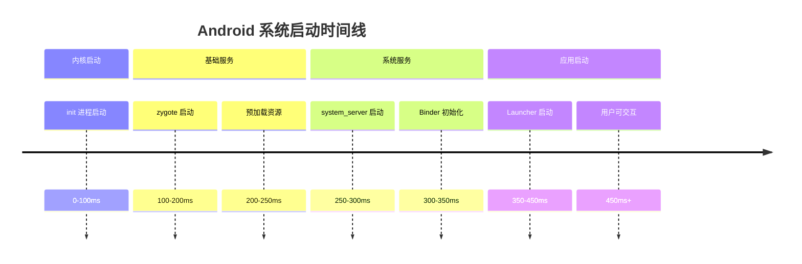

##  一、通信

#### Android 的 PID 是什么？多进程的声明方式？

**(1) PID 定义**

PID 是系统为每个正在运行的进程分配的唯一数字ID。进程启动时分配，进程销毁后回收。在 Android 中，后续启动的进程 PID 通常会比前面的大（因为系统 PID 计数器是递增的）。

**(2) 多进程的声明方式**

在 `AndroidManifest.xml`中为组件（如 Activity、Service）添加 `android:process`属性，即可使其运行在独立进程中。

```xml
<application ...>
    <activity android:name=".MainActivity" />
    
    <!-- 声明一个独立进程 -->
    <service 
        android:name=".RemoteService"
        android:process=":remote" />
</application>
```

在 Android 中，一个应用（APK）默认运行在一个主进程中，但开发者可以主动配置组件（如 Activity、Service）运行在**独立的进程**中。这种设计主要基于**稳定性、性能优化和资源管理**的考虑。但是，不同进程之间需要使用 IPC进行通信，增加复杂性。


#### Android 里面的 UID 是什么？有什么作用？

**(1) 应用的静态身份标识**

UID 是应用的静态身份标识。在应用**首次安装**时确定，在应用的整个生命周期内（除非卸载）**保持不变**。即使应用升级，其UID也不会变。

**(2) 沙箱隔离和权限检测的核心依据**

- **沙箱隔离**：Android基于Linux内核，它将**每个应用映射为一个独立的Linux用户**。这个Linux用户的ID就是应用的 UID。这构成了Android“沙箱”的基础：系统通过Linux的文件访问控制机制，天然地阻止了不同 UID（即不同应用）之间互相访问私有数据。

- **权限检测**：所有危险权限（如相机、位置）的授予对象都是 UID，而不是PID。当应用请求权限时，系统检查的是“UID 10123是否被授予了相机权限”。


#### PID 和 UID 的联系和区别

**考察点**：是否理解进程标识（PID）与应用身份（UID）的用途；权限与数据隔离基于谁。

**答案要点**：

**(1) 联系**

- 二者都是系统用来标识“谁是谁”的 ID：每个**进程**在运行时都有一个 **PID**，同时继承所属应用的 **UID**。
- 同一应用的多进程：**UID 相同**（同属一个应用），**PID 不同**（不同进程）。它们可共享该应用的私有数据目录，权限检查按 UID 进行。
- 系统用 **PID** 做进程调度与生命周期管理，用 **UID** 做权限授予、文件归属与跨应用隔离。

**(2) 区别**

| 维度 | PID | UID |
| :--- | :--- | :--- |
| **含义** | 进程 ID，标识一个**进程实例** | 用户/应用 ID，标识**应用身份** |
| **分配** | 进程创建时由内核分配，进程结束可复用 | 应用安装时由 PMS 分配，卸载前不变 |
| **变化** | 进程重启则 PID 变 | 同一应用始终同一 UID（除非 sharedUserId 等） |
| **主要用途** | 调度、内存隔离、进程管理 | 权限控制、数据归属（如 `/data/data/包名`）、多应用隔离 |

- **一句小结**：**UID 决定“数据属于谁、权限给谁”；PID 决定“当前是哪一个进程”（内存、调度）。两个进程 **UID 不同** 才是“不同应用”；**PID 不同** 只表示“不同进程”，可能属于同一应用。


#### 暴露方式

**考察点**：组件被其他应用访问的权限控制方式；exported、permission、sharedUserId 的适用场景与风险。

**答案要点**：

“暴露方式”指**组件（Activity、Service、ContentProvider）被其他应用访问的权限控制机制**，在允许应用间通信的同时防止未授权访问。

**(1) 完全暴露**

- **做法**：将组件的 `android:exported` 设为 `"true"`。
- **效果**：任何其他应用无需声明权限即可启动、绑定或访问该组件。
- **风险**：安全性最低，仅适合完全公开、无敏感操作的页面（如帮助页）。若组件声明了 `<intent-filter>`，**exported 默认为 true**，需显式设为 `false` 或加权限保护。

**示例（Activity 完全暴露）**：

```xml
<activity
    android:name=".HelpActivity"
    android:exported="true" />
<!-- 其他应用：startActivity(new Intent().setComponent(...)) 即可启动 -->
```

**(2) 权限暴露**

- **做法**：在组件上声明 `android:permission`（自定义或系统权限）；调用方在 Manifest 中 `<uses-permission>`，危险权限还需运行时申请。
- **效果**：只有声明并（必要时）获得该权限的应用才能访问，**最推荐**的跨应用交互方式。

**示例（Service 需权限才能绑定）**：

```xml
<!-- 提供方 -->
<permission android:name="com.example.MY_SERVICE" android:protectionLevel="normal" />
<service android:name=".MyService" android:permission="com.example.MY_SERVICE" />

<!-- 调用方 -->
<uses-permission android:name="com.example.MY_SERVICE" />
```

**(3) 私有暴露（sharedUserId）**

- **做法**：在不同应用的 `<manifest>` 根节点声明相同 `android:sharedUserId`，且用**同一证书**签名。
- **效果**：两应用被系统视为同一应用、分配相同 UID，可同进程、**无条件访问彼此私有数据**（如 `/data/data/`）。
- **风险**：共享程度最高、风险最大，一方被攻破则另一方数据暴露，仅适合同一开发者、需深度集成的多应用（如主应用与插件）。

**示例（两应用共享 UID）**：

```xml
<!-- 应用 A 和 应用 B 的 AndroidManifest.xml 根节点均声明，且用同一 keystore 签名 -->
<manifest xmlns:android="http://schemas.android.com/apk/res/android"
    android:sharedUserId="com.example.sharedapp">
```


#### 请简述 Android 系统中应用 UID 的分配机制，包括分配流程、复用策略以及取值范围

1. **分配流程**： 在应用安装时，PackageManagerService (PMS) 会解析 APK 文件。 在 `scanPackageNewLI()`方法中，会调用 `mSettings.getSharedUserLPw()`获取或创建应用的 `SharedUserSetting`对象。 如果是新应用（或共享用户），会调用 `acquireAndRegisterNewAppIdLPw()`方法为其分配一个唯一的 UID。

2. **分配策略（核心逻辑）**： 
   - **复用机制**：系统会从 `mFirstAvailableUid`（通常为 0）开始，在 `mAppIds`数组中查找第一个空闲的槽位（`null`）。如果找到，则复用该位置对应的 ID。这通常发生在有应用被卸载后，其 UID 会被后续安装的应用复用。 
   - **顺序分配**：如果没有找到空闲槽位（即数组已满），系统会在数组末尾添加新元素，并返回新的 ID。这解释了为什么普通应用的 UID 通常是从 10000 开始递增的。

3. **取值范围**： 
   - 普通应用的 UID 范围是 `Process.FIRST_APPLICATION_UID`(10000) 到 `Process.LAST_APPLICATION_UID`(19999)。 
   - 系统最多支持安装 `LAST_APPLICATION_UID - FIRST_APPLICATION_UID + 1`个应用，即 10000 个。如果超过这个数量，`acquireAndRegisterNewAppIdLPw()`会返回 -1，导致安装失败。

| UID 范围        | 拥有者                | 目的                                 | 示例                                                      |
| --------------- | --------------------- | ------------------------------------ | --------------------------------------------------------- |
| **0**           | `root`                | 最高系统权限，内核和初始化进程       | `init`, `adbd`(root模式)                                  |
| **1-999**       | 系统守护进程          | 各种底层系统服务                     | `surfaceflinger`(显示合成), `servicemanager`(Binder 总管) |
| **1000-1999**   | 核心 Android 框架服务 | 运行系统服务的用户                   | `system_server`(UID 1000), `mediaserver`(UID 1013)        |
| **2000-9999**   | 其他系统组件/供应商   | 供应商特有的服务或不太核心的系统进程 | 某些 OEM 的硬件抽象层进程                                 |
| **10000-19999** | **第三方应用程序**    | 每个应用一个独立的沙箱               | 微信、支付宝、浏览器等                                    |


**谈谈Android的IPC（进程间通信）机制**

Android是在Linux内核基础之上运行，因此Linux中存在的IPC机制在Android中基本都能使用。

- **管道**
- **信号**
- **信号量**
- **共享内存**
- **消息队列**
- **socket**

同时，Android 还有特有的高性能、安全的 RPC 通信机制 
Binder。它是几乎所有系统组件通信的基础。在基于 Binder 的基础上，还有如下 IPC 方式

- **Messenger**：基于 Binder 实现的轻量级 IPC 方式，底层是 AIDL 的封装，但使用更简单。在服务端创建一个 `Handler`来处理消息，通过 `Messenger`包装这个 `Handler`的 `Binder`对象返回给客户端。
- **ContentProvider：** Android 提供的统一数据共享机制，底层基于 Binder 实现。
- **BroadcastReceiver**： 基于 Binder 的发布-订阅模式 IPC 机制。


#### 为什么Android选择Binder作为应用程序中主要的IPC机制？

**(1) 性能优势**

管道/消息队列/Socket 通常需要 2 次数据拷贝，共享内存则是零拷贝。

Binder 比大多数传统 IPC 少一次拷贝，但**不如共享内存**（零拷贝）。然而，共享内存的同步和管理复杂度极高，Binder 在性能与复杂度间取得了更好平衡。

**(2) 安全性优势：内核级身份标识**

- **传统 IPC**：接收方无法可靠获取发送方的身份（UID/PID）。身份信息需由发送方自行填入数据包，极易伪造，安全性差。
- **Binder**：身份标识（UID/PID）由内核在通信过程中自动添加，不由应用程序控制，从根本上杜绝了身份伪造。这对于 Android 的权限模型至关重要，系统服务（如 `ActivityManagerService`）可以据此可靠地验证调用者权限。

在Android的Linux内核中，每个应用被映射为一个独立的“Linux用户”。这个用户的ID就是UID。它在应用安装时确定，只要应用不卸载，其UID就固定不变。一个应用（一个UID）可以启动多个进程（多个PID），但它们的UID相同。


#### **为什么 Binder 不采用完全的共享内存实现？**

虽然共享内存是“零拷贝”，但 Binder 有意不采用完全的共享内存模型，关键在于**内核保留的控制权**：

- **访问控制**：在共享内存模型中，进程可直接读写共享区域，缺乏访问仲裁。而在 Binder 中，内核管理着缓冲区，发送方无法直接写入接收方的内存。
- **权限与安全**：内核在数据从发送方拷贝到缓冲区前，可以进行安全检查。它**有选择地**将数据拷贝到目标进程的映射区域，并决定何时唤醒接收进程处理数据。
- **复杂度与可靠性**：将内存管理和同步的复杂性交由内核统一处理，避免了应用程序直接操作共享内存可能带来的复杂性和稳定性问题，使得 IPC 更安全、更可靠。


#### Android 的通信方式

**(1) 通信方式**

| 通信类型   | 机制/组件                        | 核心特点                 | 适用场景                                             |
| ---------- | -------------------------------- | ------------------------ | ---------------------------------------------------- |
| **线程间** | **Handler/Looper**               | 核心机制，灵活可控       | 子线程与主线程通信，任务调度                         |
|            | **`runOnUiThread`/`View.post`**  | 便捷的UI更新API          | 在非UI线程快速更新界面                               |
|            | **事件总线**                     | 发布/订阅，解耦          | 组件间解耦通信                                       |
| **进程间** | **AIDL (基于Binder)**            | 类型安全，支持并发，复杂 | 需定义复杂接口、服务端多线程处理的系统服务或应用服务 |
|            | **Messenger (基于Binder)**       | 基于消息，串行处理，简单 | 简单的指令传递，无需处理线程同步                     |
|            | **ContentProvider (基于Binder)** | 标准化数据共享接口       | 对外提供结构化数据访问（如数据库）                   |
|            | **BroadcastReceiver**            | 全局广播，松耦合         | 发送应用内或系统级通知、事件                         |
|            | 文件/SharedPreferences           | 简单，效率低，可靠性差   | 极简单的、低频的数据共享，不推荐                     |

(2) **如何选择？**

**同一进程内，线程间通信**：优先使用 **`Handler`** 或协程（`Kotlin Coroutines`）。

**跨进程通信，需要高性能、结构化调用**： 

- 如果无需跨不同应用执行并发 IPC，可以通过实现 **Binder** 来创建接口。  
- 如果通信复杂，服务端需并发处理，用 **AIDL**。 
- 如果通信是简单的消息传递，用 **Messenger**。
-  如果需要对外提供数据，用 **ContentProvider**。 
- 如果需要发送全局通知，用 **BroadcastReceiver**。


#### 为什么 system_server 进程和 Zygote 进程之间为什么使用 socket 通信?


**(1) 时间线**

system_server 需要 zygote 来 fork



**(2) 依赖服务**

Socket 在 init 进程启动后立即可用, 依赖内核 TCP/IP 协议栈，不依赖其他系统服务

Binder 在 system_server 初始化才能使用，依赖 servicemanager,、Binder 驱动等系统服务。

