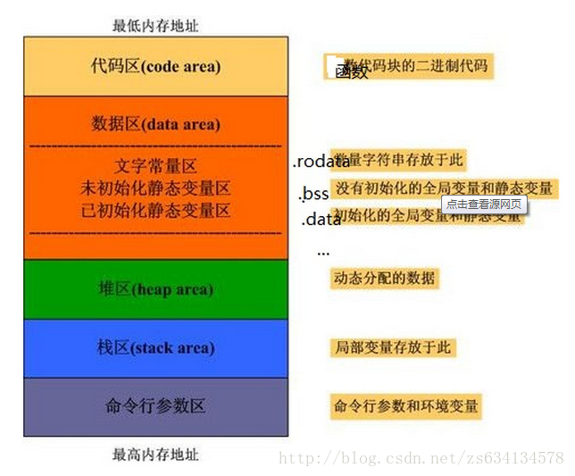

## 内存管理

**问题：** 以下哪一项不是 Windows 操作系统使用的内存管理机制？

A. 虚拟内存管理
B. 分页 (Paging)
C. 垂直分配 (Vertical Allocation)
D. 堆栈 (Heap and Stack)

**正确答案：** C. 垂直分配 (Vertical Allocation)

**答案解析：**

- A、B 和 D 都是 Windows 操作系统中常见的内存管理机制。
- **垂直分配 (Vertical Allocation)** 不是常见的内存管理策略，它并不是 Windows 操作系统所使用的术语或策略，因此是正确答案。

**软链接和硬链接有什么区别？**

| 特性               | 硬链接 (Hard Link)                                 | 软链接 (Symbolic Link)                             |
| ------------------ | -------------------------------------------------- | -------------------------------------------------- |
| **指向对象**       | 指向文件的物理数据块（即 inode）                   | 指向文件路径（即文件名）                           |
| **跨文件系统**     | 不支持，必须在同一个文件系统中                     | 支持，可以跨文件系统创建链接                       |
| **目标文件删除后** | 如果源文件被删除，硬链接仍然有效，文件数据不会丢失 | 如果目标文件被删除，软链接会失效，变成“悬挂”链接   |
| **链接类型**       | 硬链接是文件的另一种名字，文件内容与原文件完全相同 | 软链接是指向原文件的路径，类似于快捷方式           |
| **对目录的支持**   | 不允许硬链接指向目录（避免文件系统结构混乱）       | 允许软链接指向目录                                 |
| **占用空间**       | 不占用额外的磁盘空间，仅增加一个目录项（文件名）   | 占用少量空间，仅保存指向目标路径的字符             |
| **文件删除后表现** | 只有最后一个硬链接被删除时，文件数据才会被删除     | 软链接删除后不会影响原文件，原文件删除后软链接无效 |
| **创建方式**       | 使用 `ln` 命令不带 `-s` 参数                       | 使用 `ln -s` 命令创建软链接                        |
| **可读性**         | 难以识别是否为硬链接，和原文件无区别               | 可以识别为软链接，通常显示为带有箭头的路径         |
| **适用场景**       | 用于在同一文件系统内创建文件的多个引用             | 用于创建快捷方式，跨文件系统链接或链接目录         |

## 进程

### 进程结构

(1) 同一进程下的线程可以共享以下?

A、stack

B、data section

C、register set

D、file fd

**正确答案**：BD

**答案解析**：

线程共享的内容包括：

1.进程代码段

2.进程的公有数据(利用这些共享的数据，线程很容易的实现相互之间的通讯)

3.进程打开的文件描述符、

4.信号的处理器、

5.进程的当前目录和

6.进程用户ID与进程组ID

线程独有的内容包括：

1.线程ID

2.寄存器组的值

3.线程的堆栈

4.错误返回码

5.线程的信号屏蔽码

(2) 静态变量通常存储在进程哪个区？（）

A、栈区

B、堆区

C、全局区

D、代码区

**正确答案**：C

**答案解析**：静态变量属于静态存储方式，但是属于静态存储方式的变量不一定就是静态变量。

### 进程状态

(1) 进程进入等待状态有哪几种方式？

A、CPU调度给优先级更高的线程

B、阻塞的线程获得资源或者信号

C、在时间片轮转的情况下，如果时间片到了

D、获得 spinlock 未果

**正确答案： **C

**答案解析：**线程处于等待状态时，通常是因为它在**等待某些资源（**如 I/O 操作、锁等）或需要等待某些事件（如条件变量、信号量等）。

A、B、C 选项中，线程是进入了就绪状态

D 选项进入了 等待状态， spinlock 是一种自旋锁。

### 进程通信

Unix系统中，哪些可以用于进程间的通信？（）

A、Socket

B、共享内存

C、消息队列

D、信号量

**正确答案**：ABCD

### 进程同步

(1) 同步机制应该遵循哪些基本准则？

A、空闲让进

B、忙则等待

C、有限等待

D、让权等待

正确答案：

答案解析：同步机制应该遵循的基本准则 

- 空闲让进：当无进程处于临界区时，表明临界资源处于空闲状态，允许一个请求进入临界区的进程立即进入临界区，以有效利用临界资源
- 忙则等待：当已有进程处于临界区时，表明临界资源正在被访问，因而其他试图进入临界区的进程必须等待，以保证对临界资源的互斥访问
- 有限等待：对要求访问临界资源的进程，应保证在有限时间内能进入自己的临界区，以免陷入“死等”状态
- 让权等待：当进程不能进入自己的临界区时，主动放弃 CPU 的控制权，以免进程陷入“忙等”状态

### Linux 命令

问题1： `chmod 644 filename`  的含义是什么？

答案解析：

**(1) chomd 数字的含义**

权限是通过将读、写和执行权限的数字值相加来计算的。具体来说：

- **读权限 (r)** 对应数字 `4`
- **写权限 (w)** 对应数字 `2`
- **执行权限 (x)** 对应数字 `1`

对于每个用户类别（文件所有者、所属组、其他用户），你可以通过加和来设置他们的权限。例如：

1. **所有者 (Owner)**: 第一位数字
2. **所属组 (Group)**: 第二位数字
3. **其他用户 (Others)**: 第三位数字

每一位数字代表的是权限的加和值，具体如下：

- `0` 表示没有任何权限
- `1` 表示仅执行权限 (`x`)
- `2` 表示仅写权限 (`w`)
- `3` 表示写权限和执行权限 (`wx`)
- `4` 表示仅读权限 (`r`)
- `5` 表示读权限和执行权限 (`rx`)
- `6` 表示读权限和写权限 (`rw`)
- `7` 表示读、写和执行权限 (`rwx`)

**（2） chmod 644 filename 的含义**

**`chmod 644 filename`**

- **6**: 所有者 (Owner) 具有读和写权限 (`rw`)
- **4**: 所属组 (Group) 具有读权限 (`r`)
- **4**: 其他用户 (Others) 具有读权限 (`r`)