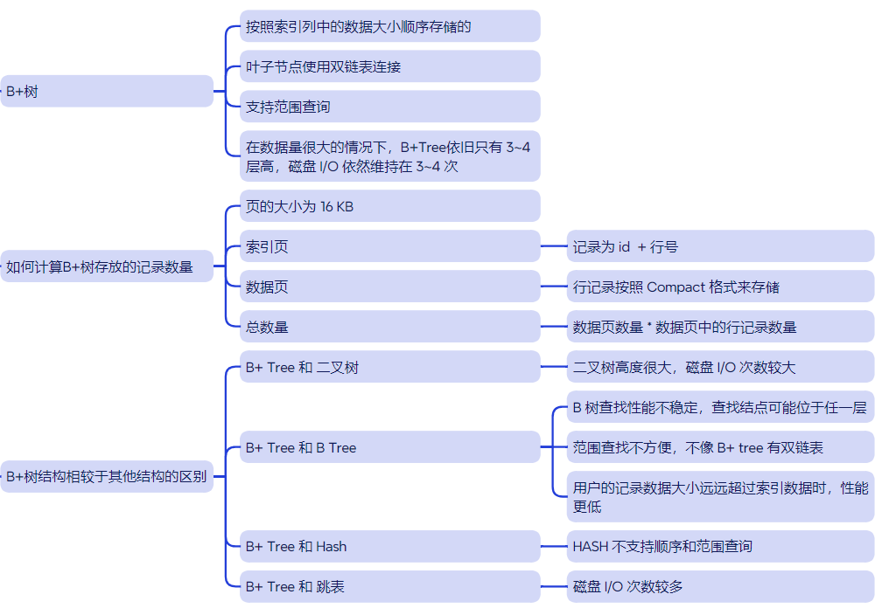
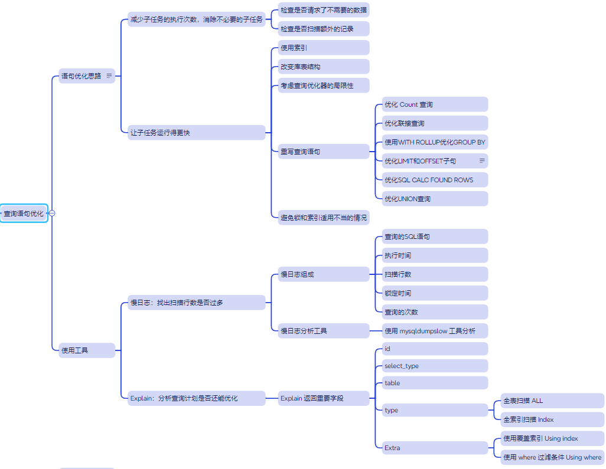

[TOC]

## 基本概念

### 数据库范式

数据库的三大范式是指设计关系型数据库时所遵循的设计规则，它们分别为第一范式 (1NF)、第二范式 (2NF) 和第三范式 (3NF)。每个范式都有其目标，**旨在减少数据冗余和提高数据一致性**。它们之间**存在递进关系**，满足更高范式的表一定满足较低范式的要求。

- **第一范式 (1NF)** ：确保数据库中的每个字段都是不可再分的原子值。

- **第二范式 (2NF)**：满足 1NF 的前提下，<font color="blue">消除非主属性对码的**部分依赖**</font>，确保每个非主属性完全函数依赖于主键。

- **第三范式 (3NF)**：满足 2NF 的前提下，<font color="blue">消除非主属性之间的**传递依赖**</font>。

<br/>


### 数据库设计步骤

1. 需求分析：通过详细调查现实世界要处理的对象(组织、部门、企业等)，充分了解原系统(手工系统或计算机系统)的工作概况，明确用户的各种需求，然后在此基础上确定新系统的功能。
2. **概念结构设计**：绘制 E-R 图
3. **逻辑结构设计**：将 E-R 图转换成表
4. **物理结构设计**：为所设计的数据库选择合适的存储结构和存取路径
5. 数据库的实施和维护：编程，测试，运行，数据库维护

<br/>


### 描述数据库的三层模式架构

三层模式架构包括：

1. **外模式（External Schema）**：面向用户的视图。
2. **概念模式（Conceptual Schema）**：描述数据的逻辑结构，独立于物理存储。
3. **内模式（Internal Schema）**：描述数据在物理存储设备上的表示。

通过这三层架构，数据库实现了数据的**物理独立性**和**逻辑独立性**：

- **物理独立性**：内模式的改变不影响概念模式和外模式。
- **逻辑独立性**：概念模式的改变不影响外模式。

<br/>


### 存储过程的优缺点

存储的优点有：

- **性能更优**：存储过程在数据库中**预编译并优化**，运行时不需要再次编译，执行效率较高。
- **逻辑封装**：存储过程将复杂的业务逻辑封装在数据库中，便于集中管理和维护。

缺点包括：

- **开发调试复杂**：存储过程的调试工具和功能通常不如应用程序开发工具强大，调试和测试困难。
- **难替换数据库引擎**：业务逻辑绑定在数据库中后，应用程序对数据库的依赖性增强，不易替换数据库引擎。

<br/>


## SQL 语法

### SQL 语句分类

- 数据查询语言（DQL） - Data Query Language   ： 从数据库中查询数据。
- 数据操作语言（DML） - Data Manipulation Language： 操作数据库中的数据
- 数据定义语言（DDL） - Data Definition Language： 创建和删除数据库结构、表、索引等对象
- 数据控制语言（DCL） - Data Control Language ： 控制数据库中的数据访问权限

值得注意的是，不要弄混 DML 和 DCL。

<br/>


### drop、delete、truncate的区别

| 特性                 | `DROP`                     | `DELETE`                         | `TRUNCATE`                     |
| -------------------- | -------------------------- | -------------------------------- | ------------------------------ |
| **功能**             | 删除整个表结构及数据       | 删除表中符合条件的部分或全部数据 | 删除表中的所有数据             |
| **是否保留表结构**   | 不保留                     | 保留                             | 保留                           |
| **是否支持条件删除** | 不支持                     | 支持                             | 不支持                         |
| **是否支持回滚**     | 不支持                     | 支持                             | 不支持（某些数据库支持）       |
| **操作性能**         | 快速，但会重建表的相关信息 | 慢，逐行删除，影响性能           | 快速，直接清空数据，无逐行操作 |
| **触发器支持**       | 不触发                     | 会触发                           | 不触发                         |
| **使用场景**         | 删除表结构，永久移除表     | 删除部分数据，保持表结构         | 清空表数据，保留表结构         |

<br/>


## 触发器

### **触发器怎么删除?**

删除是使用 `DROP` ，不要跟 REMOVE 、DELETE 弄混。

```sql
DROP TRIGGER [IF EXISTS] trigger_name;
```

**`IF EXISTS`**:如果触发器不存在，避免抛出错误。

**`trigger_name`**:要删除的触发器的名称。

<br/>


## 视图

### 视图是否能更新?

在 **MySQL** 中，如果视图是可更新的，对视图执行的 `INSERT`、`UPDATE`、或 `DELETE` 操作会直接影响其底层数据表的内容。

- 视图 **在满足条件** 时可以更新，主要是简单视图（单表、无聚合、无计算列）。

- 复杂视图（如多表联接、分组、聚合）通常是不可更新的。

<br/>


## 索引

### MySQL 索引类型？

MySQL可以按照四个角度来分类索引。

- 按「数据结构」分类：**B+tree索引、Hash索引、Full-text索引**。
- 按「物理存储」分类：**聚簇索引（主键索引）、二级索引（辅助索引）**。
- 按「字段特性」分类：**主键索引、唯一索引、普通索引、前缀索引**。
- 按「字段个数」分类：**单列索引、联合索引(覆盖索引)**。


### B+tree 索引




### 什么是全文搜索？

全文搜索是针对文本字段的一种高级搜索方法，<font color="blue">**专门用于查找大段文字中是否包含某些关键字或短语**</font>。与简单的 `LIKE` 模糊匹配不同，全文搜索具有以下特点：

- **使用全文索引**：全文搜索会为指定字段创建一种特殊的索引（`FULLTEXT`），加速搜索操作。
- **分词**：全文搜索会将长文本切分成若干“词”（Token），并按词匹配，而不是单纯字符匹配。
- **评分**：全文搜索会根据匹配的相关性给搜索结果打分，以便按相关性排序。

相关使用案例如下所示。

```sql
CREATE TABLE articles (
    id INT PRIMARY KEY,
    title VARCHAR(255),
    content TEXT,
    FULLTEXT (title, content) -- 创建全文索引
);

SELECT * FROM articles
WHERE MATCH(title, content) AGAINST('database');
```

<br/>


### 全文索引的底层结构

 **Full-text 索引使用的是倒排索引（Inverted Index）**，这是一种专门用于高效文本搜索的结构。它的核心思想是通过**建立单词（或词条）与其出现位置的映射关系**，使得我们能够快速定位包含特定词汇的文档或记录。

倒排索引的工作原理

- **词典**：存储所有文档中出现的词汇，并为每个词汇创建一个倒排列表。
- **倒排列表**：每个倒排列表包含了一个或多个文档 ID，表示该词条出现在哪些文档中。

举个例子，假设我们有以下三篇文档：

```
文档1：apple banana apple
文档2：apple orange banana
文档3：banana orange apple
```

对于每个词条，我们记录它出现在了哪些文档中。构建倒排索引时，记录每个词条出现的文档 ID。倒排索引将如下：

| 词条   | 倒排列表            |
| ------ | ------------------- |
| apple  | 文档1, 文档2, 文档3 |
| banana | 文档1, 文档2, 文档3 |
| orange | 文档2, 文档3        |


## 性能优化

### 性能优化基本思路




### 慢查询日志

(1) 什么是慢查询日志

**慢查询日志**（Slow Query Log）是 MySQL 数据库的一种日志功能，用于记录所有执行时间超过指定阈值的查询语句。这个日志记录了哪些查询语句的执行时间较长，有助于分析数据库性能瓶颈和优化查询性能。

慢查询日志通常会记录以下内容：

1. **查询执行时间**：每个查询执行的时间，只有当查询的执行时间超过预设的阈值时，才会被记录。
2. **查询的 SQL 语句**：被执行的 SQL 查询语句，帮助开发人员了解哪些语句占用了大量时间。
3. **执行次数**：查询执行的次数（如适用）。
4. **锁等待时间**：查询在等待锁时所花费的时间。
5. **扫描的行数**：查询扫描的行数，有助于分析查询效率。

(2) 怎么找到日志

慢查询日志的文件路径是通过 `slow_query_log_file` 参数来设置的。如果没有特别指定路径，MySQL 会将慢查询日志记录在默认位置，通常是 MySQL 数据目录下。可以通过以下命令查看慢查询日志的文件路径：

```sql
SHOW VARIABLES LIKE 'slow_query_log_file';
```

(3) 怎么查看日志

 使用 `cat` 或 `less` 命令查看日志。

```sql
cat /path/to/your/slow-query.log
```

使用 MySQL 自带工具  `mysqldumpslow`  分析日志。

```sql
mysqldumpslow /path/to/your/slow-query.log
```


### EXPLAIN 语句的作用

[`EXPLAIN`](https://dev.mysql.com/doc/refman/8.4/en/explain.html) 是一个用于分析查询的 SQL 语句，它可以帮助你理解查询执行计划。通过 `EXPLAIN`，你可以看到数据库如何优化并执行查询语句，了解索引使用情况、表连接顺序等信息。

执行 `EXPLAIN` 语句后，通常会返回一个表，表中包含如下常见字段：

- **id**：查询中执行的顺序或步骤。`id` 值越大，优先级越高。
- **select_type**：表示查询的类型。常见类型有 `SIMPLE`（简单查询）、`PRIMARY`（主查询）、`SUBQUERY`（子查询）等。
- **table**：当前步骤所访问的表。
- type：表的访问方式，常见值有：
  - `ALL`：全表扫描（性能较差）。
  - `index`：全索引扫描（扫描索引中的所有数据）。
  - `range`：索引范围扫描。
  - `ref`：通过索引查找单个或多个匹配值。
  - `eq_ref`：通过索引查找精确匹配的一行数据。
  - `const/system`：查询一次后结果恒定的表。
- **possible_keys**：查询可能使用的索引。
- **key**：实际使用的索引。如果值为 `NULL`，表示没有使用索引。
- **key_len**：使用的索引的长度。
- **ref**：用于和索引进行比较的列或常量。
- **rows**：估计需要扫描的行数。
- **Extra**：其他额外信息，可能显示优化器对查询的处理。例如，`Using index` 表示使用了覆盖索引，`Using where` 表示查询使用了 `WHERE` 过滤条件。


### 查询优化的基本思路


## 其他

### MySQL 如何防止 SQL 注入？

- **使用预处理语句**：使用预处理语句和绑定参数是防止 SQL 注入的最有效方法之一。预处理语句将 SQL 查询的结构与用户输入的参数分开，从而避免了将用户输入直接拼接到 SQL 查询中。即使用户提供恶意的 SQL 代码，预处理语句也会将其视为参数而非 SQL 代码。
- **使用存储过程**：存储过程是一种预编译的 SQL 语句集合，可以防止 SQL 注入。


### 数据库连接池

**问题描述**：为什么用数据库连接池？如果数据库支持的最大连接数满了，怎么操作？（高可用）如果让你来设计一个数据库连接池，你会考虑什么因素？为什么？

**答案解析**：

使用数据库连接池的主要原因：

1. **减少连接创建和销毁的开销：** 每次创建一个数据库连接是一个昂贵的操作，包括网络延迟和数据库资源的占用。通过使用连接池，可以避免频繁的连接创建和销毁，连接池在应用启动时初始化一些连接，应用程序通过池获取连接并复用。
2. **提高资源利用率：** 连接池控制着与数据库的连接数，它可以确保应用程序在不超过数据库最大连接数的情况下，能够尽可能多地并发处理请求。

当数据库的最大连接数达到上限时，数据库连接池无法提供新的连接，可能会导致应用程序的连接请求被阻塞或失败。为了避免这种情况，通常会采取以下策略：

1. **增加数据库连接池的最大连接数：**如果数据库本身支持更多的并发连接，可以考虑增加数据库的最大连接数限制（如修改 MySQL 的 `max_connections` 参数）。
2. **采用连接池超时机制**： 设置连接池的连接获取超时时间和最大等待时间，类似于线程池的拒绝策略。

设计数据库连接池时，需要考虑多个因素，以确保其高效、稳定、安全地运作。以下是我会重点考虑的几个因素：

1. 设置连接数
2. 连接获取超时和队列等待策略
3. 数据库连接池日志


### 数据库中使用链表的地方

数据库中索引叶子节点的双向链表


### 数据库死锁如何检测

(1) 如何检测死锁

数据库系统通常会记录死锁的详细日志，帮助开发者分析死锁原因。日志中通常会包含死锁的以下信息：

- 参与死锁的事务。
- 每个事务的执行状态和等待的资源。
- 数据库在死锁发生时选择回滚的事务。

例如，在 **MySQL** 中，可以通过查看 `SHOW ENGINE INNODB STATUS` 命令的输出，找到死锁信息。

(2) 避免死锁的策略

- **限制锁的持有时间**：事务应尽量减少锁定资源的时间，减少死锁发生的机会。
- **超时设置**：设置锁的超时限制，在无法获取锁时自动回滚事务。

