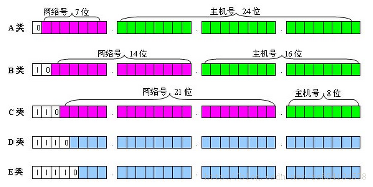

### 静态路由和动态路由

**问题1:**  阐述静态路由和动态路由的区别

**官方解析：**

| 特性       | 静态路由                         | 动态路由                           |
| ---------- | -------------------------------- | ---------------------------------- |
| 配置方式   | 手动配置                         | 自动配置（通过路由协议）           |
| 可扩展性   | 不适用于大规模网络，维护成本高   | 适用于大规模网络，自动更新         |
| 适应性     | 适应性差，需要手动调整           | 自动适应网络变化                   |
| 更新频率   | 静态配置，不会自动更新           | 自动更新，定期或实时交换路由信息   |
| 故障恢复   | 无自动故障恢复，需要手动修改路由 | 自动故障恢复，重新计算路径         |
| 性能与开销 | 低性能开销，资源消耗小           | 性能开销较大，消耗带宽和计算资源   |
| 应用场景   | 小型或稳定网络，安全性要求高     | 大型、复杂网络，拓扑变化频繁的环境 |

### IP 地址

**问题1:**  IP地址131.153.12.71是一个（）类IP地址。

**正确答案：**B

**官方解析：**IP地址分类

-  A类网络的IP地址范围为1.0.0.1－127.255.255.254； 

- B类网络的IP地址范围为：128.1.0.1－191.255.255.254；

- C类网络的IP地址范围为：192.0.1.1－223.255.255.254。

我们可以根据每一类网络地址的网络标识来区分网络。例如， B 类的网络标识为 10， C 类的网络标识为 110

**问题1:** 下面哪个地址是广播地址？

A、192.168.0.127/24

B、192.168.0.255/24

C、192.168.0.55/27

D、192.168.0.33/27

**正确答案：**B

**官方解析：**

主机标识段 host ID 为全 1 的 IP 地址为广播地址。 

  A项，**11000000.10101000.00000000**.01111111 

  B项，**11000000.10101000.00000000**.11111111 

  C项，**11000000.10101000.00000000.001**10111 

  D项，**11000000.10101000.00000000.001**00001 

  只有B中的全为1。

### TCP 协议

**问题1**：服务器端向客户端发送的确认段为 ack 1 seq 1024 ack 1025，服务器发送到客户端的字节数是多少？问题缺少部分内容

**答案解析**：

- **确认号 ack**： 期望接收的**下一个字节**的序列号

- **序列号 seq**：本次发送的字节序列号

### HTTP 状态码

(1) 常考的状态码

请求错误：

- 401： Unauthorized     请求**未通过身份验证**，服务器需要客户端提供**有效的身份凭证**（如 `token`、`API key`、`用户名+密码`）。

- 403： Forbidden， 禁止访问，    请求已经通过**身份验证**，但是**没有权限**访问该资源。
- 404:   Not Found  客户端请求的**资源不存在**，服务器找不到对应的 URL

服务器错误：

- 500： Internal Server Error  服务器内部错误
- 502： Bad Gateway，  服务器作为网关或代理，**向上游服务器**请求数据时，**上游服务器响应异常**（无响应或返回错误）

 

