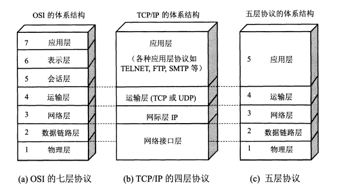

## 基本概念

### 几句话介绍一下计算机网络

- 计算机网络是由多台计算机及其外围设备通过通信链路和网络设备互联组成的系统，用于信息传输和资源共享。
- 网络中的计算机通过各种协议（如 TCP/IP）进行数据交换，以实现远程通信、文件共享、应用访问等功能。

### OSI 模型和 TCP/IP 协议的区别？

协议是水平的， 即协议是控制两个对等实体进行通信的规则的集合。

服务是垂直的，即服务是由下层向上层通过层间接口提供的。

## 传输层

### TCP粘包拆包实现原理？如果让你来实现，你会怎么设计？

**(1) 粘包和拆包问题**

TCP 在接收数据的时候，利用滑动窗口(类似于缓冲区)来控制接收数据的大小，滑动窗口满的时候发送数据。由于数据包的大小不固定，产生以下问题：

- **粘包问题**：当发送方发送数据包比较小，没达到缓冲区大小，接收方可能会将多个数据包合并成一个大的数据包接收，从而造成粘包现象。

- **拆包问题**：如果发送方发送的数据量比较大，超过缓冲区大小，超出了 TCP 包的最大传输单元（MSS），那么 TCP 会将数据拆成多个小包发送，接收方需要将这些小包重新组装成完整的数据。

这两个问题的原因在于 TCP 传输是**流式的**，没有明显的消息边界。因此，**接收方不知道数据包的具体边界，可能会出现多个应用层的数据粘合成一个包，或者一个数据包被拆分成多个部分**。

**(2) 粘包拆包问题常见解决方案**

解决粘包问题的关键在于 **标记消息边界**，通过某种方式让接收方知道每个完整的数据包的边界。

常见的解决方案有：

- **定长消息**：发送的数据包大小固定，接收方可以根据固定的大小来读取每个包的数据。
- **以特殊字符作为分隔符（分隔符法）**：在每个数据包的末尾添加特定的分隔符（例如，`\n`、`\0`、`|`等），接收方可以通过扫描分隔符来确定每个消息的边界。
- **通过固定头部字段标识数据包长度**：在每个数据包的开头加入一个固定长度的字段，表示该数据包的长度，接收方通过读取该字段来确定数据包的边界。

**(3) 详细解决方案**

使用 **固定头部字段** 来标识每个数据包的长度，这是最常见且灵活的做法。假设我们要设计一个消息协议，每个消息都由一个固定长度的头部和一个变长的消息体组成，数据包具体结构如下：

- **头部（固定长度）**：包含消息的总长度。
  - 头部长度为 4 字节（可以存储消息体的最大长度）。
  - 头部字段包含一个整数，表示数据包的总长度（包括头部和消息体）。
- **消息体（可变长度）**：存储实际的数据。

### TCP 协议建立连接的过程？

3 + 4 + 可能出现的情况

### TCP 的最大连接数

TCP 四元组可以唯一的确定一个连接，四元组包括如下：

- 源地址
- 源端口
- 目的地址
- 目的端口

根据 TCP 四元组，由于服务端的端口和 IP 地址通常是固定的， TCP 连接的理论上限 = 客户端的 IP 数目 * 客户端的端口数

[4.1 TCP 三次握手与四次挥手面试题 | 小林coding (xiaolincoding.com)](https://xiaolincoding.com/network/3_tcp/tcp_interview.html#如何唯一确定一个-tcp-连接呢)

### TCP 包排序的实现？

在 TCP 中，数据包的排序是通过 **序列号** 来实现的。这个过程的核心机制是：

- **序列号（Sequence Number）：** 每个 TCP 包都有一个 **序列号**（Sequence Number），它用于标识包中数据的顺序。
- **重组过程：** 当接收方收到多个 TCP 包时，它们可能会到达的顺序不一致，甚至因为网络拥塞等问题，部分数据包可能会丢失或者延迟到达。为了保证数据的顺序，接收方会依据每个包的 **序列号** 对数据包进行排序。
- **确认机制（Acknowledgement）：** 每个接收方都需要对接收到的数据包发送 **确认应答**。确认应答中包含了接收到的 **下一个期望序列号**，即接收方期望接收到的数据的下一个字节的序列号。

### TCP 是怎样超时重传的？

- **重传超时时间**：TCP 超时重传机制的核心是通过 **重传超时时间**（RTO）来动态计算和控制重传时机，同时采用 **指数回退** 来逐步增加重传间隔，避免因网络拥塞导致的过多重传。
- **重复确认（Duplicate ACK）触发的快速重传**：如果发送方收到三个重复的确认（通常称为 **三次重复 ACK**），它认为网络中某个数据包丢失了（不一定是因为超时），会立即重传这个丢失的数据包，而无需等待超时发生。

### TCP 和 UDP 协议的区别？

总的来说，

- UDP 更适用于实时性要求高、数据量小、对数据丢失容忍度较高的场景，
- 而 TCP 更适用于对数据可靠性和完整性要求高、数据量大、对延迟和丢包要求较高的场景。

| 特性           | TCP (传输控制协议)                                   | UDP (用户数据报协议)                                         |
| -------------- | ---------------------------------------------------- | ------------------------------------------------------------ |
| **连接方式**   | 面向连接，需要建立连接，只能一对一                   | 无连接，不需要建立连接，可以一对多                           |
| **可靠性**     | 提供可靠的数据传输，保证数据的顺序和完整性           | 不保证数据的顺序和完整性                                     |
| **传输速度**   | 较慢，因为需要进行连接、确认和重传等操作             | 较快，因为不进行连接和重传                                   |
| **流量控制**   | 支持流量控制，防止拥塞                               | 不支持流量控制                                               |
| **拥塞控制**   | 有拥塞控制机制                                       | 没有拥塞控制机制                                             |
| **数据包大小** | 每个数据包都有头部，通常较大                         | 每个数据包头部较小，效率较高                                 |
| **顺序保证**   | 保证数据包的顺序                                     | 不保证数据包的顺序                                           |
| **错误检测**   | 通过校验和、重传机制来确保数据完整性                 | 仅进行简单的错误检查，不进行重传                             |
| **应用场景**   | 适合需要高可靠性的应用，如网页浏览、文件传输、邮件等 | 适合对实时性要求高但能容忍丢包的应用，如视频流、VoIP、在线游戏等 |

### TCP 和 UDP 可以使用同一个端口吗？

结论：TCP 和 UDP 可以同时绑定相同的端口；

原因：传输层有两个传输协议分别是 TCP 和 UDP，在内核中是两个完全独立的软件模块。

### 多个 TCP 服务端进程可以绑定同一个端口吗？

**结论：**不可以

**现象：**如果两个 TCP 服务进程同时绑定的 IP 地址和端口都相同，那么执行 **bind()** 时候就会出错，错误是“Address already in use”； 

**原因：**如果允许多个进程绑定到同一个端口上，**操作系统将无法正确地将传入的连接请求分发给相应的进程**，从而导致混乱和冲突。

[4.18 TCP 和 UDP 可以使用同一个端口吗？ | 小林coding (xiaolincoding.com)](https://xiaolincoding.com/network/3_tcp/port.html#多个-tcp-服务进程可以绑定同一个端口吗)

### 客户端的 TCP 连接端口可以重复使用吗?

**结论：**在客户端执行 **connect()** 函数的时候，只要客户端连接的服务器不是同一个，内核允许端口重复使用。

**原因：**TCP 连接是由四元组（源IP地址，源端口，目的IP地址，目的端口）唯一确认的，那么只要四元组中其中一个元素发生了变化，那么就表示不同的 TCP 连接的。所以如果客户端已使用端口 64992 与服务端 A 建立了连接，那么客户端要与服务端 B 建立连接，还是可以使用端口 64992 的

### 重启 TCP 服务进程时，为什么会有“Address in use”的报错信息？

结论： TCP 服务进程重启之后，总是碰到“Address in use”的报错信息，TCP 服务进程不能很快地重启，而是要过一会才能重启成功。

原因：当 TCP 服务进程重启时，服务端会出现 TIME_WAIT 状态的连接，TIME_WAIT 状态的连接使用的 IP+PORT 仍然被认为是一个有效的 IP+PORT 组合，相同机器上不能够在该 IP+PORT 组合上进行绑定，那么执行 bind() 函数的时候，就会返回了 Address already in use 的错误。

## 应用层

### 怎么使用原生语言来解析请求的 json 数据?

根据 json 的格式，使用 Java 的 String 操作功能来解析 json 数据。

### HTTPS 的连接过程？

### HTTPS 连接过程概述：

1. **客户端发起请求**
   - 当浏览器或客户端发起 HTTPS 请求时，它首先会连接到服务器的 443 端口（HTTP 是 80 端口）。
   - 客户端会向服务器发送一个 HTTPS 请求，告知服务器客户端希望使用安全连接。
2. **服务器返回证书**
   - 服务器会响应客户端的请求，返回其 SSL/TLS 证书（通常是公钥证书），该证书包含了服务器的公钥、证书的颁发机构（CA）信息等。
   - 证书用于验证服务器身份，以确保客户端连接到正确的服务器而非恶意站点。
3. **客户端验证证书**
   - 客户端收到证书后，会验证证书的合法性，确保：
     - 证书是由受信任的 CA 签发的。
     - 证书没有过期。
     - 证书中的域名与请求的域名匹配。
   - 如果验证通过，客户端继续执行加密过程。如果证书无效，客户端会中止连接或给出警告。
4. **生成共享密钥（密钥交换）**
   - 在客户端和服务器之间交换信息，通常通过 **公钥加密** 和 **对称加密** 实现密钥交换。最常见的算法是 **Diffie-Hellman 密钥交换协议**。
   - 客户端生成一个称为“预主密钥”的随机数，并使用服务器的公钥加密它，然后发送给服务器。
   - 服务器使用自己的私钥解密这个预主密钥，从而获得共享的密钥（主密钥）。
   - 基于预主密钥，客户端和服务器都生成会话密钥，这个会话密钥用于加密后续的数据传输。
5. **安全连接建立**
   - 一旦客户端和服务器成功交换并验证了共享密钥，它们会向对方发送一条加密的“Finished”消息，表示加密和身份验证过程已经完成。
   - 从此以后，所有的通信都将使用这个对称加密的会话密钥进行加密和解密。
6. **数据传输（加密通信）**
   - 客户端和服务器之间的数据将通过对称加密算法进行加密和解密。对称加密算法的优势是速度快，适合大规模数据传输。
   - 由于使用了加密通道，数据在传输过程中被加密，第三方无法读取或篡改传输内容。
7. **连接关闭**
   - 一旦数据传输完成，客户端和服务器会发送关闭连接的请求，结束加密通信。

### HTTP 和 WebSocket 的区别

在用户不做任何操作的情况下，网页能收到消息并发生变更。

- HTTP 不断轮询， 长轮询
- webSocket

| 特性             | HTTP                                        | WebSocket                                  |
| ---------------- | ------------------------------------------- | ------------------------------------------ |
| **协议类型**     | 无状态的请求/响应协议                       | 全双工、持久化的连接协议                   |
| **连接方式**     | 基于请求/响应模型，每次请求都需要建立新连接 | 建立一个持久化的双向通信连接               |
| **连接持续性**   | 每次请求之后连接关闭                        | 连接持续，直到客户端或服务器关闭连接       |
| **通信模式**     | 客户端向服务器发送请求，服务器响应请求      | 双向通信，客户端和服务器都可以随时发送数据 |
| **连接建立过程** | 客户端发送请求，服务器返回响应              | 客户端发起握手，服务器接受后建立连接       |
| **数据传输**     | 仅在请求和响应之间传输数据                  | 可以在连接期间持续传输数据                 |
| **协议栈**       | 基于 TCP/IP，通常使用 HTTP 协议             | 基于 TCP，直接通过 WebSocket 协议          |
| **实时性**       | 非实时，通常是延迟较高的请求-响应模式       | 实时，支持低延迟的消息推送                 |
| **头部信息**     | 每次请求和响应都包含 HTTP 头部信息          | 初始握手时包含头部信息，后续通信无头部信息 |
| **传输方式**     | 请求响应后关闭连接                          | 保持连接，直到显式关闭                     |
| **应用场景**     | 静态网页加载、数据请求、API接口等           | 聊天应用、实时通知、实时数据流、多人游戏等 |

总而言之，

- **HTTP** 是一种请求-响应协议，适用于无状态、较为简单的请求和响应场景。

- **WebSocket** 是一种实时双向通信协议，适用于需要长时间连接和实时交互的场景。

### HTTP 协议历史版本

- HTTP协议：无状态， 明文传输， 不安全

- HTTP/1.1 协议 ： 将短连接替换成长连接； 管线化，解决请求的对头阻塞。

  - **持久连接（Persistent Connections）**：默认情况下，TCP连接在请求结束后不会关闭，可以复用同一个连接进行多个请求，减少了连接的建立和关闭开销。

  - **管道化（Pipelining）**：允许客户端在前一个请求未完成时发送多个请求，减少延迟。

- HTTP/2： 加入了 SSL/TLS 安全协议， 服务器主动推送资源。

- HTTP/3