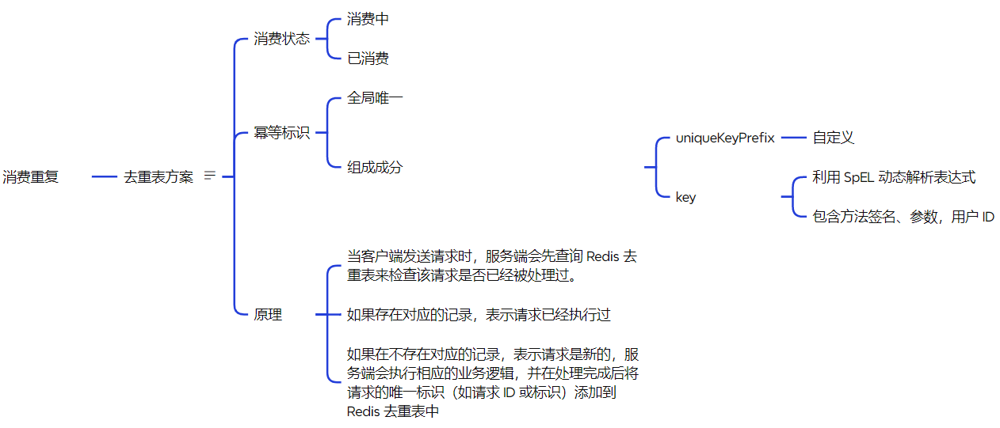

### 发布订阅模式

(1) 什么是发布订阅模式？

发布-订阅模型（Publish-Subscribe Pattern）是一种软件设计模式，用于实现消息的发布和订阅机制。在这种模式中，消息的发布者（发布者）将消息发布到一个中心（通常称为主题或频道），而消息的订阅者（订阅者）可以订阅感兴趣的主题或频道，以接收相关的消息通知。

主要组成部分包括：

1. **发布者（Publisher）**：负责发布消息到指定的主题或频道。一旦发布者发布了消息，所有订阅了该主题或频道的订阅者都会收到相应的消息通知。
2. **订阅者（Subscriber）**：订阅感兴趣的主题或频道，并在有相关消息发布时接收通知。订阅者可以是一个或多个，它们通过注册订阅来表明对特定主题或频道感兴趣。
3. **主题或频道（Topic/Channel）**：消息发布者发布消息的地方，订阅者订阅的对象。一个主题或频道可以有多个发布者和多个订阅者。

(2) 发布订阅模式的优缺点？

优点：

- 解耦
- 异步消息处理
- 支持多对多通信

缺点：

- 难以保证消息的顺序
- 实现较为复杂

### 消息丢失问题

#### (1) 生产者消息丢失

常见的解决方案主要有：

* 事务机制：生产者发送消息前开启事务。发送消息出现异常就回滚事务，发送消息成功就提交事务。
* 发送确认机制：confirm 确认模式。生产者发送消息时，等待消息队列系统返回确认（ACK）信号，以确保消息成功到达消息队列。如果未收到确认或收到 NACK（否认）信号，生产者可以重试发送消息。

#### (1) 消息队列消息丢失

持久化机制 + confirm 确认模式

#### (3) 消费者消息丢失

消费者重传

### 消息重复问题

#### (1) 问题产生原因

- 生产者重复生产。
- MQ 重试机制

#### (2) 解决方案

- **查询法去重**：解决方案是先判断再操作，但是会有并发重复消费的问题，针对并发去重问题可以借助select for update 悲观锁或者乐观锁来解决。

- **去重表方案**：可以很好的处理消息幂等问题，但是无法支持跨库操作以及不支持事务的数据源数据数据的修改，为此引入了非事务消息幂等性方案。

[如何保证MQ消息的幂等性 (qq.com)](https://mp.weixin.qq.com/s/EeYNJJMKkJOFHBV9w0oDUg)

### 消息堆积

一般而言，当消费者服务挂掉的时候，消息队列里面的数据会大量积压。

解决方案：

- 快速修复消费者服务
- 处理消息队列中积压的消息

[【RocketMQ系列十四】RocketMQ中消息堆积如何处理_rocketmq消息堆积处理-CSDN博客](https://blog.csdn.net/u014534808/article/details/133920009)

### 消息顺序问题

### 参考资料

[超详细消息队列MQ使用时常见问题以及解决办法_mq队列冲突的时候-CSDN博客](https://blog.csdn.net/m0_46614240/article/details/106626475)