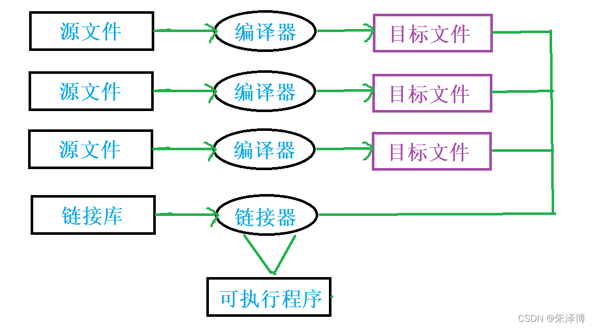

### 编译链接整体流程

1. **源代码编写**：编写 C 语言源代码，保存为 `.c` 文件。
2. **预处理（Preprocessing）**：预处理器 (`cpp`) 处理源代码中的指令，如宏定义 (`#define`)、文件包含 (`#include`)、条件编译 (`#if`、`#ifdef` 等) 等。预处理后的文件被生成一个扩展名为 `.i` 或 `.ii` 的文件，包含了所有宏展开和头文件的内容。
3. **编译（Compilation）**：编译器会对源代码进行语法分析、优化，并最终生成与硬件架构兼容的汇编代码。生成的汇编代码通常是一个 `.s` 文件。

4. **汇编（Assembly）**：汇编器将生成的汇编语言文件（`.s` 文件）转化为机器代码（目标代码）。此时，程序的每个源文件都会生成一个目标文件( `.o` 文件), ，包含了该源文件的机器码和数据，但还不完整，无法直接执行。
5. **链接（Linking）**：链接器将一个或多个目标文件（`.o` 文件）以及库文件（如标准库、第三方库）链接成最终的可执行文件。

```
源码（main.c）
    ↓
  预处理（cpp）
    ↓
  预处理文件（main.i）
    ↓
  编译（gcc）
    ↓
  汇编文件（main.s）
    ↓
  汇编（assembler）
    ↓
  目标文件（main.o）
    ↓
  链接（linker）
    ↓
  可执行文件（program）

```



[详解C语言的编译与链接-CSDN博客](https://blog.csdn.net/m0_50655389/article/details/121687526)


### 内存分配

- `malloc()` 用于在堆区动态分配一块指定大小的内存。分配的内存内容是未初始化的，因此，内存中的值是不可预测的。

    ```c
    void* malloc(size_t size);
    ```

- `calloc()` 用于在堆区分配内存并将其初始化为零。它会分配 `num` 个对象，每个对象的大小为 `size` 字节，并且所有字节都会被设置为 0。

    ```c
    void* calloc(size_t num, size_t size);
    ```

- `realloc()` 用于调整已分配内存块的大小。如果原始内存块的大小不足以满足新的需求，它会尝试扩展或重新分配一个更大的内存块，并将原内存中的数据复制到新内存块中。如果内存重新分配失败，返回 `NULL`，并且原来的内存块保持不变。

    ```c
    void* realloc(void* ptr, size_t new_size);
    ```

- `free()` 用于释放之前通过 `malloc()`, `calloc()` 或 `realloc()` 分配的内存。

  ```c
  void free(void* ptr);
  ```

  在内存释放后，指针仍然存在，但指向的内存已不再有效，因此必须将指针置为 `NULL`，以避免悬挂指针。

  ```c
  free(arr);  // 释放内存
  arr = NULL; // 将指针置为NULL，避免悬挂指针
  ```

  

### 链接库

在 C 或 C++ 编程中，程序的可执行文件通常由多个模块组成，这些模块可能会使用一些外部库或共享代码。静态链接库和动态链接库是两种不同的链接方式，用于将这些外部库与程序的源代码结合。

**(1) 静态链接库 (Static Linking)**

静态链接库（.a 文件在 Unix/Linux 系统中，.lib 文件在 Windows 系统中）是一个<font color="blue">**包含预编译代码的文件**</font>。当程序在编译时，链接器会将所有使用到的静态库的代码复制到最终的可执行文件中。

> 静态库是一个或者多个obj文件的打包。

静态链接库的具体过程为：

1. 编译器会将程序源代码和静态库文件一起编译，生成目标文件（.o 或 .obj 文件）
2. 链接器将源代码目标文件和静态库目标文件合并，生成最终的可执行文件（.exe 或 .out 文件）。

静态链接库的特点有：

- **文件较大**：静态链接会将库的所有代码复制到可执行文件中，导致最终可执行文件较大。
- **不依赖外部库**：生成的可执行文件包含了所有的代码和数据，不依赖于外部的库文件，独立性较强。在运行时不需要静态库。
- **更新不方便**：如果库有更新，需要重新编译和链接整个程序，以包含更新后的库。
- **不支持共享**：如果多个程序使用相同的静态库，每个程序都包含库的副本，这会浪费磁盘空间。

**(2) 动态链接库 (Dynamic Linking)**

动态链接库（.so 文件在 Unix/Linux 系统中，.dll 文件在 Windows 系统中）是<font color="blue">**在程序运行时加载的库文件**</font>。程序并不会将库的代码直接复制到可执行文件中，而是在程序运行时，动态链接器会加载并连接这些库。

> 动态链接库是通过链接器将多个目标文件（`.o`）链接起来形成的。

动态链接库的具体过程为：

1. 编译时，只将程序的代码编译成目标文件，不包含库的代码。
2. 链接时，程序只记录库文件的位置（在运行时加载），生成的可执行文件较小。
3. 在程序执行时，操作系统的动态链接器（如 `ld` 或 Windows 的 `dll loader`）会查找并加载动态链接库。

**特点**：

- **文件较小**：由于库的代码并不被复制到程序中，最终的可执行文件通常较小。
- **依赖外部库**：程序在运行时需要动态加载所依赖的库文件，因此需要确保库文件存在并且版本正确。
- **支持库的共享**：多个程序可以共享同一个动态库的代码，节省磁盘空间。、

**(3) 静态链接库和动态链接库的区别**

| 特性           | 静态链接库 (Static Linking)            | 动态链接库 (Dynamic Linking)                     |
| -------------- | -------------------------------------- | ------------------------------------------------ |
| **链接时机**   | 编译时链接，生成最终的可执行文件       | 运行时链接，执行时加载动态链接库                 |
| **文件大小**   | 可执行文件较大，包含了所有库的代码     | 可执行文件较小，库文件是独立的                   |
| **更新库时**   | 更新库时需要重新编译程序               | 更新库时只需要替换库文件，无需重新编译程序       |
| **共享库**     | 每个程序都有一份库的副本，不能共享     | 多个程序可以共享同一份库文件                     |
| **依赖性**     | 可执行文件不依赖外部库，完全独立       | 可执行文件依赖于外部库文件，缺少库时程序无法运行 |
| **运行时效率** | 启动时不需要加载外部库，运行效率较高   | 启动时需要加载动态库，可能稍微影响启动时间       |
| **内存使用**   | 每个程序都有自己的库副本，内存消耗较大 | 程序共享同一份库，节省内存                       |


### Makefile 工具

`Makefile` 是一种自动化构建工具，用于<font color="blue">**指定如何编译和链接程序的规则**</font>。

在 Linux 或类 Unix 系统中，`make` 命令使用  `Makefile`  来自动化执行编译、链接等任务，避免手动重复操作。`Makefile` 由一系列规则（rules）构成，告诉 `make` 如何从源代码生成目标文件。它通常用于 C/C++ 等程序的编译。

**运行 `make` 的过程:**

1. 读取 `Makefile` 文件。
2. 根据目标和依赖关系判断哪些文件需要重新编译。
3. 执行编译命令，生成目标文件。
4. 执行链接命令，生成最终的可执行文件。


### 动态链接库的使用

Android NDK 通过 **JNI（Java Native Interface）** 使得 Java 和 C/C++ 代码能够互相调用。JNI 是一个框架，允许 Java 代码和其他语言编写的代码进行交互，通常用于 Java 与本地代码之间的桥梁。

- **Java 层**：应用的主要部分，负责 UI 和大部分业务逻辑。
- **Native 层**：使用 C/C++ 编写的底层代码，通过 JNI 进行 Java 和 Native 代码之间的交互。

关键点如下：

- NDK 提供了一个交叉编译工具链，用于将 C/C++ 代码编译为适合 Android 系统的本地代码（如 ARM、x86 架构的代码）。

- NDK 提供的 `ndk-build` 工具来编译本地代码，并生成 `.so`（共享库）文件。