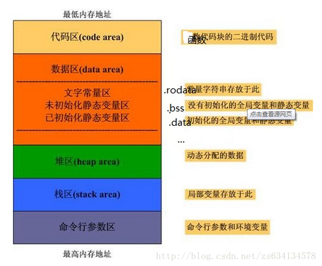

## 数据类型

### String 的 length() 函数

在 Java 中，字符串是由 `char` 类型的字符组成的，每个 `char` 占 2 个字节（16 位），表示一个 Unicode 字符。中文字符通常使用多个字节表示，但在 Java 字符串中，**每个中文字符仍然算作一个 `char`**。

字符串的 `length()` 方法返回的是字符串中字符的数量，而不是字节数。

执行以下代码：

```java
public class Main {
    public static void main(String[] args) {
        String str = "你好，世界！";  // 包含中文字符
        System.out.println("Length of string: " + str.length());
    }
}
```

输出结果为：

```
Length of string: 6
```


### String 和 char 数组的比较

```java
String str1 = "Hello";
char[] chars1 = {'H', 'e', 'l', 'l', 'o'};

// 将 char[] 转换为 String
String str2 = new String(chars1);

// 使用 equals() 比较内容
System.out.println(str1.equals(str2));  // 输出: true
```


## 面向对象

### 构造方法

**构造方法**是用于创建对象时初始化对象的特殊方法。

**`super()`**：调用父类的构造方法。如果父类有无参构造方法，`super()` 会默认被隐式调用。如果父类没有无参构造方法，你必须显式调用父类的构造方法，并传递适当的参数。

**`this()`**：调用当前类的其他构造方法。可以通过 `this()` 调用同一类中的其他构造方法，但必须是构造方法的第一个语句。

构造方法并不强制要求必须使用 `super()` 或 `this()`，但有一些规则需要遵守。

- `super()` 或 `this()` **不能同时出现**在同一个构造方法中。即一个构造方法中只能有 一个 `super()` 或 一个 `this()`
- `super()` 或 `this()` 必须为构造方法的**第一行**。
- 如果没有显式调用 `super()` 和 `this()`，Java 会**自动调用父类的无参构造方法**。如果调用了 `this()`， 则不会调用 `super()` 方法，但 `this()` 所对应的构造方法可能会自动调用父类的无参构造方法。

```java
class Parent {
    public Parent() {
        System.out.println("Parent constructor ");
    }
}

class Child extends Parent {
    // 无参构造方法
    public Child() {
        // 不能在构造方法中同时使用 `this()` 和 `super()`
        this("Default Name"); // 调用当前类的另一个构造方法
        System.out.println("Child constructor");
    }

    // 带参构造方法
    public Child(String name) {
        System.out.println("Child constructor with name: " + name);
    }
}

public class Main {
    public static void main(String[] args) {
        Child child = new Child(); 
    }
}
```

输出结果为：

```
Parent constructor 
Child constructor with name: Default Name
Child constructor
```


### 构造方法执行顺序

(1) 对于派生类的构造函数，在定义对象时构造函数的执行顺序为？
			1：成员对象的构造函数
			2：基类的构造函数
			3：派生类本身的构造函数

**正确答案**：213

**答案解析**：在 Java 中，派生类（子类）对象的构造函数执行顺序如下：

1. **父类的构造函数**：在子类构造函数的第一行，默认会调用父类的无参构造函数（如果没有显式调用父类的构造函数，则 Java 自动调用 `super()`）。如果父类没有无参构造函数，必须显式调用父类的带参构造函数。
2. **成员对象的构造函数**：父类构造函数执行完后，接着会初始化子类的成员变量。如果子类有成员对象（如其他类的实例），则会先初始化这些成员对象。
3. **子类本身的构造函数**：最后，执行子类构造函数的剩余部分，即初始化子类本身的实例变量或执行其他操作。


### 内部类

**问题1：**以下代码的输出结果是什么？

```java
class Outer {
    public int num = 10;
    class Inner {
        public int num = 20;
        public void show() {
            int num = 30;
            System.out.println(num);
            System.out.println(this.num);
            System.out.println(Outer.this.num);
        }
    }
}

class InnerClassTest2 {
    public static void main(String[] args) {
        Outer.Inner oi = new Outer().new Inner();
        oi.show();
    }    
}

```

**答案解析：**

- `num` ：表示方法中的局部变量
- `this.num` ：表示调用该方法所属的类的对象的成员变量。
- `外部类.this.num` ：`Outer.this` 表示外部类 (`Outer`) 的当前实例，`外部类.this.num` 则表示访问外部类的同名成员。

具体结果为：

```
30
20
10
```


## 基础语法

### switch 语句的 fall-through行为

**fall-through 行为**： `switch` 语句**不会在执行判断为真后的语句之后跳出循环**，而是<font color="red">**无条件继续执行**</font>后面所有case语句 和 default 语句。其中，`break` 可以 跳出 `switch` 块，防止执行其他 `case`。

- 如果匹配到某个 `case`，且 没有 `break`，则程序会继续执行后续的 `case` 和 `default` 中的代码，无论这些 `case` 条件是否匹配。
- 如果匹配到某个 `case`，且 有 `break`，程序跳出 `switch`，后续代码不会被执行，包括 `default`。
- **`default` 不会自动跳过**，是否执行取决于前面的代码块是否有 `break`。

```java
public class SwitchTest {
    public static void main(String[] args) {
        int num = 2;

        switch (num) {
            case 1:
                System.out.println("Case 1");
            case 2:
                System.out.println("Case 2");
            case 3:
                System.out.println("Case 3");
            default:
                System.out.println("Default case");
        }
    }
}
```

输出结果为：

```
Case 2
Case 3
Default case
```


## 访问类型

### main 是否可以访问私有方法

`private` 修饰符的访问限制仅在于 "类外不可访问"。

类内部，`main` 方法依旧是类的一部分，依旧可以直接访问类的私有成员。

```java
public class Main {
    // 非静态私有变量
    private String message = "Hello, Instance!";

    // 非静态私有方法
    private void printMessage() {
        System.out.println(message);
    }

    public static void main(String[] args) {
        // 创建类的实例，访问非静态私有变量
        Main test = new Main();
        System.out.println("Accessing private variable: " + test.message);  // 输出：Accessing private variable: Hello, Instance!

        // 调用非静态私有方法
        test.printMessage();    // 输出：Hello, Instance!

    }
}
```


### 静态方法不能直接调用非静态方法

`main` 方法不能直接调用非静态方法或访问非静态变量，因为非静态方法和变量属于对象。

如果需要在 `main` 方法中访问非静态方法或变量，必须先创建该类的实例。

```java
public class Demo {

    // 非静态方法
    public void greet() {
        System.out.println("Hello, from non-static method!");
    }
    
    // 静态方法
    public static void greet() {
        System.out.println("Hello from static method!");
    }

    public static void main(String[] args) {
        // 创建类的实例， 调用非静态方法
        Demo demo = new Demo(); 
        demo.greet();
        
        // 可以直接调用静态方法
        greet();
    }
}
```


### 线程

在公司笔试的时候，公司很有可能要求我们手写多线程。因此，我们应该记住常用的 API

例如，手写多线程，每个一分钟，创建一个线程，并输出某条语句


## Java 虚拟机

(1) 静态变量通常存储在进程哪个区？（）

A、栈区

B、堆区

C、全局区

D、代码区

**正确答案**：C

**答案解析**：

静态变量的修饰关键字：static，又称静态全局变量。

静态变量属于静态存储方式，但是属于静态存储方式的变量不一定就是静态变量。

[牛客网 - 找工作神器|笔试题库|面试经验|实习招聘内推，求职就业一站解决_牛客网](https://www.nowcoder.com/exam/test/85086972/submission?pid=133)




