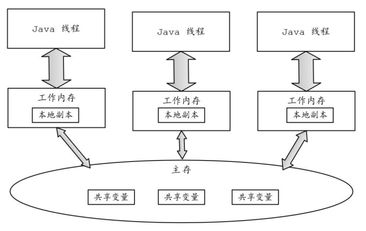
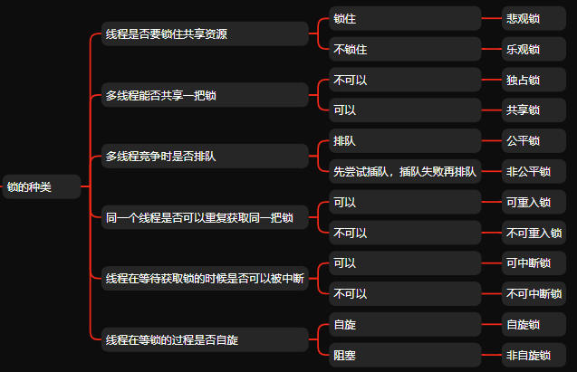
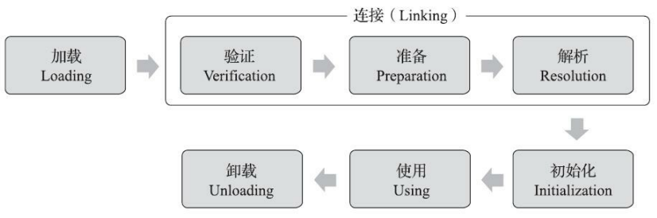
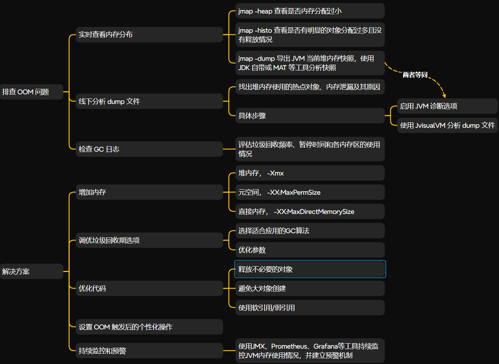

## 一、数据类型


## 二、集合

### 2.1 线程不安全集合

#### 是否支持 Null 值

**答案解析：**

通常而言，支持自动排序或者线程安全的集合不允许 Null 值。

不支持的情况：

- `TreeSet` 和 `TreeMap` 使用 `Comparator` 或对象的 `compareTo` 方法进行自动排序，因此它们不允许 `null` 值。因为在比较过程中，`null` 无法与其他元素进行有意义的比较，会导致 `NullPointerException`。
- `ConcurrentHashMap` 是线程安全的 `Map` 实现，它不允许 `null` 键或 `null` 值。由于该类实现的高并发性，`null` 键或值会影响其工作机制，可能引发不期望的行为或异常。如果在 `ConcurrentHashMap` 中插入 `null` 键或值，会抛出 `NullPointerException`。
- `PriorityQueue` 是基于优先级排序的队列实现，不允许 `null` 元素。因为它必须对元素进行排序或优先级处理，`null` 值无法参与其中。

支持的情况：

- `HashSet` 和 `HashMap` 允许存储 `null` 值。`HashMap` 允许一个 `null` 键和多个 `null` 值。`HashSet` 只允许一个 `null` 值。
- `ArrayList` 和 `LinkedList` 都允许 `null` 元素，因为它们基于索引或链表存储元素，不对值的比较或排序做限制。注意，`ArrayList` 可以进行排序，但 `ArrayList` 自身不会自动排序。


#### 介绍 PriorityQueue 的实现原理

在 `PriorityQueue` 里面，**数组 `queue` 用于存储堆中的元素**，使用二叉堆（ Binary Heap）来实现。具体细节如下：

数组表示堆：

1. 子节点索引：
   - 节点 `queue[n]` 的左子节点是 `queue[2*n+1]`。
   - 节点 `queue[n]` 的右子节点是 `queue[2*(n+1)]`。
2. 排序规则：
   - 如果提供了 `comparator`，则按照 `comparator` 排序。
   - 如果没有提供 `comparator`，则按照元素的自然顺序排序。
3. 堆性质：对于堆中的每个节点 n 和其所有后代节点 d，都有 n <= d。
4. 最小值位置：假设队列非空，最小值始终位于 queue[0]。

```java
transient Object[] queue; // non-private to simplify nested class access
```

当元素存储在一个数组中，并且需要支持优先级队列的功能时，**元素的优先级通常是通过元素本身或者与元素紧密关联的方式来存储的**。

1. 元素自身携带优先级：
   - 如果元素本身就是可比较的对象（比如实现了 Comparable 接口），那么元素的自然顺序就可以用来表示优先级。
   - 如果元素是一个复合对象，可以将优先级作为对象的一个属性（例如，一个 Pair<优先级, 数据> 或者自定义类中包含优先级字段）。
2. 数组索引映射优先级：
   - 数组中的每个位置存储的是一个完整的元素，包括其数据和优先级。在这种情况下，优先级不需要单独存储，因为它是元素的一部分。


#### 什么时候链表转换为红黑树？

在 `HashMap` 中，链表会在特定条件下转换为红黑树，以提高性能。具体流程为：

1. **检查链表长度是否超过阈值**：当一个哈希桶中的链表长度超过 `TREEIFY_THRESHOLD`，调用`treeifyBin()` 函数，链表会被转换为红黑树。相关源码为：

   ```java
   // 当某个链表的长度超过此阈值时，该链表可能会转换为红黑树以提高查找效率
   static final int TREEIFY_THRESHOLD = 8;
     
   final V putVal(int hash, K key, V value, boolean onlyIfAbsent,
                      boolean evict) {
   	...
   	if (binCount >= TREEIFY_THRESHOLD - 1) // -1 for 1st
       	treeifyBin(tab, hash);
       ...                   
   }
   ```

2. **链表转化为红黑树**：首先，创建一个红黑树，开始时将链表中的节点插入到红黑树中。每个链表节点会被转换为红黑树节点（`TreeNode`）。然后，检查哈希表是否为空或其长度是否小于红黑树所需的最小容量。相关源码为：

   ```java
   // 当给定索引的桶中的链表转换为红黑树时，哈希表要求的最小容量
   static final int MIN_TREEIFY_CAPACITY = 64;
   
   /**
    * 将给定索引的桶中的链表转换为红黑树，前提是哈希表的容量足够。
    * 如果哈希表的容量不足，则会先进行扩容。
    *
    * @param tab 哈希表（桶数组）。
    * @param hash 键的哈希值。
    */
   final void treeifyBin(Node<K,V>[] tab, int hash) {
       int n, index;
       Node<K,V> e;
   
       // 检查哈希表是否为空或其长度是否小于红黑树所需的最小容量
       if (tab == null || (n = tab.length) < MIN_TREEIFY_CAPACITY) {
           // 如果哈希表的容量不足，则进行扩容
           resize();
       } else if ((e = tab[index = (n - 1) & hash]) != null) {
           // 如果指定索引的桶不为空，则开始将链表转换为红黑树
           TreeNode<K,V> hd = null, tl = null; // 红黑树的头节点和尾节点
   
           // 遍历桶中的链表
           do {
               // 将链表中的节点转换为 TreeNode
               TreeNode<K,V> p = replacementTreeNode(e, null);
   
               // 将节点链接成一个双向链表，以构建红黑树
               if (tl == null) {
                   // 如果是链表中的第一个节点，则将其设置为红黑树的头节点
                   hd = p;
               } else {
                   // 否则，将当前节点链接到前一个节点
                   p.prev = tl;
                   tl.next = p;
               }
               // 更新尾节点为当前节点
               tl = p;
           } while ((e = e.next) != null); // 继续遍历直到链表末尾
   
           // 将转换后的红黑树放回哈希表的对应桶中
           if ((tab[index] = hd) != null) {
               // 调用 treeify 方法将链表转换为红黑树，调整树的结构以保持平衡
               hd.treeify(tab);
           }
       }
   }
   
   ```


#### 链表转换为红黑树的优劣势

**优势**：

- 当某个哈桶中的元素数量超过一定阈值（`TREEIFY_THRESHOLD`），链表会被转换成一个平衡树（红黑树），以提高性能。树化使得在桶中元素数量过多时，**查找时间从 O(n) 降低到 O(log n)**。

**劣势**：

- `TreeNode`  占用的空间是普通节点的两倍，因此只有在桶中元素数量足够多时才会使用树化。树化可以减少性能下降，但在  `hashCode` 分布良好的情况下，树化通常不会被使用。


#### 红黑树什么时候转链表？

当一个桶中的元素个数减少到一定阈值时（通常是 `TREEIFY_THRESHOLD` 以下），`TreeBin` 会调用 `untreeify` 方法，将红黑树转换回链表。这是因为，较少的元素（比如小于 8 个元素）存储在链表中会更为高效。


#### HashMap  的扩容操作

当没有指定初始容量时，哈希表的默认初始容量为 16 ， 扩容阈值为 12。当 HashMap 中的元素数量达到该阈值时，会触发 HashMap 的扩容操作。阈值计算公式为：

```
threshold = capacity * load factor
```

扩容的核心函数为 `resize()` 。当链表长度超过 扩容阈值时， 执行`resize()` 函数。在 `resize()` 里面， 具体步骤为：

1. 扩展哈希表长度， `newCap = oldCap << 1`  表示扩容后的容量为原来的两倍。
2. 将旧哈希表中的数据放到新的哈希表中。


#### hashmap从空扩容到百万级，扩容的次数大概是多少？

扩容机制的简要概述：

1. **初始容量**：默认情况下，`HashMap` 的初始容量是 16（`initial capacity = 16`）。
2. **负载因子**：默认的负载因子是 0.75，即当 `size > capacity * 0.75` 时会触发扩容。
3. **扩容比例**：每次扩容时，`HashMap` 的容量会翻倍。

从空的 `HashMap` 扩容到百万级别（1,000,000），大约需要 **16 次扩容**。


### 2.2 线程安全集合

#### 什么是 ConcurrentHashMap ？

**答案解析：**

**(1)存储结构**

在 JDK 17， 数据结构为 <font color="red">**数组 + 链表 / 红黑树**</font>。其中，

- 数组(哈希表)： 存放 HashMap 里面的键值对。数组里面的每个元素要么是 `null`，要么是哈希桶的头节点（一个 `Node<K, V>` 对象），指向链表 / 红黑树的起始。
- 链表 / 红黑树(哈希桶)：解决哈希冲突。当链表达到一定长度时，链表将会转化为红黑树。 在 链表 / 红黑树 中，所有元素的键不相同，但键的哈希值相同。

**(2) 线程安全**

线程安全的实现策略为 `Node + CAS + synchronized`，具体优化如下：

- **细粒度锁与 CAS 的结合使用**：使用更细粒度的锁（`synchronized`）和 CAS (Compare-And-Swap) 算法来保证线程安全，根据锁竞争操作来判断使用 `synchronized`  或者 CAS 。
- **锁粒度进一步优化到节点级别**：锁的粒度被细化到每个节点，最大限度地降低锁的范围，从而实现更高的并发度。JDK 17 最大并发度是 Node 数组的大小。

- **链表或树节点操作中的自旋机制**：在某些操作（如链表或树节点的插入、删除）中，CAS 失败后，采用自旋的方式重试。在高并发环境下，自旋可以避免不必要的上下文切换，从而提高性能。如果自旋锁仍然无法解决冲突，`ConcurrentHashMap` 会回退到更传统的锁机制，即使用内置的 `synchronized` 来进行更粗粒度的锁保护。


#### ConcurrentHashMap 操作的安全实现有什么区别？

**(1) initTable() 方法**

- **CAS**：使用 CAS 尝试将 `sizeCtl` 设置为 -1，表示当前线程开始初始化
- **`volatile` 可见性**：`table` 是一个 `volatile` 变量，保证多线程对其操作的可见性。
- **细粒度控制**：通过 `sizeCtl` 的状态（正数/负数）协调线程，避免多个线程同时初始化或扩容。

**(2) put() 方法**

- 当桶为空时，使用 CAS 更新。
- 当桶正在扩容的情况，当前线程会协助完成扩容任务。协助完成后，当前线程会继续自己的插入操作。
- 当目标桶不为空时（存在链表或红黑树结构），操作逻辑复杂，无法通过 CAS 一步完成，需要 `synchronized` 来保护一致性。

**(3) get() 方法**

- 只读操作无需加锁
- 基于 `volatile` 保证可见性：`ConcurrentHashMap` 内部使用了 `volatile` 修饰 `table` 和桶中的节点（如 `Node` 数组）。


#### ConcurrentHashMap 为什么 key 和 value 不能为 null？

null 具备二义性：

- 不存在
- 存在，但本身为 null

在多线程的环境下，`containsKey(key)` **无法完全准确地判断一个 `key` 是否存在**。因为 `containsKey` 本身并不会加锁，也没有保证在它执行时，其他线程不会修改 `Map`。举个例子，

- 线程 A 执行 `containsKey(key)`，判断 `key` 是否存在。

- 在查询过程中，线程 B 执行了 `remove(key)`，将该 `key` 从 `Map` 中移除。

- 如果线程 A 得到 `containsKey(key)` 为 `true`，而实际上 `key` 已经被线程 B 删除了，结果就不准确了。


#### ConcurrentHashMap 和 HashTable 的区别？

- **`HashTable` 使用 `synchronized` 来保证线程安全**，包含 `get()/put()` 在内的所有相关需要进行同步执行的方法都加上了 `synchronized`  关键字，以锁定这个哈希表。`HashTable` 线程安全策略的代价非常大，这相当于给整个哈希表加了一把大锁。

- ConcurrentHashMap 则使用 `Node + CAS + synchronized` 保证线程安全，锁的粒度降到来 Node。


## 三、并发

### 3.1 理论基础

#### Java 内存模型

Java内存模型的规定如下： 

- 所有变量存储在主存中。 
- 每个线程都有自己的工作内存，将主存中的变量复制到自己的工作内存中，且对变量的操作都是在工作内存中进行的。
- 不同线程之间无法直接访问彼此工作内存中的变量，要想访问只能通过主存来传递。




#### Happens-Before 原则的定义

在 Java 内存模型中，**Happens-Before** 原则用于描述两个操作之间的先后顺序，保证有序性。一个操作 `A` **happens-before** 另一个操作 `B`，意味着 `A` 的结果对 `B` 是可见的，即 `A` 必须在 `B` 之前完成。

Happens-Before 原则主要有：

- 顺序性规则：一个线程内，按照代码顺序书写在前面的操作 **happens-before**  发生于书写在后面的操作。
- `volatile` 规则：对一个 `volatile` 变量的写操作 `A` **happens-before** 对该 `volatile` 变量的后续读操作 `B`。
- 传递性规则：如果  A 操作 **happens-before**  B 操作，且 B 操作 **happens-before**  C 操作，那么 A 操作 **happens-before**   C 操作。
- 监视锁规则：对一个锁的unlock操作先行发生于后面对同一个锁的lock操作
- `start()` 规则：如果线程 A 执行 `ThreadB.start()` 操作启动线程 B，那么线程 A 的 `ThreadB.start()` 操作 **happens-before**  线程 B 中的任意操作。
- `join()` 规则:  如果线程 A 执行 `threadB.join()` 操作并成功返回，那么线程 B 中的任意操作先行发生于线程 A 的 `ThreadB.join()` 操作。


#### 为什么需要 happens-before 原则

Happens-Before 原则主要是为了平衡程序员的需求、编译器和处理器的需求。

| 目标                    | 程序员的需求                       | 编译器和处理器的需求               |
| ----------------------- | ---------------------------------- | ---------------------------------- |
| **主要诉求**            | 可理解的、符合预期的执行顺序       | 最大化性能，减少执行时间和内存访问 |
| **约束**                | 程序行为应按预期顺序执行，避免错误 | 尽量减少约束，进行重排序和优化     |
| **Happens-Before 原则** | 保证多线程执行顺序符合预期         | 允许优化，但不改变程序行为         |


#### 并发编程三大特性

**(1) 原子性**

原子性指的是一个操作要么全部完成，要么完全不执行，不会被其他线程打断。在多线程环境中，原子性确保了某个操作的不可分割性。

原子性主要是通过锁来实现的，具体解决方案有：

- 使用**互斥锁**（Mutex）或**信号量**（Semaphore）来保护临界区。
- 使用 CAS 算法，调用了底层 CPU 指令 `cmpxchg`。例如，使用 `java.util.concurrent.atomic` 包中的原子类来实现原子操作。

**(2) 可见性**

可见性指的是一个线程对共享变量的修改能被其他线程及时看到。在多线程程序中，如果一个线程修改了共享变量，其他线程必须能够立即看到这个变化。

可见性主要是通过 `volatile` 来实现的。

**(3) 有序性**

有序性指的是指令的执行顺序与程序中代码的编写顺序一致。在单线程程序中，指令是按顺序执行的，但在多线程环境中，编译器、处理器和优化可能会改变指令的执行顺序。

有序性的实现方式为：

- 使用 `synchronized` 和 `volatile` 可以通过内存屏障来保证操作顺序，避免 CPU 重排。


### 3.2 线程

#### 创建线程的方式

Java 提供了三种创建线程的方法：

- 通过实现 `Runnable` 接口；
- 通过继承 `Thread` 类本身；
- 通过 `Callable` 和 `Future` 创建线程。

<br>


#### Java 线程状态转换

Java 线程状态变迁图(图源：[挑错 |《Java 并发编程的艺术》中关于线程状态的三处错误open in new window](https://mp.weixin.qq.com/s/UOrXql_LhOD8dhTq_EPI0w))：


 **Thread 类 和  Runnable 接口 的区别**

 `Thread` 类实现 `Runnable` 接口

<br>


####  wait()方法和 sleep()方法的区别是什么?

**答案解析：**

- 功能： `wait()` 是 `Object` 类中的一个方法, 使线程进入 **`WAITING`** 状态，等待被其他线程唤醒。。而 `sleep()`是 `Thread` 类中的一个静态方法, 使线程进入 **`TIMED_WAITING`** 状态，直到指定的休眠时间结束。
- 底层实现： `wait()` 会释放锁，让其他线程有机会获得锁。`sleep()` 不会释放锁，当前线程仍然持有它所占有的锁。

<br>


#### **启动一个线程是run()还是start()?有什么区别？**

启动一个线程是调用start(）方法，这并不意味着线程就会立即运行，只是进入了可运行状态。

start() 方法用于启动线程，run() 方法用于执行线程的运行时代码。run() 可以重复调用，而 start() 只能调用一次。

直接调用run()方法不会产生线程，而是把它当作普通的方法调用，马上执行。

<br>


#### interrupt() 方法

`interrupt()` 方法是 Java 中用于中断线程的一种机制。它并不会直接终止线程，而是设置一个中断标志位，通知目标线程它被请求中断了。具体来说，线程通过检查自身的中断状态来响应这个中断请求。<font color="red">**Java 认为线程应该自行决定是否以及如何处理中断请求**</font>。`interrupt()` 只是提供了一个信号，允许线程有机会对中断做出反应。

`interrupt()`  对不同类型的线程的执行结果如下：

- **非阻塞线程**： 对于非阻塞的线程，`interrupt()` 仅仅是将线程的中断状态置为 `true`。如果线程不检查这个状态，它将继续运行。

- **阻塞线程**： **对于处于等待、睡眠或阻塞状态的线程，调用 `interrupt()` 会让线程抛出 `InterruptedException`**，这也是阻塞状态下唯一响应中断的方法。例如，在调用 `Thread.sleep()`、`Object.wait()`、`BlockingQueue.take()` 等方法时，如果线程被中断，将抛出 `InterruptedException`


#### 线程同步通信

使用同步的方式，通过 notifyAll 和 wait 方法实现线程间的通信。

<br>


#### 常用的工具类 JUC

- **CountDownLatch 类**：作为倒计时器来使用，让一个或多个线程等待其他线程完成某些操作后再继续执行。

- **Semaphore 类**: 用于限制同时访问特定资源的线程数量

- **CyclicBarrier 类**: 让一组线程到达一个屏障时阻塞，直到所有线程到达屏障，所有被屏障拦截的线程才会继续执行


#### ThreadLocal 类

ThreadLocal 类存在的问题：

- **可能存在的内存泄露问题**(如果没有使用 `threadLocal.remove()` )。
- **线程池中存在的变量污染问题**。因为多个任务在同一个线程中执行，它们共享了同一个 `ThreadLocal`。当线程池中的线程执行任务后，如果不清理 `ThreadLocal`，后续任务可能会继承之前任务中的数据，导致上下文污染。
- **子线程无法继承父线程的变量**。ThreadLocal 的不可继承性是指在子线程中无法直接继承父线程的 ThreadLocal 变量。

`InheritableThreadLocal`解决了子线程无法继承父线程的变量这一问题，但依然存在以下问题：

- **线程池中存在的变量污染问题**：线程池中的线程是被复用的。当线程池中的线程执行任务后，如果不清理 `ThreadLocal`，后续任务可能会继承之前任务中的数据，导致上下文污染。
- **动态上下文传递问题**： `InheritableThreadLocal` 的传递机制是在子线程创建时完成的，这意味着如果父线程的 `ThreadLocal` 值在子线程创建后发生变化，这个变化不会传递给已经创建的子线程。

TTL 解决了动态上下文传递问题。


### 3.3 线程池

#### 线程池核心参数

 `ThreadPoolExecutor` 类的构造函数，用于创建一个具有指定参数的线程池。源代码为：

```java
public ThreadPoolExecutor(int corePoolSize,
                          int maximumPoolSize,
                          long keepAliveTime,
                          TimeUnit unit,
                          BlockingQueue<Runnable> workQueue,
                          ThreadFactory threadFactory,
                          RejectedExecutionHandler handler) {
    if (corePoolSize < 0 ||
        maximumPoolSize <= 0 ||
        maximumPoolSize < corePoolSize ||
        keepAliveTime < 0)
        throw new IllegalArgumentException();
    if (workQueue == null || threadFactory == null || handler == null)
        throw new NullPointerException();
    this.corePoolSize = corePoolSize;
    this.maximumPoolSize = maximumPoolSize;
    this.workQueue = workQueue;
    this.keepAliveTime = unit.toNanos(keepAliveTime);
    this.threadFactory = threadFactory;
    this.handler = handler;
}
```

参数具体解析为：

- **corePoolSize**：核心线程数，即线程池中始终保持活动的线程数量。
- **maximumPoolSize**：最大线程数，即线程池允许同时运行的最大线程数量。
- **keepAliveTime**：线程的闲置时间。当线程池中的线程数量超过核心线程数时，超过 `keepAliveTime` 未被使用的多余线程将被终止。
- **unit**：`keepAliveTime` 的时间单位。
- **workQueue**：任务队列，用于存储等待执行的任务。
- **threadFactory**：线程工厂，用于创建新线程。
- **handler**：拒绝执行处理器。当线程池和任务队列都已满时，用于处理新提交的任务。


#### 拒绝策略

拒绝执行处理器（`RejectedExecutionHandler`）用于处理当线程池任务提交超出其容量限制时的情况。线程池在无法执行提交的任务时会调用拒绝策略。

| 策略类型              | 描述                                                 | 场景                                       |
| --------------------- | ---------------------------------------------------- | ------------------------------------------ |
| `AbortPolicy`（默认） | 抛出 `RejectedExecutionException` 异常，任务无法执行 | 需要严格执行任务时，拒绝新任务应该立即告警 |
| `DiscardPolicy`       | 直接丢弃无法处理的任务，不抛异常                     | 任务不重要，允许丢弃                       |
| `DiscardOldestPolicy` | 丢弃队列中最早提交的任务，并尝试重新提交新任务       | 新任务优先级高于旧任务                     |
| `CallerRunsPolicy`    | 由调用线程（提交任务的线程）执行该任务               | 不想丢弃任务，同时减缓任务提交速率         |
| 自定义策略            | 用户自定义处理逻辑                                   | 需要更复杂的拒绝逻辑（如重试、日志记录等） |


#### excute() 和 submit()  的区别

`ExecutorService` 线程池**提交异步执行 target 目标任务的常用方法**主要为 **execute()** 和 **submit()** , 具体细节如下：

| 任务类型        | 方法                        | 说明                                             |
| --------------- | --------------------------- | ------------------------------------------------ |
| `Runnable` 任务 | `execute(Runnable command)` | 提交一个不返回结果的任务                         |
| `Callable` 任务 | `submit(Callable<T> task)`  | 提交一个有返回结果的任务，返回一个 `Future` 对象 |


#### 线程池的 corePoolSize 设置经验

线程数的配置与异步任务类型是分不开的，异步任务主要包括：

- **IO 密集型任务**： 主要是执行 IO 操作。由于执行 IO 操作的时间较长，导致 CPU 的利用率不高
- **CPU 密集型任务**： 主要是执行计算任务。由于响应时间很快，CPU 一直在运行，这种任务 CPU 的利用率很高。
- **混合型任务**：此类任务既要执行逻辑计算，又要进行 IO 操作（如 RPC 调用、数据库访问）。相对来说，由于执行 IO 操作的耗时较长（一次网络往返往往在数百毫秒级别），这类任务的 CPU 利用率也不是太高。Web 服务器的 HTTP 请求处理操作为此类任务的典型例子。

当 CPU 利用率高时，**并行的任务越多， 花在任务切换的时间就越多**，CPU执行任务的效率就越低。因此，针对不同类型的任务，线程池的 `corePoolSize`  设置情况如下：

- **IO 密集型任务**：  `corePoolSize` = CPU 核数 *  2
- **CPU 密集型任务**：  `corePoolSize` = CPU 核数  

- **混合型任务**： `corePoolSize` = CPU 核数  * （  （线程等待时间 + 线程 CPU 时间 ）/ 线程 CPU 时间 ）


### 3.4 锁

#### 锁的种类




#### 如何检测死锁

- 使用`jmap`、`jstack`等命令查看 JVM 线程栈和堆内存的情况。
- 使用 VisualVM、JConsole 等工具进行排查。JConsole 自带可视化界面，能够一键检测死锁。

[Java并发常见面试题总结（上） | JavaGuide](https://javaguide.cn/java/concurrent/java-concurrent-questions-01.html#什么是线程死锁)


## 四、Java 虚拟机

### 4.1 自动内存管理

#### 简单阐述一下 JVM 的内存结构？


#### 如何判断对象已经死亡？

垃圾收集器在对堆进行回收前，第一步就是判断哪些对象死亡（不可达）。 <font color="blue">**死亡指不可能再被任何途径使用的对象**</font>。

**(1) 引用计数法（Reference Counting）**

引用计数法**为每个对象维护一个引用计数器**。当有一个新的引用指向该对象时，计数器加一；当一个引用不再指向该对象时，计数器减一。如果计数器的值为零，说明该对象不再被任何其他对象引用，因此可以认为该对象是死亡的，能够被垃圾回收器回收。

但是，该算法**无法解决循环引用问题**：如果两个对象互相引用，但没有其他对象引用它们，引用计数不会归零，导致它们无法被回收。

**(2) 可达性分析算法（Reachability Analysis）**

可达性分析算法的基本思路是以一组称为 **GC Roots** 的根对象为起点，遍历对象引用关系。如果一个对象从 GC Roots 不可达，那么该对象就被认为是“死”的，可以被垃圾回收。


#### 说说常见的垃圾回收器

**(1) CMS 收集器**

CMS（Concurrent Mark Sweep）收集器是一种以**获取最短回收停顿时间为目标的收集器**。具体特征如下：

- 基于标记-清除算法来实现
- 除了并发标记和并发清理，**初始标记、重新标记这两个步骤仍然需要“Stop The World”**。

**(2) Garbage First 收集器**

G1 (Garbage-First) 是一款面向服务器的垃圾收集器,主要针对配备多颗处理器及大容量内存的机器. 以极高概率满足 GC 停顿时间要求的同时,还具备高吞吐量性能特征。具体特点如下：

- 使用了 **Mixed GC 模式**， 基于标记-整理算法来实现。
- 基于Region的堆内存布局
- 除了并发标记外，其余阶段需要**“Stop The World”**


#### 有没有看过 GC 垃圾回收日志？

在 Java 程序中启用 GC 日志，通常使用以下 JVM 参数：

```
-Xlog:gc*:file=<log_file_path>  # 输出 GC 日志
```


### 4.2 虚拟机执行子系统

#### 类加载过程

一个类型从被加载到虚拟机内存中开始，到卸载出内存为止，它的整个生命周期将会经历加载 （Loading）、验证（Verification）、准备（Preparation）、解析（Resolution）、初始化 （Initialization）、使用（Using）和卸载（Unloading）七个阶段，其中验证、准备、解析三个部分统称 为连接（Linking）。

其中，加载、验证、准备、初始化和卸载这五个阶段的顺序是确定的，但是解析的阶段并不确定。


#### 双亲委派模型

<font color="blue">**双亲委派模型（Parents Delegation Model）是指各种类加载器之间的层次关系和协作关系**</font>。双亲委派模型的工作过程是：如果一个类加载器收到了类加载的请求，它首先不会自己去尝试加 载这个类，而是把这个请求委派给父类加载器去完成，每一个层次的类加载器都是如此，因此所有的 加载请求最终都应该传送到最顶层的启动类加载器中，只有当父加载器反馈自己无法完成这个加载请求（它的搜索范围中没有找到所需的类）时，子加载器才会尝试自己去完成加载。


#### 为什么要使用双亲委托模型

- **避免类的重复加载** ：双亲委派模型可以避免同一个类被多个类加载器重复加载，从而避免了类冲突的问题。当父加载器已经加载了某个类时，子加载器就不会再次加载，而是直接使用父加载器加载的版本。

- **保证核心类库的一致性：** Java核心类库由启动类加载器加载，因此不会被应用程序类加载器替换，保证了核心类库的一致性和稳定性。


### 4.3 内存泄漏

#### JVM 常见的内存泄漏原因？

**答案解析：**

[Java 中发生内存泄漏 5 个场景以及解决方法_java内存泄漏-CSDN博客](https://blog.csdn.net/wuhuayangs/article/details/122594327)

- **连接没有正常关闭**（如数据库连接、网络连接等）。如果在使用数据库连接、文件流、网络连接等资源时，没有在使用完毕后及时关闭，JVM 会将这些连接对象保留在内存中，造成资源无法释放，导致内存泄漏。为了避免这类问题，我们可以使用 `try-with-resources` 或在 `finally` 代码块中显式关闭连接。
- **静态集合类（如 `Map`, `List` 等）持有大量数据**。这些静态变量的生命周期和应用程序一致，则容器中的对象在程序结束之前将不能被释放，从而造成内存泄漏，简单而言，长生命周期的对象持有短生命周期对象的引用，尽管短生命周期的对象不再使用，但是因为长生命周期对象持有它的引用而导致不能被回收。
-  **线程未停止或未关闭**。
- **使用 ThreadLocal 造成内存泄露**。使用到 ThreadLocal 来保留线程池中线程的变量副本时，ThreadLocal 没有显式地删除时，就会一直保留在内存中，不会被垃圾回收。解决办法是不在使用 ThreadLocal 时，调用 remove() 方法。

<br>

#### 内存泄漏的常见错误?

**答案解析：**

`java.lang.OutOfMemoryError` 错误的种类有：

+ 堆内存溢出  `java.lang.OutOfMemoryError: Java heap space`
+ 元空间溢出  `java.lang.OutOfMemoryError: Metaspace`
+ 直接内存溢出  `java.lang.OutOfMemoryError: Direct buffer memory`
+ 线程内存溢出（ `java.lang.OutOfMemoryError: unable to create new native thread`

比较特殊地，栈溢出 `java.lang.StackOverflowError` 耗尽了栈空间，但并没有导致内存资源耗尽。


#### OOM 解决方案

