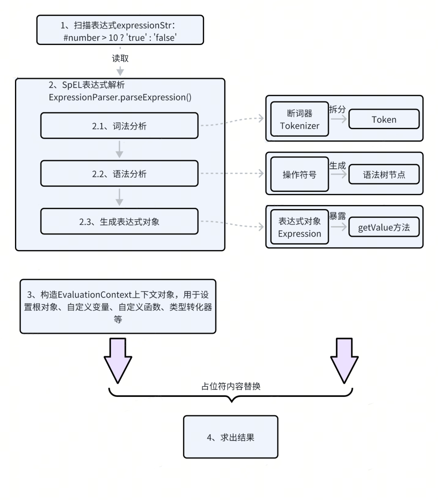

[TOC]

## 一、控制反转 IoC 

### 什么是 Bean 和 Spring Bean？

**答案解析：**

- 一个 Java Bean 是一种符合以下约定的可重用类：
  1. **属性私有化**：类的属性通过 `private` 修饰，不能直接访问。
  2. **提供 Getter 和 Setter 方法**：通过 `get` 和 `set` 方法访问或修改属性。
  3. **无参构造器**：必须提供一个公共的无参构造器。
  4. **可序列化**（可选）：实现 `Serializable` 接口，方便对象的序列化。

- Spring Bean 是在 Spring 配置文件（XML、注解或 Java 配置类）中定义的组件或对象， 由 Spring IoC 容器进行管理。

<br>


### 依赖注入的常见方式？

**答案解析：**

构造函数注入适合处理必需的依赖项，而 Setter 注入则更适合可选的依赖项。

- **构造函数注入**（官方推荐做法）

  ```java
  @Service
  public class Service {
      private final Repository repository;
      
      // 构造器底层会使用注解 @Autowired ，可以隐式使用
      public Service(Repository repository) {
          this.repository = repository;
      }
  }
  ```

- **Setter 注入**：依赖对象通过 setter 方法注入。

  ```java
  public class Service {
      private Repository repository;
      
      // 可以隐式使用 @Autowired
      public void setRepository(Repository repository) {
          this.repository = repository;
      }
  }
  ```

- **Field 注入**：使用`@Autowired`注解直接在字段上注入依赖。这种方式通常用于小型项目或者在测试时注入模拟对象。不建议使用字段注入。

  ```java
  @Service
  public class Service {
      @Autowired
      private Repository repository;
  }
  ```

<br>


### Bean 的作用域有哪些？

**答案解析：**

Bean 的作用域定义了 Bean 的生命周期和可见性。

- Spring 中的 Bean 默认都是单例的。
- 无状态的 Bean 的使用 `singleton`,  而有状态的 Bean 使用 `prototype`。注意：有状态单例 Bean 存在线程安全问题。
- 作用域可以用 `@scope` 注解来设置。

不同作用域的含义如下：

| 作用域                                                       | 描述                                                         |
| :----------------------------------------------------------- | :----------------------------------------------------------- |
| [singleton](https://docs.spring.io/spring-framework/reference/core/beans/factory-scopes.html#beans-factory-scopes-singleton) | (**默认**) 将单个 Bean 定义作用域限定为每个 Spring IoC 容器中的一个对象实例。 |
| [prototype](https://docs.spring.io/spring-framework/reference/core/beans/factory-scopes.html#beans-factory-scopes-prototype) | 将单个 Bean 定义作用域限定为多个对象实例。                   |
| [request](https://docs.spring.io/spring-framework/reference/core/beans/factory-scopes.html#beans-factory-scopes-request) | 将单个 Bean 定义作用域限定为一个 HTTP 请求的生命周期。即，每个 HTTP 请求都有基于同一个 Bean 定义创建的自己的实例。仅在支持 Web 的 Spring `ApplicationContext` 中有效。 |
| [session](https://docs.spring.io/spring-framework/reference/core/beans/factory-scopes.html#beans-factory-scopes-session) | 将单个 Bean 定义作用域限定为 HTTP `Session` 的生命周期。仅在支持 Web 的 Spring `ApplicationContext` 中有效。 |
| [application](https://docs.spring.io/spring-framework/reference/core/beans/factory-scopes.html#beans-factory-scopes-application) | 将单个 Bean 定义作用域限定为 `ServletContext` 的生命周期。仅在支持 Web 的 Spring `ApplicationContext` 中有效。 |
| [websocket](https://docs.spring.io/spring-framework/reference/web/websocket/stomp/scope.html) | 将单个 Bean 定义作用域限定为 `WebSocket` 的生命周期。仅在支持 Web 的 Spring `ApplicationContext` 中有效。 |

<br>


### protype bean 里面的依赖是 singleton bean 的话，IoC 容器会怎么处理？

- Singleton bean 是在容器启动时创建并共享的，只会实例化一次。Prototype bean 是每次请求都会创建一个新的实例。

- 当我们通过 Spring 容器请求 Prototype Bean 时，Spring 会创建一个新的 Prototype Bean 实例，但会将已经存在的 Singleton Bean 实例注入到其中。`Singleton Bean` 是共享的，在整个容器生命周期内只有一个实例，而每次请求 Prototype Bean 时，都会得到一个新的实例，注入的 Singleton Bean 仍然是同一个实例。

<br>


### Bean 的生命周期？

**答案解析：**

Bean 的生命周期概括起来就是 **4 个阶段**：

1. 实例化（Instantiation）：实例化一个 Bean 对象
2. 属性赋值（Populate）：为 Bean 设置相关属性和依赖
3. 初始化（Initialization）： 执行 Bean 自身的初始化操作，Spring 提供了多个钩子方法和机制来执行初始化逻辑。其中，第 5、6 步为初始化操作，第 3、4 步为在初始化前执行，第 7 步在初始化后执行。该阶段结束，才能被用户使用。
4. 销毁（Destruction）：第8步不是真正意义上的销毁），而是先在使用前注册了销毁的相关调用接口，为了后面第9、10步真正销毁 bean 时再执行相应的方法。


[如何记忆Spring Bean的生命周期 - 草捏子 (chaycao.github.io)](https://chaycao.github.io/2020/02/15/如何记忆Spring-Bean的生命周期.html)

[Customizing the Nature of a Bean :: Spring Framework](https://docs.spring.io/spring-framework/reference/core/beans/factory-nature.html#beans-factory-aware)

<br>


### @Resource 和 @Autowired 有什么区别吗？

**答案解析：**

当一个接口存在多个实现类的话，byType 这种方式就无法正确注入对象。我们必须设置为按名称匹配。

指的注意的是，@Resource 会增加额外代码，  SpringBoot3 及以上已经废弃了 @Resource 注解。

| **特性**           | **@Resource**                            | **@Autowired**                       |
| ------------------ | ---------------------------------------- | ------------------------------------ |
| **来源**           | Java 标准（JSR-250，`javax.annotation`） | Spring 专属（`org.springframework`） |
| **默认匹配规则**   | 按名称优先，其次按类型                   | 按类型优先                           |
| **按名称注入支持** | 原生支持（`name` 属性）                  | 需配合 `@Qualifier` 使用             |
| **支持可选性**     | 不支持                                   | 支持（`required = false`）           |
| **推荐使用场景**   | 需要按名称注入，或项目遵循 Java 标准规范 | Spring 项目中，默认按类型注入        |

<br>


### @Component 和 @Bean 的区别是什么？

**答案解析：**

| **特点**       | **@Component**                                 | **@Bean**                                        |
| -------------- | ---------------------------------------------- | ------------------------------------------------ |
| **适用场景**   | 对于开发者定义的类，推荐使用 `@Component`。    | 对于外部类或复杂实例化逻辑，推荐使用 `@Bean`。   |
| **自动化支持** | 借助类路径扫描自动生成 Bean，简化配置。        | 需要显式声明，但更灵活，适合自定义对象生成过程。 |
| **语义化**     | 强调组件的职责，如 `@Service`、`@Repository`。 | 强调是一个通过方法定义的 Bean 实例。             |

<br>


### Spring 如何解决循环依赖？

**答案解析：**

Spring 主要是利用三级缓存来解决依赖。

**(1) 循环依赖问题**

在 Spring IoC 中， 循环依赖问题主要有以下三种情况：

* **构造器注入**：通过构造方法进行依赖注入时产生的循环依赖问题。
* **setter 注入原型模式**: 通过setter方法进行依赖注入且是在多例(原型)模式下产生的循环依赖问题。
* **setter 注入单例模式**: 通过setter方法进行依赖注入且是在单例模式下产生的循环依赖问题。

其中， 只有 **setter 注入单例模式**的循环依赖问题可以被解决，其他两种方式下的循环依赖问题无法解决。具体原因为：

- 使用构造器注入时，循环依赖是不可解决的，因为依赖项必须在对象创建之前完成注入。如果有循环依赖，构造器注入会导致 `StackOverflowError` 或抛出异常。
- 原型 Bean 的生命周期不受 Spring 容器管理，它**每次请求时都会创建一个新的实例。**因此，Spring 容器无法像管理单例 Bean 那样，在初始化阶段解决依赖关系（包括循环依赖）。

**(2) 循环依赖解决方案**

在 **setter 注入单例模式**下， 循环依赖问题的解决方案主要有：

- 三级缓存机制：在属性注入中，容器首先创建 Bean 的实例（无需立即填充依赖），然后在实例化之后处理其依赖项，这样可以打破循环。
- 使用懒加载 + 代理对象

**(3) 三级缓存**

三级缓存都是 Map 类型的缓存， 分别对应 `DefaultSingletonBeanRegistry`类 中的属性。

1. **一级缓存**（`singletonObjects`）：
   一级缓存是一个存放已经完成初始化的单例对象的缓存。当 Bean 完成所有初始化步骤后，它会被放入一级缓存中。在 Bean 的生命周期中，如果一级缓存中已经存在对应的 Bean，那么直接返回即可。

2. **二级缓存**（`earlySingletonObjects`）：
   二级缓存是一个<font color="red">**存放提前暴露的单例对象**</font>的缓存，即已经实例化但未被初始化的 Bean 。在某些情况下，一个对象的创建未完全完成（例如，未进行属性注入和后置处理器的处理），但为了打破循环依赖，需要提前暴露该对象。在这种情况下，该对象会被放入二级缓存中，**允许其他对象提前引用**。

3. **三级缓存**（`singletonFactories`）：

   三级缓存是一个存放创建 Bean 的工厂方法（`ObjectFactory`）的缓存。通过这个工厂方法，可以创建出尚未完全初始化的对象。三级缓存的存在目的是允许在创建过程中，Bean 被代理（如通过 AOP 生成代理对象），并且可以按需获取对象。

**(4) 为什么不用二级缓存**

在没有 AOP 的情况下，确实可以只使用一级和三级缓存来解决循环依赖问题。

但是，当涉及到 AOP 时，如果只有一级缓存和三级缓存，那么 Spring 将无法保存三级缓存中存储的`ObjectFactory`（即生成代理对象的工厂）调用 `getObject` 方法生成的前期暴露对象，这就意味着**每次访问 Bean 时都可能会重新生成代理对象**。这不仅会增加计算开销，还会导致不同的代理实例，而这与 AOP 的设计初衷不符（AOP 代理应该是对同一个 Bean 实例的装饰）。

[Spring常见面试题总结 | JavaGuide](https://javaguide.cn/system-design/framework/spring/spring-knowledge-and-questions-summary.html#spring-的循环依赖)

<br>


## 二、面向切面编程 AOP

### Spring AOP 和 AspectJ AOP 有什么区别

**答案解析：**

**Spring AOP** 和 **AspectJ AOP** 都是面向切面编程（AOP）的实现方案，但在使实现方式、使用场景以及功能特性上有显著区别。

- **实现方式**：
  - **Spring AOP**:  基于**代理**（Proxy）机制，默认使用 JDK 动态代理或 CGLIB 代理实现。
  - AspectJ AOP: 在编译时、类加载时甚至运行时进行**字节码操作**，使用独立的 AspectJ 编译器来处理切面逻辑。

- **切入点表达式：**
  - **Spring AOP**: 仅支持**方法级别**的切面。它只支持切入方法调用的逻辑，无法切入构造函数、字段访问、静态方法等。
  - **AspectJ AOP**: 支持更丰富的切入点表达式，包括**方法、构造函数、字段、静态方法、异常处理块**等。它能够对代码的更多方面进行切入和增强。

<br>


### 描述 AOP 的领域模型

**答案解析：**

**目标(Target):** 被通知的对象

**代理(Proxy):** 向目标对象应用通知之后创建的代理对象

**切面(Aspect):** 切面是一个模块，包含横切关注点的定义和实现。切面可以通过注解或配置来声明。

**连接点(Join Point):** 程序执行的某个特定点，例如方法调用、异常抛出等。AOP 可以在这些点上插入横切关注点。

**切入点(Pointcut):** 切入点定义了切面要织入的连接点的集合。通过切入点表达式，可以精确地指定在哪些连接点上应用切面。

**通知(Advice):**  通知定义了切面在特定的连接点上执行的动作。通知类型包括前置通知、后置通知、返回通知、异常通知和环绕通知。

**织入(Weaving):** 织入是将切面应用到目标对象并创建代理对象的过程。织入可以在编译时、类加载时或运行时进行。

AOP 的术语具体解释查看 [AOP Concepts :: Spring Framework](https://docs.spring.io/spring-framework/reference/6.0/core/aop/introduction-defn.html)

<br>


### Spring AOP的动态代理类型有什么区别

**答案解析：**

Spring AOP 的动态代理类型主要包括基于 JDK 的动态代理、 基于 CGLIB 的代理。

**(1) 代理方式**

- **JDK 动态代理**是 Java 提供的一种代理机制，它通过反射机制在运行时创建目标对象的代理实例，并且代理类实现了目标对象的接口。

- **CGLIB 代理**通过继承目标类，生成一个目标类的子类并覆盖其中的方法来实现增强。同时，CGLIB 代理对于深度继承的对象和 `final` 类/方法无效。

  > CGLIB（Code Generation Library）是一个开源的代码生成库，基于底层的字节码操作，可以在运行时动态生成目标对象的子类。

**(2) 两种代理类型的效率和开销差距**

JDK 动态代理创建代理开销小，方法调用效率相对较低。而 CGLIB 代理创建代理开销大，方法调用效率高。

- **JDK 动态代理**：通过反射机制调用目标对象的方法，因此相对较慢，尤其是方法调用频繁时，性能开销较大。
- **CGLIB 代理**：直接访问生成的代理类的方法，相比 JDK 动态代理，效率较高。但对于大型对象或深度继承结构时，CGLIB 代理会更加占用内存和计算资源。

**(3)  Spring 如何使用不同的动态代理类型**

- **默认使用 JDK 动态代理**：当目标对象实现了至少一个接口时，Spring 默认会使用 JDK 动态代理。

- **使用 CGLIB 代理**：当目标对象没有实现任何接口时，Spring 会使用 CGLIB 代理。

总结以上内容

| 代理类型         | 使用场景                                        | 优点                                                | 缺点                                        |
| ---------------- | ----------------------------------------------- | --------------------------------------------------- | ------------------------------------------- |
| **JDK 动态代理** | 目标对象实现了接口                              | 轻量、符合接口编程                                  | 只能代理实现接口的类，性能受反射影响        |
| **CGLIB 代理**   | 目标对象没有实现接口                            | 能代理没有接口的类，调用效率较高                    | 生成的代理类较大，无法代理 `final` 类和方法 |
| **选择条件**     | 目标对象实现接口：JDK 动态代理；没有接口：CGLIB | 可以通过 `@EnableAspectJAutoProxy` 强制指定代理类型 | 在深度继承和 `final` 类/方法场景下不适用    |

[深入解析：Cglib与JDK动态代理的实现原理、区别及性能对比-腾讯云开发者社区-腾讯云](https://cloud.tencent.com/developer/article/2422961)

<br>


### 多个切面的执行顺序如何控制？

**答案解析：**

- **使用 `@Order` 注解**： Spring AOP 支持使用 `@Order` 注解来指定切面的执行顺序。`@Order` 注解指定了切面的优先级，数字越小，优先级越高。Spring 会按照优先级从小到大顺序执行切面。

- **实现`Ordered` 接口重写 `getOrder` 方法。**

<br>


## 三、SpEL 表达式

### 什么是 SpEL 表达式

**答案解析：**

SpEL 可以在运行时评估表达式并生成值。

<br>


### SpEL 表达式的处理过程

- 表达式解析：首先，SpEL 对表达式进行解析，将其转换为内部表示形式即抽象语法树（AST）或者其他形式的中间表示。
- 上下文设置：在表达式求值之前，需要设置上下文信息。上下文可以是一个对象，它包含了表达式中要引用的变量和方法。通过将上下文对象传递给表达式求值引擎，表达式可以访问并操作上下文中的数据。
- 表达式求值：一旦表达式被解析和上下文设置完成，SpEL 开始求值表达式。求值过程遵循 AST 的结构，从根节点开始，逐级向下遍历并对每个节点进行求值。求值过程可能涉及递归操作，直到所有节点都被求值。
- 结果返回：表达式求值的结果作为最终结果返回给调用者。返回结果可以是任何类型，包括基本类型、对象、集合等。



```java
/**

 * 验证数字是否大于10
 *
 * @param number 数字
 * @return 结果
 */
public String spELSample(int number) {
    // 创建ExpressionParser对象，用于解析SpEL表达式
    ExpressionParser parser = new SpelExpressionParser();
    String expressionStr = "#number > 10 ? 'true' : 'false'";
    Expression expression = parser.parseExpression(expressionStr);

    // 创建EvaluationContext对象，用于设置参数值
    StandardEvaluationContext context = new StandardEvaluationContext();
    context.setVariable("number", number);

    // 求解表达式，获取结果
    return expression.getValue(context, String.class);
}
```

[SpEL应用实战 (dewu.com)](https://tech.dewu.com/article?id=99)

<br>


## 四、Spring MVC

### Spring MVC 的核心组件

- **`DispatcherServlet`**  是前端控制器设计模式的实现，提供 Spring Web MVC 的集中访问点，而且负责职责的分派，而且与Spring IoC 容器无缝集成，从而可以获得 Spring 的所有好处
- **`HandlerMapping`**：用于将 HTTP 请求映射到具体的 `Handler`
- **`Handler`** 是处理 HTTP 请求的具体对象或方法， 即所熟悉的 Controller。
- **`HandlerAdapter`** 是调用 `Handler` 的适配器，它根据 `Handler` 的类型来选择合适的调用方式。

<br>


### Spring MVC的工作原理

Spring MVC的工作原理如下：

1. **请求进入**： 客户端所有的请求都提交给 `DispatcherServlet`,它会委托应用系统的其他模块负责负责对请求进行真正的处理工作。 
2. **查询 `Handler`**： `DispatcherServlet` 查询一个或多个 `HandlerMapping` , 找到处理请求的 `Handler`。
3. **匹配 `HandlerAdapter`** ：找到 `Handler` 后，`DispatcherServlet` 会根据 `Handler` 的类型，选择一个合适的 `HandlerAdapter`。不同的 `Handler` 可能需要不同的 `HandlerAdapter` 来适配，比如 `RequestMappingHandlerAdapter` 适用于基于注解的控制器方法。
4. **调用 `HandlerAdapter`**： `HandlerAdapter` 调用 `Handler` 来处理请求，并执行与之相关的业务逻辑。最后，`HandlerAdapter`  将 `Handler`  的执行结果包装成`ModelAndView` ， 并返回给 `DispatcherServlet`   。
5. **视图解析**：`DispatcherServlet` 查询一个或多个 `ViewResolver` 视图解析器, 找到 `ModelAndView` 对象指定的视图对象 。
6. **返回响应**：视图对象负责渲染返回给客户端。


<br>


### 如何使用适配器模式

`HandlerAdapter` 和 `Handler` 是解耦的，通过 `HandlerAdapter`，Spring MVC 能够灵活支持不同类型的处理器，而不需要 `DispatcherServlet` 直接依赖于特定的 `Handler` 类型。

适配器的职责是将请求委托给具体的 `Controller`（源接口），并将结果返回给客户端（目标接口）。其中，

- 目标接口：客户端的 HTTP 请求，例如对 `/example` 的 GET 请求。
- 源接口：`HandlerAdapter`，它是处理请求的接口，用于适配不同类型的 `Controller`。
- 适配器：`HandlerAdapter` 的具体实现类，它将请求适配到具体的 `Controller` 实现。


举个例子，

```java
@Controller
public class MyController {
    @RequestMapping("/hello")
    public String sayHello() {
        return "hello";
    }
}
```

在这个例子中：z

- `MyController` 的 `sayHello` 方法就是一个 `Handler`。
- `RequestMappingHandlerAdapter` 就是相应的 `HandlerAdapter`，它负责调用带有 `@RequestMapping` 注解的处理方法。

当请求 `/hello` 时，`DispatcherServlet` 通过 `HandlerMapping` 找到 `MyController` 的 `sayHello` 方法（即 `Handler`），然后使用 `RequestMappingHandlerAdapter` 适配并调用该方法。


## 五、Spring Boot

### 阐述一下自动配置原理？

**(1) 自动配置的作用**

Spring Boot 自动装配是 Spring Boot 的核心功能之一，旨在简化应用程序的配置和开发流程。通常，在传统的 Spring 应用中，开发者需要手动编写大量的 XML 或 Java 配置来定义 Bean、组件扫描、数据源、事务管理等各种组件。**Spring Boot 的自动装配机制可以根据项目的依赖（starter）和环境（application.yaml）自动配置这些组件，极大地减少了开发者手动配置的工作**。

**(2) 自动配置的原理**

自动配置的工作步骤为：

1. **启动自动配置**：Spring Boot通过`@EnableAutoConfiguration` 注解开启自动装配。
2. **扫描类路径**： 扫描所有依赖的 jar 包中的 `META-INF\spring.factories` 文件，加载文件中的所有配置类  `XXXAutoConfiguration`。
3. **条件判断**：每每个自动配置类通过 `@Conditional` 系列注解检查是否符合加载条件。

<br>


### 介绍一下自动装配？

**答案解析:**

自动装配是指通过 Spring 的 IoC 容器自动将所需的依赖注入到目标对象中。

<br>


### 自动装配和自动配置的区别？

**答案解析:**

| **特性**     | **自动装配（Autowiring）**                                   | **自动配置（Auto-Configuration）**                           |
| ------------ | ------------------------------------------------------------ | ------------------------------------------------------------ |
| **定义**     | 自动装配是指通过 Spring 的 IoC 容器自动将所需的依赖注入到目标对象中。 | 自动配置是指 Spring Boot 根据类路径中的依赖和配置，自动加载并配置所需的 Bean。 |
| **核心目的** | 用于解决依赖注入问题，实现组件之间的松耦合。                 | 用于减少配置文件和代码，快速提供开箱即用的默认配置。         |
| **实现方式** | 借助注解（如 `@Autowired`、`@Qualifier` 等）或 XML 配置，动态装配所需的依赖。 | 基于 `@EnableAutoConfiguration` 和 `META-INF/spring.factories` 的机制，动态加载配置类。 |
| **触发条件** | 在 Bean 的定义阶段，通过注解标注的字段、构造函数或方法参数被 IoC 容器自动注入依赖。 | 应用启动时，`@EnableAutoConfiguration` 启用自动配置，扫描类路径和配置文件加载配置类。 |
| **依赖方式** | 通常依赖于 `ApplicationContext` 提供的 Bean 容器以及组件的显式定义。 | 依赖 Spring Boot 提供的 Starter 包和 `spring.factories` 文件，基于条件加载配置类。 |
| **典型场景** | 在业务逻辑中需要动态注入服务、仓库或其他依赖时。             | 在启动时为应用程序自动配置常见组件，如数据源、Web 环境、消息队列、缓存等。 |
| **灵活性**   | 灵活且精确，可以通过显式配置覆盖或限定具体 Bean 的注入行为。 | 提供开箱即用的功能，但需要通过 `exclude` 或条件注解来调整默认配置行为。 |
| **主要注解** | - `@Autowired` <br>- `@Qualifier` <br>- `@Primary` <br>- `@Resource` | - `@EnableAutoConfiguration` <br>- `@Conditional` 系列注解：`@ConditionalOnClass` 等 |
| **依赖容器** | - `ApplicationContext`                                       | - Spring Boot 的自动配置机制和 Starter 包                    |
| **主要组件** | - Bean 的依赖注入部分                                        | - 数据源配置类（`DataSourceAutoConfiguration`） <br>- 缓存配置类（`CacheAutoConfiguration`） |

<br>


### 在自定义 starter 的时候，Spring Boot 2.x 和 Spring Boot 3.x 之间的区别

**答案解析：**

从 Spring Boot 3.x 开始，自动配置包的路径从`META-INF/spring.factories` 修改为 `META-INF/spring/org.springframework.boot.autoconfigure.AutoConfiguration.imports`jar 包中的 `META-INF\spring.factories` 文件变更为 

<br>


## 六、Spring Security

### 6.1 Spring Security 的原理

**认证：** 通过用户名和密码或其他方式验证用户身份，Spring Security 会将用户信息存储在 `SecurityContext` 中。

**授权：** 根据用户的角色和权限判断是否允许访问某些资源。

**过滤器链：** Spring Security 的核心是过滤器链，所有的安全控制都通过各个过滤器按顺序执行。

**会话管理和 CSRF 防护：** 支持会话管理，防止 CSRF 攻击，保护用户的安全。